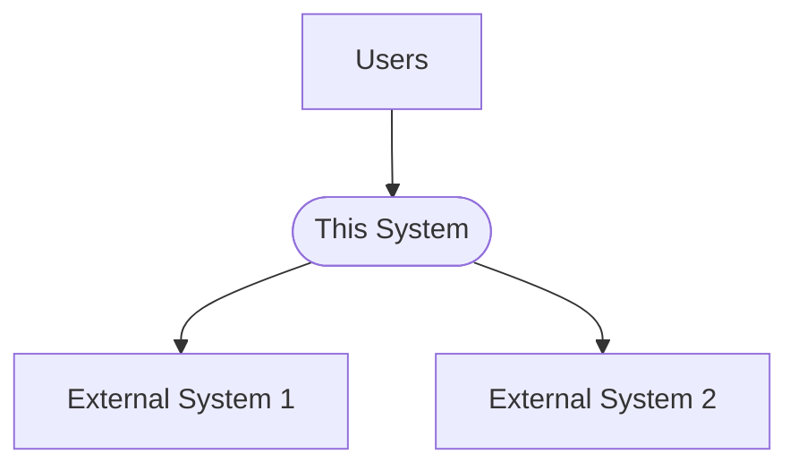
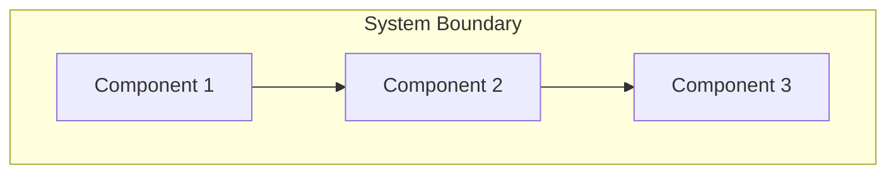
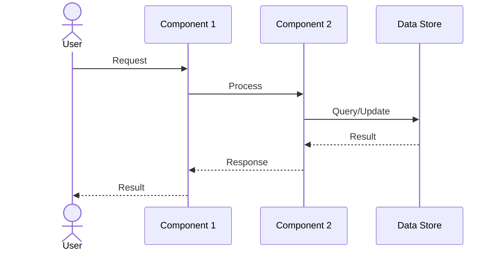
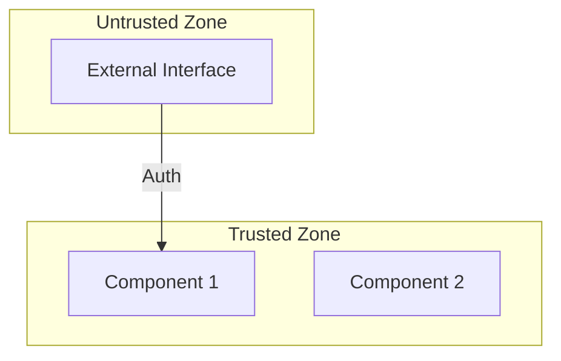
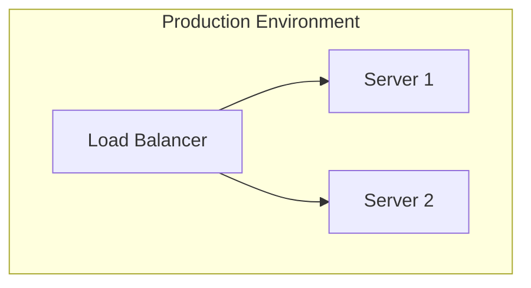

# System Architecture Design

**Document Version:** 1.0
**Last Updated:** [DATE]
**Status:** [DRAFT | REVIEWED | APPROVED]

---

## 1. Overview

### 1.1 System Purpose
<!-- High-level description of what this system does -->

### 1.2 Scope
<!-- What is included and excluded from this system -->

### 1.3 Design Principles
<!-- Core architectural principles -->

- [Principle 1]
- [Principle 2]
- [Principle 3]

---

## 2. High-Level Architecture

### 2.1 System Context
<!-- How this system fits into the larger environment -->

### 2.2 Component Overview
<!-- High-level component structure -->

### 2.3 Technology Stack
<!-- Key technologies used -->

| Layer | Technology | Version | Purpose |
|-------|-----------|---------|---------|
| [Layer 1] | | | |
| [Layer 2] | | | |

---

## 3. Component Design

### 3.1 [Component Name 1]

**Purpose:** <!-- What this component does -->

**Responsibilities:**
- [Responsibility 1]
- [Responsibility 2]

**Interfaces:**
| Interface | Type | Description |
|-----------|------|-------------|
| [Interface 1] | [API/Event/Message] | |
| [Interface 2] | [API/Event/Message] | |

**Dependencies:**
- [Dependency 1]
- [Dependency 2]

### 3.2 [Component Name 2]

**Purpose:** <!-- What this component does -->

**Responsibilities:**
- [Responsibility 1]
- [Responsibility 2]

**Interfaces:**
| Interface | Type | Description |
|-----------|------|-------------|
| [Interface 1] | [API/Event/Message] | |
| [Interface 2] | [API/Event/Message] | |

**Dependencies:**
- [Dependency 1]
- [Dependency 2]

---

## 4. Data Architecture

### 4.1 Data Flow
<!-- How data moves through the system -->

### 4.2 Data Models
<!-- Key data structures -->

| Entity | Attributes | Relationships |
|--------|------------|---------------|
| [Entity 1] | | |
| [Entity 2] | | |

### 4.3 State Management
<!-- How state is managed -->

| State Type | Storage | Scope | Lifecycle |
|------------|---------|-------|-----------|
| [State 1] | | | |
| [State 2] | | | |

---

## 5. Communication Protocols

### 5.1 Inter-Component Communication
<!-- How components communicate -->

| Type | Protocol | Format | Use Case |
|------|----------|--------|----------|
| [Synchronous/Async] | | | |
| [Synchronous/Async] | | | |

### 5.2 External Interfaces
<!-- Communication with external systems -->

| System | Protocol | Authentication | Data Format |
|--------|----------|----------------|-------------|
| [System 1] | | | |
| [System 2] | | | |

---

## 6. Security Architecture

### 6.1 Security Boundaries
<!-- Security zones and boundaries -->

### 6.2 Authentication & Authorization
<!-- How users and systems are authenticated -->

| Mechanism | Used By | Purpose |
|-----------|---------|---------|
| [Mechanism 1] | | |
| [Mechanism 2] | | |

### 6.3 Data Protection
<!-- How data is protected -->

| Data Type | Protection Method | Storage |
|-----------|-------------------|---------|
| [Data 1] | | |
| [Data 2] | | |

### 6.4 Security Controls
<!-- Security measures in place -->

- [Control 1]
- [Control 2]

---

## 7. Deployment Architecture

### 7.1 Deployment Model
<!-- How the system is deployed -->

### 7.2 Infrastructure Requirements
<!-- Hardware and infrastructure needs -->

| Component | CPU | Memory | Storage | Network |
|-----------|-----|--------|---------|---------|
| [Component 1] | | | | |
| [Component 2] | | | | |

### 7.3 Scalability Strategy
<!-- How the system scales -->

| Aspect | Horizontal | Vertical |
|--------|------------|----------|
| [Aspect 1] | | |
| [Aspect 2] | | |

---

## 8. Reliability & Availability

### 8.1 Failure Scenarios
<!-- How failures are handled -->

| Failure Type | Impact | Mitigation |
|--------------|--------|------------|
| [Failure 1] | | |
| [Failure 2] | | |

### 8.2 Recovery Mechanisms
<!-- How the system recovers from failures -->

- [Mechanism 1]
- [Mechanism 2]

### 8.3 Backup Strategy
<!-- How data is backed up -->

| Data Type | Backup Frequency | Retention | Location |
|-----------|------------------|-----------|----------|
| [Data 1] | | | |
| [Data 2] | | | |

---

## 9. Performance Considerations

### 9.1 Performance Requirements
<!-- Performance targets -->

| Metric | Target | Measurement |
|--------|--------|-------------|
| [Metric 1] | | |
| [Metric 2] | | |

### 9.2 Optimization Strategies
<!-- How performance is optimized -->

- [Strategy 1]
- [Strategy 2]

### 9.3 Caching Strategy
<!-- What is cached and how -->

| Data Type | Cache Type | TTL | Invalidation |
|-----------|------------|-----|--------------|
| [Data 1] | | | |
| [Data 2] | | | |

---

## 10. Monitoring & Observability

### 10.1 Metrics
<!-- What is monitored -->

| Metric | Type | Purpose | Alert Threshold |
|--------|------|---------|-----------------|
| [Metric 1] | [Business/Technical] | | |
| [Metric 2] | [Business/Technical] | | |

### 10.2 Logging
<!-- What is logged and where -->

| Log Type | Destination | Retention | Format |
|----------|-------------|-----------|--------|
| [Log 1] | | | |
| [Log 2] | | | |

### 10.3 Tracing
<!-- How requests are traced through the system -->

- [Tracing approach 1]
- [Tracing approach 2]

---

## 11. Technology Decisions

### 11.1 Key Technologies
<!-- Why specific technologies were chosen -->

| Technology | Justification | Alternatives Considered |
|------------|----------------|-------------------------|
| [Tech 1] | | |
| [Tech 2] | | |

### 11.2 Technical Debt
<!-- Known technical debt and plans to address it -->

- [Debt 1] - [Plan to address]
- [Debt 2] - [Plan to address]

---

## 12. Open Issues

<!-- Outstanding architectural questions or concerns -->

- [Issue 1]
- [Issue 2]

---

## Appendix

### A. Acronyms
<!-- Acronyms used in this document -->

| Acronym | Definition |
|---------|------------|
| [Acronym 1] | |
| [Acronym 2] | |

### B. References
<!-- Related architecture documents -->

- [Document 1]
- [Document 2]
