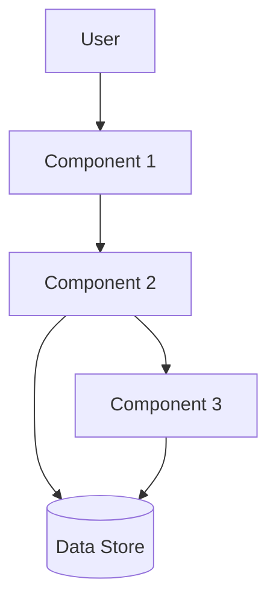
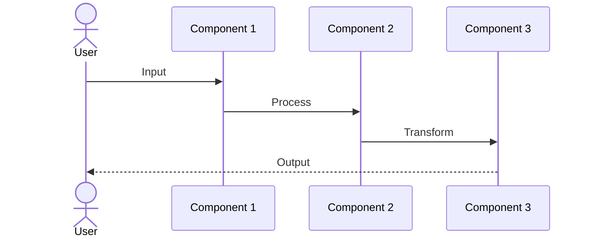

# Solution Design

**Document Version:** 1.0
**Last Updated:** [DATE]
**Status:** [DRAFT | REVIEWED | APPROVED]

---

## Executive Summary

<!-- One-paragraph overview of the proposed solution -->

---

## Solution Overview

### Vision statement
<!-- High-level description of the solution -->

### How it works
<!-- Brief explanation of the solution approach -->

```
Solution Concept:
[Input] → [Process] → [Output]
```

### Key differentiators
<!-- What makes this solution unique or effective -->

- [Differentiator 1]
- [Differentiator 2]

---

## Core Components

### [Component 1]
**Purpose:** <!-- What this component does -->

**Responsibilities:**
- [Responsibility 1]
- [Responsibility 2]

### [Component 2]
**Purpose:** <!-- What this component does -->

**Responsibilities:**
- [Responsibility 1]
- [Responsibility 2]

### [Component 3]
**Purpose:** <!-- What this component does -->

**Responsibilities:**
- [Responsibility 1]
- [Responsibility 2]

---

## Architecture

### System diagram
<!-- High-level view of how components interact -->



### Component interactions
<!-- How components communicate and work together -->

| From | To | Interaction Type | Data Flow |
|------|-----|------------------|-----------|
| [Component 1] | [Component 2] | | |
| [Component 2] | [Component 3] | | |

---

## Data Flow

### Primary flow
<!-- Main data path through the system -->



### Key data entities
<!-- Important data structures -->

| Entity | Description | Key Fields |
|--------|-------------|------------|
| [Entity 1] | | |
| [Entity 2] | | |

---

## Technical Approach

### Technology choices
<!-- Key technologies and why they were chosen -->

| Technology | Purpose | Justification |
|------------|---------|---------------|
| [Tech 1] | | |
| [Tech 2] | | |

### Implementation strategy
<!-- How the solution will be built -->

- [Strategy 1]
- [Strategy 2]

### Integration points
<!-- How this solution integrates with existing systems -->

| System | Integration Type | Notes |
|--------|-----------------|-------|
| [System 1] | | |
| [System 2] | | |

---

## User Experience

### User journey
<!-- How users will interact with the solution -->

```
User Flow:
[Start] → [Step 1] → [Step 2] → [Step 3] → [End]
          ↓          ↓          ↓
       [Action]   [Action]   [Action]
```

### Key interactions
<!-- Critical user interactions -->

| Interaction | Description | User Value |
|-------------|-------------|------------|
| [Interaction 1] | | |
| [Interaction 2] | | |

### UI/UX considerations
<!-- Important user interface and experience factors -->

- [Consideration 1]
- [Consideration 2]

---

## Security & Privacy

### Security measures
<!-- How the solution addresses security -->

| Concern | Mitigation |
|---------|------------|
| [Concern 1] | |
| [Concern 2] | |

### Privacy considerations
<!-- How user data is protected -->

- [Consideration 1]
- [Consideration 2]

### Compliance
<!-- Relevant regulations or standards -->

- [Compliance requirement 1]
- [Compliance requirement 2]

---

## Performance & Scalability

### Performance requirements
<!-- Expected performance characteristics -->

| Metric | Target | Measurement |
|--------|--------|-------------|
| [Metric 1] | | |
| [Metric 2] | | |

### Scalability approach
<!-- How the solution scales -->

- [Approach 1]
- [Approach 2]

### Capacity planning
<!-- Expected load and capacity -->

| Resource | Expected | Maximum | Buffer |
|----------|----------|---------|--------|
| [Resource 1] | | | |

---

## Trade-offs & Considerations

### Design trade-offs
<!-- Key trade-offs made in the solution design -->

| Trade-off | Chosen Approach | Rationale |
|-----------|-----------------|-----------|
| [Trade-off 1] | | |
| [Trade-off 2] | | |

### Limitations
<!-- Known limitations of the solution -->

- [Limitation 1]
- [Limitation 2]

### Assumptions
<!-- Assumptions made in the design -->

- [Assumption 1]
- [Assumption 2]

---

## Alternatives Considered

### Evaluated options
<!-- Other solutions that were considered -->

| Option | Pros | Cons | Why Not Chosen |
|--------|------|------|----------------|
| [Option 1] | | | |
| [Option 2] | | | |

---

## Risks & Mitigation

| Risk | Impact | Probability | Mitigation |
|------|--------|-------------|------------|
| [Risk 1] | | | |
| [Risk 2] | | | |

---

## Open Questions

<!-- Questions that need to be answered before implementation -->

| Question | Priority | Owner |
|----------|----------|-------|
| [Question 1] | | |
| [Question 2] | | |
