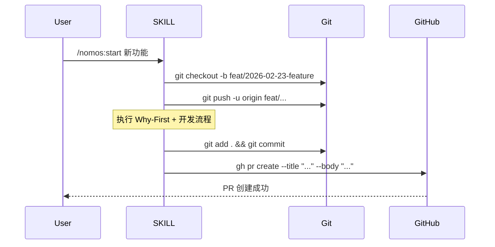
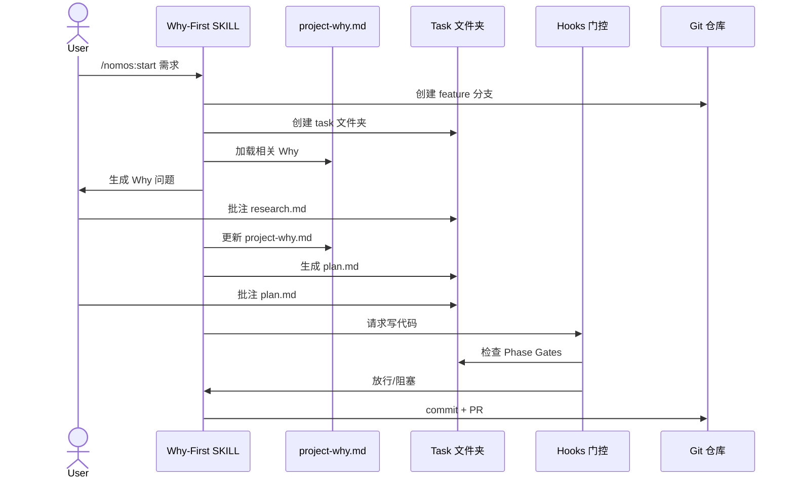

# System Architecture Document (系统架构文档)

**Document Version:** 1.0
**Last Updated:** 2026-02-24
**Status:** DRAFT

---

## 1. 系统整体架构

### 1.1 架构概览

Nomos 系统采用分层架构,通过 Claude Code Hooks 机制实现刚性质量管控。系统核心由以下几个层次组成:

```
┌─────────────────────────────────────────────────────────────┐
│                      用户交互层                              │
│  (Claude Code CLI / Task Viewer HTML 界面)                  │
└─────────────────────────────────────────────────────────────┘
                            ↓
┌─────────────────────────────────────────────────────────────┐
│                      SKILL 编排层                            │
│  (/nomos 主 SKILL + 子 SKILL)                          │
└─────────────────────────────────────────────────────────────┘
                            ↓
┌─────────────────────────────────────────────────────────────┐
│                      Hooks 门控层                            │
│  (PreToolUse / PostToolUse / Stop / SessionStart)           │
└─────────────────────────────────────────────────────────────┘
                            ↓
┌─────────────────────────────────────────────────────────────┐
│                      规则引擎层                              │
│  (AgentLinterEngine + 三层规则体系)                         │
└─────────────────────────────────────────────────────────────┘
                            ↓
┌─────────────────────────────────────────────────────────────┐
│                      状态持久化层                            │
│  (Task 文件夹 + project-why.md + .claude/)                  │
└─────────────────────────────────────────────────────────────┘
```

### 1.2 核心设计原则

1. **刚性优先**: 通过 Hooks 物理门控,确保规则强制执行
2. **文档驱动**: 所有状态持久化在 Markdown 文件中,支持跨会话恢复
3. **任务隔离**: 每个任务独立文件夹,避免上下文污染
4. **Why-First**: 强制深度思考"为什么",避免"想当然"
5. **标注循环**: 在文档中直接批注,前置 code review
6. **可插拔扩展**: BaseRule 接口支持自定义规则
7. **人机分工**: 人类负责"为什么",Agent 负责"怎么做"

---

## 2. Task Viewer HTML 界面架构

### 2.1 整体架构

Task Viewer 采用前后端分离架构,Python 后端提供 HTTP 服务和文件操作,HTML/CSS/JS 前端提供渲染和交互。

```
┌──────────────────────────────────────────────────────────┐
│                    浏览器前端                             │
│  ┌────────────────────────────────────────────────────┐  │
│  │  HTML 结构层                                        │  │
│  │  - 导航栏 (任务信息、快捷操作)                      │  │
│  │  - 内容区 (Markdown 渲染、Mermaid 图表)             │  │
│  │  - 附着式标注标记点 (附着在相关行旁边)              │  │
│  │  - 悬浮编辑框 (点击标记点弹出)                      │  │
│  └────────────────────────────────────────────────────┘  │
│  ┌────────────────────────────────────────────────────┐  │
│  │  CSS 样式层                                         │  │
│  │  - 响应式布局                                       │  │
│  │  - 代码高亮主题                                     │  │
│  │  - 标记点样式 (小图标、状态颜色)                    │  │
│  │  - 悬浮编辑框样式 (定位、阴影、动画)                │  │
│  └────────────────────────────────────────────────────┘  │
│  ┌────────────────────────────────────────────────────┐  │
│  │  JavaScript 逻辑层                                  │  │
│  │  - Markdown 渲染 (marked.js)                       │  │
│  │  - Mermaid 渲染 (mermaid.js)                       │  │
│  │  - 标注注入 (根据行号注入标记点)                    │  │
│  │  - 悬浮编辑框交互 (显示/隐藏/保存/删除)             │  │
│  │  - WebSocket 通信 (实时同步)                       │  │
│  └────────────────────────────────────────────────────┘  │
└──────────────────────────────────────────────────────────┘
                          ↕ HTTP/WebSocket
┌──────────────────────────────────────────────────────────┐
│                    Python 后端服务器                      │
│  ┌────────────────────────────────────────────────────┐  │
│  │  HTTP 服务层                                        │  │
│  │  - 静态文件服务 (.task-viewer.html)                │  │
│  │  - API 端点 (读取/保存 plan.md)                    │  │
│  │  - WebSocket 服务 (浏览器关闭通知)                 │  │
│  └────────────────────────────────────────────────────┘  │
│  ┌────────────────────────────────────────────────────┐  │
│  │  端口管理层                                         │  │
│  │  - 动态端口分配 (从 8765 开始)                     │  │
│  │  - 端口冲突检测                                     │  │
│  │  - 多实例管理                                       │  │
│  └────────────────────────────────────────────────────┘  │
│  ┌────────────────────────────────────────────────────┐  │
│  │  自动关闭层                                         │  │
│  │  - 超时检测 (30 分钟无活动)                        │  │
│  │  - 浏览器关闭监听                                   │  │
│  │  - 优雅关闭 (保存状态)                             │  │
│  └────────────────────────────────────────────────────┘  │
└──────────────────────────────────────────────────────────┘
                          ↕ 文件系统
┌──────────────────────────────────────────────────────────┐
│                    任务文件系统                           │
│  tasks/t1-YYYY-MM-DD-feature/                            │
│  ├── .task-viewer.html (界面文件)                        │
│  ├── plan.md (计划文档)                                  │
│  ├── research.md (调研文档)                              │
│  └── code_review.md (审查文档)                           │
└──────────────────────────────────────────────────────────┘
```

### 2.2 前端技术栈

**核心技术**:
- **HTML5**: 语义化标签,支持 ARIA 无障碍
- **CSS3**: Flexbox/Grid 布局,CSS Variables 主题
- **Pure JavaScript**: 无框架依赖,轻量高效

**第三方库 (CDN 引入)**:
- **marked.js** (v11.0+): Markdown 解析和渲染
  - CDN: `https://cdn.jsdelivr.net/npm/marked@11/marked.min.js`
  - 功能: 将 Markdown 转换为 HTML
  - 配置: 启用 GFM(GitHub Flavored Markdown)、代码高亮

- **mermaid.js** (v10.0+): 图表渲染
  - CDN: `https://cdn.jsdelivr.net/npm/mermaid@10/dist/mermaid.min.js`
  - 功能: 渲染流程图、时序图、架构图
  - 配置: 主题、字体大小、安全模式

### 2.3 后端技术栈

**核心技术**:
- **Python 3.9+**: 后端服务器语言
- **http.server**: 内置 HTTP 服务器模块
- **WebSocket**: 浏览器关闭通知

**关键模块**:
- **端口管理**: 动态分配端口(8765 起始)
- **自动关闭**: 30 分钟超时 + 浏览器关闭监听
- **文件操作**: 读取/保存 plan.md、research.md 等

### 2.4 Short ID 映射系统

**设计目标**: 让用户可以通过简短 ID(t1, t2, t3...)快速引用任务,同时在目录名中可见。

**实现方案**:
```
tasks/
├── t1-2026-02-23-login-feature/
├── t2-2026-02-24-payment-refactor/
└── t3-2026-02-24-api-optimization/
```

**映射文件**: `tasks/short-id-mapping.json`
```json
{
  "t1": "t1-2026-02-23-login-feature",
  "t2": "t2-2026-02-24-payment-refactor",
  "t3": "t3-2026-02-24-api-optimization"
}
```

### 2.5 附着式标注系统

**设计理念**: 标注不是独立区域,而是附着在相关内容旁边的标记点,支持右键创建标注、左键查看历史,实现持久化的标注循环。

#### 2.5.1 交互设计

**双击交互模式**:

| 操作 | 行为 | 场景 |
|------|------|------|
| **右键点击行** | 高亮该行 + 打开新建标注框 | 创建新标注 |
| **左键点击标记点** | 打开该标注的历史/追问/状态 | 查看已存在标注 |
| **悬停标记点** | 显示标注摘要预览 | 快速浏览 |

**视觉设计**:

```
┌──────────────────────────────────────────────────────────────────┐
│  ## 4. Implementation Phases                                      │
│                                                                   │
│  ### Phase 1: 用户认证                                            │
│  目标: 实现手机号+验证码登录                         📝❓ ← 标记点 │
│                                                      ↑            │
│                                              左键点击打开历史      │
│  #### Phase Gates (阶段门控)                                      │
│  - [ ] Gate 1.1: 数据库表设计                      📝            │
│  - [ ] Gate 1.2: API 接口实现                                     │
│                                                                   │
│  右键点击任意行 → 高亮该行 + 打开新建标注框                        │
└──────────────────────────────────────────────────────────────────┘

标记点状态图标:
📝  - 有标注（待处理/已处理）
📝❓ - AI有追问/疑问（需用户澄清）
🔴  - CRITICAL 严重程度
🟠  - MAJOR 严重程度
🟢  - 已处理 (addressed)
```

**左键点击标记点 - 查看标注历史**:

```
┌──────────────────────────────────────────────────────────────────┐
│  ### Phase 1: 用户认证                    ┌────────────────────┐ │
│  目标: 实现手机号+验证码登录        📝 ────┤ RC-1 历史记录 [X]  │ │
│                                          ├────────────────────┤ │
│                                          │ 📋 标注历史         │ │
│                                          │ ┌────────────────┐ │ │
│                                          │ │ 👤 @developer   │ │ │
│                                          │ │ 02-24 10:30    │ │ │
│                                          │ │ [MAJOR]        │ │ │
│                                          │ │ 需要补充微信登录│ │ │
│                                          │ │ 的边界条件...  │ │ │
│                                          │ └────────────────┘ │ │
│                                          │ ┌────────────────┐ │ │
│                                          │ │ 🤖 @agent 回复  │ │ │
│                                          │ │ 02-24 10:45    │ │ │
│                                          │ │ 已在 Phase     │ │ │
│                                          │ │ Gates 补充...  │ │ │
│                                          │ └────────────────┘ │ │
│                                          │ ┌────────────────┐ │ │
│                                          │ │ ❓ AI 追问      │ │ │
│                                          │ │ 02-24 10:46    │ │ │
│                                          │ │ 请确认：微信   │ │ │
│                                          │ │ 服务不可用时   │ │ │
│                                          │ │ 是否需要降级？ │ │ │
│                                          │ │ [回复追问]     │ │ │
│                                          │ └────────────────┘ │ │
│                                          │                    │ │
│                                          │ 状态: 🟠 待确认    │ │
│                                          │ [追加标注] [关闭]  │ │
│                                          └────────────────────┘ │
└──────────────────────────────────────────────────────────────────┘
```

**右键点击行 - 新建标注**:

```
┌──────────────────────────────────────────────────────────────────┐
│  ### Phase 1: 用户认证 ← ═══════════════════════ 高亮选中        │
│                                          ┌────────────────────┐ │
│                                          │ 新建标注      [X]   │ │
│                                          ├────────────────────┤ │
│                                          │ 行号: 45           │ │
│                                          │ 严重程度:          │ │
│                                          │ ○CRITICAL ○MAJOR   │ │
│                                          │ ○MINOR   ○SUGGEST  │ │
│                                          │ ┌────────────────┐ │ │
│                                          │ │输入标注内容... │ │ │
│                                          │ │                │ │ │
│                                          │ └────────────────┘ │ │
│                                          │                    │ │
│                                          │ [保存] [取消]      │ │
│                                          └────────────────────┘ │
└──────────────────────────────────────────────────────────────────┘
```

#### 2.5.2 标注数据结构

**Review Comments 格式（持久化存储）**:

```markdown
## 8. Review Comments

### RC-1: 补充微信登录边界条件
> 位置: 47
> 创建时间: 2026-02-24 10:30
> 最后更新: 2026-02-24 11:15
> 严重程度: [MAJOR]
> 状态: pending_ai_question  ← 特殊状态：AI有追问

#### 标注历史

**[2026-02-24 10:30] 👤 @developer**
> 需要补充微信登录的边界条件，如用户取消授权、网络超时等场景

**[2026-02-24 10:45] 🤖 @agent**
> 已在 Phase Gates 中补充 Gate 1.4，处理以下边界条件：
> - 用户取消授权 → 返回错误码 1001
> - 网络超时 → 重试 3 次后返回错误码 1002
> - 授权过期 → 引导用户重新授权

**[2026-02-24 10:46] ❓ @agent 追问**
> 请确认：微信服务不可用时是否需要降级处理？如果需要，降级方案是什么？

**[2026-02-24 11:15] 👤 @developer**
> 是的，需要降级。降级方案：显示"微信服务暂时不可用，请使用手机号登录"

---

### RC-2: 数据库表设计建议
> 位置: 52
> 创建时间: 2026-02-24 10:35
> 最后更新: 2026-02-24 10:50
> 严重程度: [MINOR]
> 状态: addressed

#### 标注历史

**[2026-02-24 10:35] 👤 @developer**
> 建议在 users 表增加 last_login_at 字段

**[2026-02-24 10:50] 🤖 @agent**
> 已添加 last_login_at 字段到 Gate 1.1 的表设计说明中
```

#### 2.5.3 标注状态体系

| 状态 | 含义 | 标记点图标 | 阻塞 |
|------|------|-----------|------|
| `pending` | 待处理 | 📝🟠 | ✅ 阻塞（CRITICAL/MAJOR） |
| `pending_ai_question` | AI有追问，待用户回复 | 📝❓ | ✅ 阻塞 |
| `pending_user_clarify` | AI有疑问，待用户澄清 | 📝❓ | ✅ 阻塞 |
| `addressed` | 已处理 | 📝🟢 | ❌ 不阻塞 |
| `wont_fix` | 不修复（人类确认忽略） | 📝⚪ | ❌ 不阻塞 |

**状态流转**:

```
┌─────────────────────────────────────────────────────────────────────┐
│                       标注状态流转图                                 │
├─────────────────────────────────────────────────────────────────────┤
│                                                                      │
│  [用户创建标注]                                                       │
│       │                                                              │
│       ▼                                                              │
│  ┌─────────┐                                                         │
│  │ pending │ ←─────────────────────────────────┐                    │
│  └────┬────┘                                   │                    │
│       │                                        │                    │
│       │ Agent 读取并处理                        │ Agent 不理解，    │
│       │                                        │ 主动提问          │
│       ▼                                        │                    │
│  ┌─────────────────────┐                       │                    │
│  │ Agent 回复/修改     │                       │                    │
│  └──────────┬──────────┘                       │                    │
│             │                                  │                    │
│             ├────────────────────┐             │                    │
│             │                    │             │                    │
│             ▼                    ▼             │                    │
│  ┌──────────────────┐  ┌───────────────────┐  │                    │
│  │ pending_         │  │ pending_user_     │  │                    │
│  │ ai_question      │  │ clarify           │  │                    │
│  │ (AI追问用户)     │  │ (AI有疑问)        │  │                    │
│  └────────┬─────────┘  └─────────┬─────────┘  │                    │
│           │                      │            │                    │
│           │ 用户回复              │ 用户澄清   │                    │
│           │                      │            │                    │
│           └──────────┬───────────┴────────────┘                    │
│                      │                                              │
│                      ▼                                              │
│              ┌───────────────┐                                      │
│              │ 用户确认通过   │                                      │
│              └───────┬───────┘                                      │
│                      │                                              │
│                      ▼                                              │
│              ┌───────────────┐                                      │
│              │  addressed    │                                      │
│              │  (已处理)     │                                      │
│              └───────────────┘                                      │
│                                                                      │
│  特殊路径:                                                           │
│  pending ──[用户确认忽略]──► wont_fix                               │
│                                                                      │
└─────────────────────────────────────────────────────────────────────┘
```

#### 2.5.4 Markdown 特殊格式标注

**问题**: Markdown 特殊格式（代码块、Mermaid、表格等）渲染后结构变化，难以用普通行号定位。

| 特殊格式 | 渲染后 | 标注难点 |
|---------|--------|---------|
| **代码块** `<pre><code>` | 语法高亮的代码 | 行号对应代码块内部 |
| **Mermaid** | 流程图/架构图 | 图形无法定位到源码行 |
| **表格** | 表格 | 单元格跨多行 |
| **列表** | 有序/无序列表 | 嵌套结构 |

**解决方案: 双视图 + 块级标注混合**

```
┌─────────────────────────────────────────────────────────────────────┐
│                    混合标注方案                                      │
├─────────────────────────────────────────────────────────────────────┤
│                                                                      │
│  1. 默认渲染视图                                                     │
│     - 普通文本: 行级标注（右键任意行）                               │
│     - 代码块: 块级标注（点击代码块右上角 📝）                        │
│     - Mermaid: 块级标注（点击图表上方 📝）                           │
│     - 表格: 行级标注（表格每行可标注）                               │
│                                                                      │
│  2. 源码视图切换                                                     │
│     - 点击 [源码] 按钮 → 显示原始 Markdown                          │
│     - 可精确标注任意位置                                             │
│     - 标注自动转换为对应的渲染视图位置                               │
│                                                                      │
└─────────────────────────────────────────────────────────────────────┘
```

**视觉设计**:

```
┌─────────────────────────────────────────────────────────────────────┐
│  [渲染] [源码]                              ← 视图切换按钮            │
├─────────────────────────────────────────────────────────────────────┤
│                                                                      │
│  ### Phase 1: 用户认证                                               │
│                                                                      │
│  ```python                                    📝 ← 代码块标注点       │
│  def login(user):                                                    │
│      # 验证用户信息                                                  │
│      if not user:                  ← 源码视图可标注此行              │
│          return None                                                 │
│      return generate_token(user)                                     │
│  ```                                                                 │
│                                                                      │
│  ```mermaid                                   📝 ← Mermaid 标注点     │
│  graph LR                                                            │
│      A[用户请求] --> B{验证}                                         │
│      B -->|成功| C[返回Token]                                        │
│      B -->|失败| D[返回错误]                                         │
│  ```                                                                 │
│                                                                      │
│  | 字段 | 类型 | 说明 |                                              │
│  |------|------|------| ← 📝 表格行标注点                           │
│  | id | int | 主键 |                                                 │
│  | name | str | 名称 |                                               │
│                                                                      │
└─────────────────────────────────────────────────────────────────────┘
```

**源码视图**:

```
┌─────────────────────────────────────────────────────────────────────┐
│  [渲染] [源码] ✓                                                     │
├─────────────────────────────────────────────────────────────────────┤
│                                                                      │
│   45 │ ### Phase 1: 用户认证                                         │
│   46 │                                                               │
│   47 │ ```python                                                     │
│   48 │ def login(user):                                              │
│   49 │     # 验证用户信息                          📝 ← 右键标注此行  │
│   50 │     if not user:                                              │
│   51 │         return None                                           │
│   52 │     return generate_token(user)                               │
│   53 │ ```                                                           │
│   54 │                                                               │
│   55 │ ```mermaid                                                    │
│   56 │ graph LR                                    📝 ← 右键标注此块  │
│   57 │     A[用户请求] --> B{验证}                                   │
│   58 │     B -->|成功| C[返回Token]                                  │
│   59 │     B -->|失败| D[返回错误]                                   │
│   60 │ ```                                                           │
│                                                                      │
└─────────────────────────────────────────────────────────────────────┘
```

**标注定位数据结构**:

```javascript
// 普通文本 - 行级定位
{
  "id": "RC-1",
  "location": {
    "type": "line",
    "line": 47
  }
}

// 代码块 - 块内行级定位
{
  "id": "RC-2",
  "location": {
    "type": "code_block",
    "block_index": 1,        // 第几个代码块
    "inner_line": 3,         // 代码块内第几行
    "source_line": 50        // 源码行号（兜底）
  }
}

// Mermaid - 块级定位
{
  "id": "RC-3",
  "location": {
    "type": "mermaid_block",
    "block_index": 1,
    "source_line_start": 55,
    "source_line_end": 60
  }
}

// 表格 - 行级定位
{
  "id": "RC-4",
  "location": {
    "type": "table_row",
    "table_index": 1,
    "row": 2,
    "source_line": 65
  }
}
```

**标注格式（MD 存储）**:

```markdown
### RC-1: 代码块标注示例
> 位置: code:1:3 (源码:50)      ← 代码块 1 第 3 行，源码第 50 行兜底
> 创建时间: 2026-02-25 10:30
> 严重程度: [MAJOR]
> 状态: pending
> 内容: 这里应该处理空用户名的情况，增加参数校验

### RC-2: Mermaid 图标注示例
> 位置: mermaid:1 (源码:55-60)  ← Mermaid 块 1，源码第 55-60 行
> 创建时间: 2026-02-25 10:35
> 严重程度: [SUGGEST]
> 状态: pending
> 内容: 建议在登录流程中增加验证码节点

### RC-3: 表格行标注示例
> 位置: table:1:row:2 (源码:65) ← 表格 1 第 2 行
> 创建时间: 2026-02-25 10:40
> 严重程度: [MINOR]
> 状态: pending
> 内容: name 字段应该增加唯一约束说明
```

**交互规则**:

| 场景 | 渲染视图行为 | 源码视图行为 |
|------|-------------|-------------|
| 普通文本 | 右键任意行标注 | 右键任意行标注 |
| 代码块 | 点击右上角 📝 标注整个块 | 可标注代码块内任意行 |
| Mermaid | 点击上方 📝 标注整个图 | 可标注 Mermaid 源码任意行 |
| 表格 | 右键表格行标注 | 右键源码行标注 |
| 列表 | 右键列表项标注 | 右键源码行标注 |

**视图切换时标注点处理**:

```
┌─────────────────────────────────────────────────────────────────────┐
│                    视图切换标注点映射                                │
├─────────────────────────────────────────────────────────────────────┤
│                                                                      │
│  渲染视图 → 源码视图:                                                │
│  - 行级标注 → 映射到对应源码行                                       │
│  - 块级标注 → 展开为源码行范围，标记点显示在块首行                   │
│                                                                      │
│  源码视图 → 渲染视图:                                                │
│  - 普通文本行 → 映射到渲染后对应位置                                 │
│  - 代码块内行 → 映射到代码块标记点（点击可查看具体行）               │
│  - Mermaid 内行 → 映射到 Mermaid 块标记点                            │
│                                                                      │
│  定位失败处理:                                                       │
│  - 如果行号漂移导致定位失败 → 使用 source_line 兜底                  │
│  - 如果仍失败 → 标记点显示在文档末尾，提示"位置已变化"              │
│                                                                      │
└─────────────────────────────────────────────────────────────────────┘
```

#### 2.5.5 内容动态刷新

**设计目标**: Agent 修改文档后，Task Viewer 自动刷新，无需重新打开。

**实现方案**:

```
┌─────────────────────────────────────────────────────────────────────┐
│                      内容动态刷新机制                                │
├─────────────────────────────────────────────────────────────────────┤
│                                                                      │
│  方案: 轮询 + WebSocket 混合                                         │
│                                                                      │
│  ┌────────────────────────────────────────────────────────────────┐ │
│  │ Task Viewer Frontend                                           │ │
│  │                                                                 │ │
│  │ 1. WebSocket 连接 (实时推送)                                    │ │
│  │    - 连接: ws://localhost:8765/ws                              │ │
│  │    - 接收: { "type": "file_changed", "file": "plan.md" }       │ │
│  │    - 触发: 自动刷新内容区                                       │ │
│  │                                                                 │ │
│  │ 2. 轮询兜底 (每 5 秒)                                           │ │
│  │    - GET /api/file/plan.md/mtime                               │ │
│  │    - 比较修改时间，变化则刷新                                   │ │
│  │                                                                 │ │
│  │ 3. 刷新策略                                                     │ │
│  │    - 保留当前打开的标注框状态                                   │ │
│  │    - 只更新 Markdown 内容区                                     │ │
│  │    - 标记点位置自动重新计算                                     │ │
│  │    - 显示"内容已更新"提示条                                     │ │
│  └────────────────────────────────────────────────────────────────┘ │
│                                                                      │
│  刷新提示 UI:                                                        │
│  ┌────────────────────────────────────────────────────────────────┐ │
│  │ 🔔 文档已由 Agent 更新，点击查看变更 [查看] [忽略]              │ │
│  └────────────────────────────────────────────────────────────────┘ │
│                                                                      │
│  Agent 端通知 (可选):                                                │
│  ┌────────────────────────────────────────────────────────────────┐ │
│  │ # Agent 修改文档后，通过 Hook 通知 Task Viewer                  │ │
│  │                                                                 │ │
│  │ PostToolUse Hook:                                               │ │
│  │   if file in [research.md, plan.md, code_review.md]:           │ │
│  │       notify_task_viewer(file)  # 发送 WebSocket 通知          │ │
│  └────────────────────────────────────────────────────────────────┘ │
│                                                                      │
└─────────────────────────────────────────────────────────────────────┘
```

#### 2.5.6 标记点样式

```css
/* 标记点基础样式 */
.annotation-marker {
  display: inline-block;
  width: 18px;
  height: 18px;
  margin-left: 4px;
  cursor: pointer;
  vertical-align: middle;
  border-radius: 50%;
  transition: all 0.2s;
}

/* 状态样式 */
.annotation-marker[data-status="pending"] {
  background: #f59e0b;  /* 橙色 - 待处理 */
  color: white;
}

.annotation-marker[data-status="pending_ai_question"],
.annotation-marker[data-status="pending_user_clarify"] {
  background: #8b5cf6;  /* 紫色 - AI追问/疑问 */
  color: white;
  animation: pulse 2s infinite;  /* 闪烁动画，吸引注意 */
}

.annotation-marker[data-status="addressed"] {
  background: #10b981;  /* 绿色 - 已处理 */
  color: white;
}

.annotation-marker[data-status="wont_fix"] {
  background: #9ca3af;  /* 灰色 - 不修复 */
  color: white;
}

/* 严重程度角标 */
.annotation-marker[data-severity="critical"]::after {
  content: "🔴";
  position: absolute;
  top: -4px;
  right: -4px;
  font-size: 10px;
}

.annotation-marker[data-severity="major"]::after {
  content: "🟠";
  position: absolute;
  top: -4px;
  right: -4px;
  font-size: 10px;
}

/* AI追问闪烁动画 */
@keyframes pulse {
  0%, 100% { opacity: 1; }
  50% { opacity: 0.6; }
}

/* 高亮选中行（右键） */
.line-highlight {
  background: linear-gradient(90deg, #fef3c7 0%, transparent 100%);
  border-left: 3px solid #f59e0b;
  padding-left: 8px;
  margin-left: -11px;
}

/* 悬浮编辑框 */
.annotation-popup {
  position: fixed;
  width: 400px;
  max-height: 500px;
  overflow-y: auto;
  background: white;
  border: 1px solid #e5e7eb;
  border-radius: 8px;
  box-shadow: 0 10px 25px rgba(0,0,0,0.15);
  z-index: 1000;
}

/* 历史记录时间线样式 */
.history-item {
  padding: 12px;
  border-left: 3px solid #e5e7eb;
  margin-left: 8px;
}

.history-item.user {
  border-left-color: #3b82f6;  /* 蓝色 - 用户 */
}

.history-item.agent {
  border-left-color: #10b981;  /* 绿色 - Agent */
}

.history-item.ai-question {
  border-left-color: #8b5cf6;  /* 紫色 - AI追问 */
  background: #f5f3ff;
}
```

#### 2.5.7 关键设计决策

| 决策点 | 选择 | 理由 |
|--------|------|------|
| 右键创建标注 | 行级右键菜单 | 符合用户习惯，精确定位 |
| 左键查看历史 | 点击标记点展开 | 区分创建和查看两种操作 |
| 标注历史持久化 | MD 文件内存储 | 版本控制友好，跨会话保持 |
| AI追问状态 | 独立状态 + 闪烁动画 | 吸引用户注意，确保不遗漏 |
| 内容刷新 | WebSocket + 轮询混合 | 实时性 + 可靠性兼顾 |
| 刷新时保留状态 | 保留打开的标注框 | 避免用户操作被打断 |

---

## 3. 核心组件设计

### 3.1 Why-First 引擎

**目的**: 强制 AI 在调研阶段深度思考"为什么",避免"想当然"和幻觉。

**职责**:
- 解析当前需求,提取关键词
- 扫描受影响的代码/模块范围(targeted scan)
- 从 project-why.md 加载相关历史 Why
- 生成 5-12 个针对性 Why 问题
- 等待用户回答并标注 ✅ Addressed
- 同步更新 project-why.md

**接口**:
| 接口 | 类型 | 描述 |
|------|------|------|
| `/nomos:start` | SKILL Command | 启动 Why-First 流程 |
| `generate_why_questions()` | Internal API | 生成 Why 问题列表 |
| `update_project_why()` | Internal API | 更新 project-why.md |

**依赖**:
- project-why.md(知识库)
- research.md(当前任务调研)
- Grep/Read 工具(代码扫描)

**关键算法**:
```python
def generate_why_questions(requirement, project_why_md):
    # 1. 提取需求关键词
    keywords = extract_keywords(requirement)

    # 2. 扫描受影响范围(只看相关模块)
    affected_modules = scan_affected_modules(keywords)

    # 3. 从 project-why.md 加载相关历史
    historical_why = load_relevant_why(project_why_md, affected_modules)

    # 4. 生成 5-12 个针对性问题
    questions = []
    for module in affected_modules:
        questions.extend(generate_module_questions(module, historical_why))

    return questions[:12]  # 最多 12 个
```

### 3.2 Hooks 门控系统

**目的**: 通过物理门控确保规则强制执行,AI 无法跳步。

**职责**:
- 拦截所有工具调用(PreToolUse)
- 检查任务完成状态(Stop)
- 会话启动时加载上下文(SessionStart)
- 用户输入时检测任务恢复(UserPromptSubmit)

**Hooks 类型**:

| Hook 类型 | 触发时机 | 主要职责 |
|----------|---------|---------|
| **PreToolUse** | 工具调用前 | 运行 AgentLinterEngine(三层规则)、检查 i18n、验证 plan.md 状态 |
| **PostToolUse** | 工具调用后 | 更新 Mermaid 图表、记录操作日志 |
| **Stop** | 任务结束前 | 检查所有 Phase Gates 已勾选、Review Comments 已 Addressed |
| **SessionStart** | 会话启动时 | 加载 project-why.md、注入当前 task 上下文 |
| **UserPromptSubmit** | 用户输入后 | 检测任务恢复命令、解析 short ID |

**配置示例**:
```yaml
# .claude/hooks/config.yml
hooks:
  PreToolUse:
    - matcher: "Write|Edit"
      command: ".claude/hooks/nomos-pretooluse.sh"
    - type: prompt
      promptFile: ".claude/hooks/i18n-prompt.md"

  Stop:
    - command: ".claude/hooks/check-gates-addressed.sh"

  SessionStart:
    - command: ".claude/hooks/load-project-why.sh"
```

### 3.3 AgentLinterEngine(规则引擎)

**目的**: 三层规则体系,从语法到业务全覆盖。

**三层规则**:

**第一层: 语法/类型规则**(静态分析)
- ESLint、Pylint、TypeScript 编译器
- 代码格式化(Prettier、Black)
- 导入检查、未使用变量

**第二层: 安全/架构规则**(框架级)
- SQL 注入检测
- XSS 防护检查
- Protected Interfaces 保护
- 循环依赖检测

**第三层: 业务规则**(项目特定)
- i18n 强制使用 customT()
- trace_id 必须传递
- 特定模块的命名约定
- plan.md 中定义的动态规则

**接口**:
```python
class BaseRule:
    def check(self, code, context) -> RuleResult:
        pass

class AgentLinterEngine:
    def run_all_rules(self, code, layer) -> List[RuleResult]:
        # 按层级运行规则
        pass
```

### 3.4 Task 状态管理器

**目的**: 管理任务生命周期和状态持久化。

**职责**:
- 创建/切换任务文件夹
- 维护 short ID 映射
- 保存/恢复任务上下文
- 管理任务快照(并行任务切换)

**状态文件**:
```
tasks/t1-2026-02-23-feature/
├── research.md          # 调研文档
├── plan.md              # 计划文档
├── code_review.md       # 审查文档
├── .task-viewer.html    # 查看器界面
├── snapshot.md          # 上下文快照(切换任务时)
└── plan-diagram.mmd     # Mermaid 流程图
```

### 3.5 Validator Subagent

**目的**: 双重验证,专门挑刺和发现幻觉。

**职责**:
- 只读模式验证 research.md 和 plan.md
- 检查是否与 Protected Interfaces 冲突
- 发现未提及的业务约束
- 生成额外问题列表

**触发时机**:
- research.md 生成后自动 spawn
- plan.md 生成后自动 spawn
- 人类手动触发 `/nomos:validate`

### 3.6 Git 集成管理器

**目的**: 自动化 Git 操作,零手动命令。

**职责**:
- 自动创建 feature 分支
- 智能 commit 消息生成
- PR 描述自动生成
- 一键提交 PR
- Commit 粒度管理

**工作流程**:


#### 3.6.1 Commit 粒度策略

**设计背景**: 由于 Revert 有多个粒度（单 commit / 多 commit / 文件级），commit 粒度直接影响 revert 的代价。

**核心原则**: 以 Phase Gate 为 Commit 边界

```
┌─────────────────────────────────────────────────────────────────┐
│                    Commit 粒度与 Revert 代价                     │
├─────────────────────────────────────────────────────────────────┤
│                                                                  │
│  粗粒度 Commit (整个 Phase 完成后 commit 一次):                  │
│  Phase 1 完成 ──► commit ──► 发现严重问题 ──► revert            │
│  结果: 整个 Phase 1 的工作全部丢失 ❌ 代价高                     │
│                                                                  │
│  细粒度 Commit (每个 Gate 完成后 commit):                        │
│  Gate 1.1 ──► commit                                             │
│  Gate 1.2 ──► commit                                             │
│  Gate 1.3 ──► commit ──► 发现问题 ──► revert (只回滚 1.3)       │
│  结果: 只丢失 Gate 1.3，1.1 和 1.2 保留 ✅ 代价低                │
│                                                                  │
└─────────────────────────────────────────────────────────────────┘
```

**推荐策略**:

| Commit 时机 | 对应内容 | 示例 |
|-------------|----------|------|
| Gate 完成后 | 一个逻辑单元 | `feat: implement user model` |
| 测试编写后 | 测试骨架/用例 | `test: add login tests` |
| 重构完成后 | 单个重构操作 | `refactor: extract auth logic` |

**每个 Commit 应该**:
- 是一个可编译/可运行的单元（不提交半成品）
- 有明确的边界（对应 plan.md 中的一个 Gate）
- 能够独立回滚（不影响其他 commit）

#### 3.6.2 Commit Message 规范

**格式**: `<type>(<scope>): <description> [#gate]`

| 类型 | 说明 | 示例 |
|------|------|------|
| `feat` | 新功能 | `feat(auth): add phone login #gate-1.1` |
| `fix` | Bug 修复 | `fix(auth): handle empty phone number` |
| `test` | 测试 | `test(auth): add login success cases #gate-1.3` |
| `refactor` | 重构 | `refactor(auth): extract token validation` |
| `docs` | 文档 | `docs(auth): update API description` |
| `chore` | 杂项 | `chore: update dependencies` |

**与 plan.md 的对应关系**:

```markdown
# plan.md
## Phase 1: 用户认证

### Phase Gates
- [ ] Gate 1.1: 数据库表设计
- [ ] Gate 1.2: API 接口实现
- [ ] Gate 1.3: 测试用例编写

# Git Log
feat(db): add users table for phone login #gate-1.1
feat(api): implement POST /auth/login #gate-1.2
test(auth): add phone login test cases #gate-1.3
```

**好处**:
- commit 历史与 plan.md 一一对应，易于追溯
- code review 时可以按 gate 粒度查看
- revert 时能精确定位到问题 gate

#### 3.6.3 Commit 粒度 Hook 检查（可选）

**目的**: 在 Stop Hook 中检查是否按 Gate 粒度 commit，提醒 Agent 遵循策略。

**检查逻辑**:

```python
# .claude/hooks/check_commit_granularity.py

import subprocess
import re

def check_commit_granularity(plan_md_path: str) -> dict:
    """
    检查 commit 粒度是否符合 Gate 边界策略

    Returns:
        {
            "passed": bool,
            "warnings": list,
            "suggestions": list
        }
    """
    result = {"passed": True, "warnings": [], "suggestions": []}

    # 1. 获取本次任务分支的 commit 数量
    commits = subprocess.run(
        ["git", "rev-list", "--count", "HEAD", "^main"],
        capture_output=True, text=True
    )
    commit_count = int(commits.stdout.strip())

    # 2. 读取 plan.md 中的 Gate 数量
    with open(plan_md_path, 'r') as f:
        plan_content = f.read()

    gate_count = len(re.findall(r'- \[ \] Gate \d+\.\d+:', plan_content))

    # 3. 检查 commit 数量与 Gate 数量的比例
    if gate_count > 0:
        ratio = commit_count / gate_count

        if ratio < 0.5:
            result["warnings"].append(
                f"Commit 粒度过粗: {commit_count} 个 commit 对应 {gate_count} 个 Gate。"
                f"建议每个 Gate 完成后 commit 一次，以便精确 revert。"
            )
            result["suggestions"].append(
                "考虑将当前工作拆分为多个 commit，每个对应一个 Gate。"
            )

    # 4. 检查 commit message 是否包含 gate 标记
    recent_commits = subprocess.run(
        ["git", "log", "--oneline", "-5"],
        capture_output=True, text=True
    )

    for line in recent_commits.stdout.strip().split('\n'):
        if '#gate' not in line.lower():
            result["warnings"].append(
                f"Commit 缺少 gate 标记: {line}"
            )

    return result

# Hook 入口
if __name__ == "__main__":
    import sys
    import json

    data = json.loads(sys.stdin.read())
    plan_path = data.get("plan_path", "plan.md")

    check_result = check_commit_granularity(plan_path)

    if check_result["warnings"]:
        print("⚠️ Commit 粒度检查:", file=sys.stderr)
        for warning in check_result["warnings"]:
            print(f"  - {warning}", file=sys.stderr)
        print("\n建议:", file=sys.stderr)
        for suggestion in check_result["suggestions"]:
            print(f"  - {suggestion}", file=sys.stderr)
        # 不阻塞，只是警告
        sys.exit(0)
```

**配置方式** (在 .claude/settings.json 中):

```json
{
  "hooks": {
    "Stop": [
      {
        "matcher": ".*",
        "hooks": ["check_commit_granularity"],
        "config": {
          "enforce": false,  // true = 阻塞, false = 警告
          "min_commit_per_gate": 0.5
        }
      }
    ]
  }
}
```

**检查时机**:
- Stop Hook: 任务结束前检查
- `/nomos:validate`: 手动触发检查

**处理方式**:
- 警告模式（默认）: 输出警告信息，不阻塞
- 强制模式（可选）: 如果粒度过粗，阻塞并要求拆分 commit

#### 3.6.4 分支管理策略

**目的**: 新任务自动创建独立分支，支持多任务并行开发。

**分支创建时机**:

| 触发命令 | 时机 | 行为 |
|---------|------|------|
| `/nomos:start` | 启动完整流程 | 自动创建分支 + 创建 task 文件夹 |
| `/nomos:new-task` | 仅创建任务 | 自动创建分支 + 创建 task 文件夹 |

**分支命名规范**:

```
格式: {type}/{date}-{task-name}

示例:
feat/2026-02-25-user-login        # 新功能
fix/2026-02-25-auth-bug           # Bug 修复
refactor/2026-02-25-auth-module   # 重构
test/2026-02-25-login-coverage    # 测试补充
docs/2026-02-25-api-documentation # 文档
```

**分支类型**:

| 类型 | 前缀 | 说明 | 示例 |
|------|------|------|------|
| **feat** | `feat/` | 新功能开发 | 新增用户登录功能 |
| **fix** | `fix/` | Bug 修复 | 修复登录验证问题 |
| **refactor** | `refactor/` | 代码重构 | 重构认证模块 |
| **test** | `test/` | 测试相关 | 补充测试覆盖率 |
| **docs** | `docs/` | 文档更新 | 更新 API 文档 |

**分支创建流程**:

```
┌─────────────────────────────────────────────────────────────────────┐
│                      分支创建流程                                    │
├─────────────────────────────────────────────────────────────────────┤
│                                                                      │
│  Step 1: 用户启动任务                                                │
│  ┌────────────────────────────────────────────────────────────────┐ │
│  │ /nomos:start 用户登录功能                                  │ │
│  │                                                                 │ │
│  │ 系统解析:                                                       │ │
│  │ - 任务类型: feat (新功能)                                       │ │
│  │ - 任务名称: user-login                                          │ │
│  │ - 日期: 2026-02-25                                              │ │
│  └────────────────────────────────────────────────────────────────┘ │
│                              │                                       │
│                              ▼                                       │
│  Step 2: 生成分支名称                                                │
│  ┌────────────────────────────────────────────────────────────────┐ │
│  │ branch_name = "feat/2026-02-25-user-login"                      │ │
│  │                                                                 │ │
│  │ 检查:                                                           │ │
│  │ - 分支是否已存在？ → 存在则追加序号 (-1, -2)                    │ │
│  │ - 当前是否有未提交的更改？ → 提示用户先处理                      │ │
│  └────────────────────────────────────────────────────────────────┘ │
│                              │                                       │
│                              ▼                                       │
│  Step 3: 执行 Git 命令                                               │
│  ┌────────────────────────────────────────────────────────────────┐ │
│  │ git checkout main                      # 确保在 main 分支       │ │
│  │ git pull origin main                   # 拉取最新代码           │ │
│  │ git checkout -b feat/2026-02-25-user-login                      │ │
│  │ git push -u origin feat/2026-02-25-user-login                   │ │
│  └────────────────────────────────────────────────────────────────┘ │
│                              │                                       │
│                              ▼                                       │
│  Step 4: 创建 Task 文件夹                                            │
│  ┌────────────────────────────────────────────────────────────────┐ │
│  │ mkdir -p tasks/t1-2026-02-25-user-login                         │ │
│  │ touch tasks/t1-2026-02-25-user-login/research.md                │ │
│  │ touch tasks/t1-2026-02-25-user-login/plan.md                    │ │
│  │ touch tasks/t1-2026-02-25-user-login/code_review.md             │ │
│  │                                                                 │ │
│  │ echo "t1-2026-02-25-user-login" > .claude/current-task.txt      │ │
│  └────────────────────────────────────────────────────────────────┘ │
│                                                                      │
└─────────────────────────────────────────────────────────────────────┘
```

**多任务分支切换**:

```
┌─────────────────────────────────────────────────────────────────────┐
│                      多任务分支切换                                  │
├─────────────────────────────────────────────────────────────────────┤
│                                                                      │
│  当前状态:                                                           │
│  ├── 分支: feat/2026-02-25-user-login                               │
│  ├── 任务: t1-2026-02-25-user-login                                 │
│  └── 状态: Plan 阶段                                                │
│                                                                      │
│  用户执行: /nomos:switch-task t2                               │
│                                                                      │
│  系统操作:                                                           │
│  1. 保存当前任务状态到 tasks/t1-xxx/snapshot.md                     │
│  2. git stash（如有未提交更改）                                     │
│  3. git checkout feat/2026-02-24-payment-refactor                   │
│  4. 更新 .claude/current-task.txt                                   │
│  5. 加载 t2 任务上下文                                              │
│                                                                      │
│  切换后状态:                                                         │
│  ├── 分支: feat/2026-02-24-payment-refactor                         │
│  ├── 任务: t2-2026-02-24-payment-refactor                           │
│  └── 状态: Execute 阶段                                             │
│                                                                      │
└─────────────────────────────────────────────────────────────────────┘
```

#### 3.6.5 Gate Commit 规范

**目的**: 每个 Gate 完成后自动 commit，确保粒度合适、消息规范。

**Commit 触发时机**:

| 时机 | 触发方式 | 说明 |
|------|---------|------|
| **Gate 完成后** | 自动/手动 | Agent 完成一个 Gate 后自动或手动 commit |
| **Phase 完成后** | 自动 | 一个 Phase 所有 Gate 完成后自动 commit |
| **测试通过后** | 自动 | 测试用例编写并通过后 commit |

**自动 Commit 流程**:

```
┌─────────────────────────────────────────────────────────────────────┐
│                      Gate 自动 Commit 流程                          │
├─────────────────────────────────────────────────────────────────────┤
│                                                                      │
│  Step 1: Gate 完成检测                                               │
│  ┌────────────────────────────────────────────────────────────────┐ │
│  │ PostToolUse Hook 检测:                                          │ │
│  │ - plan.md 中某个 Gate 被勾选 [x]                                │ │
│  │ - 对应的代码/测试已写入                                         │ │
│  │ - Linter 检查通过                                               │ │
│  └────────────────────────────────────────────────────────────────┘ │
│                              │                                       │
│                              ▼                                       │
│  Step 2: 生成 Commit Message                                        │
│  ┌────────────────────────────────────────────────────────────────┐ │
│  │ # 根据 Gate 信息自动生成                                        │ │
│  │                                                                 │ │
│  │ Gate: "Gate 1.2: API 接口实现"                                  │ │
│  │ Phase: "Phase 1: 用户认证"                                      │ │
│  │ 变更文件: src/auth/api.py, src/auth/api_test.py                │ │
│  │                                                                 │ │
│  │ 生成:                                                           │ │
│  │ feat(auth): implement POST /auth/login API #gate-1.2           │ │
│  │                                                                 │ │
│  │ Body (自动生成):                                                │ │
│  │ - 实现 /auth/login 接口                                         │ │
│  │ - 支持手机号+验证码登录                                         │ │
│  │ - 添加接口测试用例                                              │ │
│  └────────────────────────────────────────────────────────────────┘ │
│                              │                                       │
│                              ▼                                       │
│  Step 3: 执行 Commit                                                │
│  ┌────────────────────────────────────────────────────────────────┐ │
│  │ git add src/auth/api.py src/auth/api_test.py                   │ │
│  │ git commit -m "feat(auth): implement POST /auth/login API #gate-1.2
│  │                                                                 │ │
│  │ - 实现 /auth/login 接口                                         │ │
│  │ - 支持手机号+验证码登录                                         │ │
│  │ - 添加接口测试用例"                                             │ │
│  └────────────────────────────────────────────────────────────────┘ │
│                              │                                       │
│                              ▼                                       │
│  Step 4: 推送（可选）                                                │
│  ┌────────────────────────────────────────────────────────────────┐ │
│  │ git push origin feat/2026-02-25-user-login                      │ │
│  │                                                                 │ │
│  │ 配置: auto_push = true (默认) / false (手动推送)                │ │
│  └────────────────────────────────────────────────────────────────┘ │
│                                                                      │
└─────────────────────────────────────────────────────────────────────┘
```

**Commit Message 生成规则**:

```python
def generate_commit_message(gate_info, changed_files):
    """
    根据 Gate 信息自动生成 commit message

    Args:
        gate_info: {
            "gate_id": "1.2",
            "gate_name": "API 接口实现",
            "phase_name": "用户认证",
            "phase_scope": "auth"
        }
        changed_files: ["src/auth/api.py", "src/auth/api_test.py"]

    Returns:
        commit_message: 完整的 commit message
    """

    # 1. 确定类型
    commit_type = determine_commit_type(gate_info, changed_files)
    # feat: 新功能实现
    # test: 测试用例
    # fix: Bug 修复
    # refactor: 重构

    # 2. 生成标题
    # 格式: <type>(<scope>): <description> #gate-X.Y
    title = f"{commit_type}({gate_info['phase_scope']}): {gate_info['gate_name'].lower()} #gate-{gate_info['gate_id']}"

    # 3. 生成 Body
    body_lines = analyze_changes(changed_files)
    # 分析变更文件，生成变更说明列表

    return f"{title}\n\n" + "\n".join(f"- {line}" for line in body_lines)
```

**Commit Message 示例**:

```
┌─────────────────────────────────────────────────────────────────────┐
│  Gate 1.1: 数据库表设计                                              │
├─────────────────────────────────────────────────────────────────────┤
│  feat(db): create users table for phone login #gate-1.1            │
│                                                                      │
│  - 创建 users 表，包含 id, phone, created_at 字段                   │
│  - 添加 phone 字段唯一索引                                          │
│  - 创建 Alembic 迁移脚本                                            │
└─────────────────────────────────────────────────────────────────────┘

┌─────────────────────────────────────────────────────────────────────┐
│  Gate 1.2: API 接口实现                                              │
├─────────────────────────────────────────────────────────────────────┤
│  feat(auth): implement POST /auth/login API #gate-1.2              │
│                                                                      │
│  - 实现 /auth/login 接口                                            │
│  - 支持手机号+验证码登录                                            │
│  - 返回 JWT token                                                   │
│  - 添加请求参数校验                                                 │
└─────────────────────────────────────────────────────────────────────┘

┌─────────────────────────────────────────────────────────────────────┐
│  Gate 1.3: 测试用例编写                                              │
├─────────────────────────────────────────────────────────────────────┤
│  test(auth): add login api test cases #gate-1.3                    │
│                                                                      │
│  - 测试手机号登录成功场景                                           │
│  - 测试验证码错误场景                                               │
│  - 测试用户不存在场景                                               │
│  - 测试参数校验失败场景                                             │
│  - 覆盖率: 95%                                                      │
└─────────────────────────────────────────────────────────────────────┘
```

**Commit 与 plan.md 对应关系**:

```
plan.md                              Git Log
────────────────────────────────────────────────────────────────────
## Phase 1: 用户认证
### Phase Gates
- [x] Gate 1.1: 数据库表设计    →  feat(db): create users table #gate-1.1
- [x] Gate 1.2: API 接口实现    →  feat(auth): implement login API #gate-1.2
- [x] Gate 1.3: 测试用例编写    →  test(auth): add login tests #gate-1.3

## Phase 2: 微信登录
### Phase Gates
- [x] Gate 2.1: 微信 OAuth 接入 →  feat(auth): add wechat oauth #gate-2.1
- [x] Gate 2.2: 微信回调处理    →  feat(auth): handle wechat callback #gate-2.2
- [ ] Gate 2.3: 测试用例编写    →  (待完成)
```

#### 3.6.6 PR 自动生成

**目的**: 任务完成后自动生成 PR 描述，一键提交。

**PR 触发时机**:

| 触发方式 | 说明 |
|---------|------|
| **自动触发** | 所有 Phase Gates 完成 + code_review.md 通过后 |
| **手动触发** | `/nomos:pr` 命令 |

**PR 描述生成规则**:

```
┌─────────────────────────────────────────────────────────────────────┐
│                      PR 描述模板                                     │
├─────────────────────────────────────────────────────────────────────┤
│                                                                      │
│  ## Summary                                                          │
│  {从 plan.md 的 Goal 节提取}                                        │
│                                                                      │
│  ## Changes                                                          │
│  {从 plan.md 的 Phase Gates 提取，列出已完成的 Gate}                │
│                                                                      │
│  ## Test Plan                                                        │
│  {从 code_review.md 的 Test Results 提取}                           │
│                                                                      │
│  ## Checklist                                                        │
│  - [x] Linter 检查通过                                              │
│  - [x] 测试覆盖率 > 80%                                             │
│  - [x] Review Comments 全部 Addressed                               │
│                                                                      │
│  ---                                                                 │
│  🤖 Generated with [Claude Code](https://claude.com/code)           │
│  Task: {task_id}                                                    │
│                                                                      │
└─────────────────────────────────────────────────────────────────────┘
```

**PR 描述示例**:

````markdown
## Summary

实现用户登录功能，支持手机号+验证码登录和微信一键登录。

## Changes

### Phase 1: 用户认证
- [x] Gate 1.1: 数据库表设计 - 创建 users 表
- [x] Gate 1.2: API 接口实现 - POST /auth/login
- [x] Gate 1.3: 测试用例编写 - 覆盖率 95%

### Phase 2: 微信登录
- [x] Gate 2.1: 微信 OAuth 接入
- [x] Gate 2.2: 微信回调处理
- [x] Gate 2.3: 测试用例编写 - 覆盖率 92%

## Test Plan

| 测试类型 | 覆盖率 | 状态 |
|---------|--------|------|
| 单元测试 | 94% | ✅ 通过 |
| 集成测试 | 88% | ✅ 通过 |
| E2E 测试 | - | ⏳ 待补充 |

关键测试用例:
- `test_phone_login_success`: 手机号登录成功
- `test_phone_login_invalid_code`: 验证码错误
- `test_wechat_login_success`: 微信登录成功
- `test_wechat_login_cancelled`: 用户取消授权

## Checklist
- [x] Linter 检查通过 (0 errors, 0 warnings)
- [x] 测试覆盖率 > 80% (实际: 94%)
- [x] Review Comments 全部 Addressed (3/3)
- [x] 无 CRITICAL/MAJOR 遗留问题

---
🤖 Generated with [Claude Code](https://claude.com/code)
Task: t1-2026-02-25-user-login
````

**PR 创建流程**:

```
┌─────────────────────────────────────────────────────────────────────┐
│                      PR 创建流程                                     │
├─────────────────────────────────────────────────────────────────────┤
│                                                                      │
│  Step 1: 检查完成条件                                                │
│  ┌────────────────────────────────────────────────────────────────┐ │
│  │ ✅ 所有 Phase Gates 已勾选                                      │ │
│  │ ✅ 所有 CRITICAL/MAJOR Review Comments 已 Addressed            │ │
│  │ ✅ Linter 检查通过                                              │ │
│  │ ✅ 测试覆盖率达标 (>80%)                                        │ │
│  │ ✅ 无未提交的更改                                               │ │
│  └────────────────────────────────────────────────────────────────┘ │
│                              │                                       │
│                              ▼                                       │
│  Step 2: 生成 PR 描述                                                │
│  ┌────────────────────────────────────────────────────────────────┐ │
│  │ # 从各文件提取内容                                              │ │
│  │                                                                 │ │
│  │ plan.md:                                                        │ │
│  │   - Goal → Summary                                              │ │
│  │   - Phase Gates → Changes                                       │ │
│  │                                                                 │ │
│  │ code_review.md:                                                 │ │
│  │   - Test Results → Test Plan                                    │ │
│  │   - Linter Results → Checklist                                  │ │
│  │   - Review Comments → Checklist                                 │ │
│  └────────────────────────────────────────────────────────────────┘ │
│                              │                                       │
│                              ▼                                       │
│  Step 3: 生成 PR 标题                                                │
│  ┌────────────────────────────────────────────────────────────────┐ │
│  │ # 格式: {type}: {description}                                  │ │
│  │                                                                 │ │
│  │ 从分支名提取: feat/2026-02-25-user-login                        │ │
│  │ 生成标题: feat: 用户登录功能                                    │ │
│  │                                                                 │ │
│  │ 或从 plan.md Goal 提取                                          │ │
│  └────────────────────────────────────────────────────────────────┘ │
│                              │                                       │
│                              ▼                                       │
│  Step 4: 执行 gh 命令                                                │
│  ┌────────────────────────────────────────────────────────────────┐ │
│  │ gh pr create \                                                  │ │
│  │   --title "feat: 用户登录功能" \                                │ │
│  │   --body-file /tmp/pr-body.md \                                │ │
│  │   --base main \                                                 │ │
│  │   --head feat/2026-02-25-user-login                             │ │
│  │                                                                 │ │
│  │ 输出: https://github.com/xxx/xxx/pull/123                       │ │
│  └────────────────────────────────────────────────────────────────┘ │
│                              │                                       │
│                              ▼                                       │
│  Step 5: 更新任务状态                                                │
│  ┌────────────────────────────────────────────────────────────────┐ │
│  │ # 更新 plan.md                                                  │ │
│  │ status: completed                                               │ │
│  │ pr_url: https://github.com/xxx/xxx/pull/123                    │ │
│  │                                                                 │ │
│  │ # 提示用户                                                      │ │
│  │ ✅ PR 已创建: https://github.com/xxx/xxx/pull/123              │ │
│  └────────────────────────────────────────────────────────────────┘ │
│                                                                      │
└─────────────────────────────────────────────────────────────────────┘
```

**PR 配置选项**:

```json
{
  "git": {
    "auto_commit_on_gate": true,      // Gate 完成后自动 commit
    "auto_push_on_commit": true,      // Commit 后自动 push
    "auto_pr_on_complete": false,     // 任务完成后自动创建 PR（建议手动）
    "pr_template": "default",         // PR 模板: default / custom
    "min_test_coverage": 80,          // 最低测试覆盖率要求
    "require_all_gates": true         // 是否要求所有 Gate 完成
  }
}
```

**手动创建 PR**:

```bash
# 用户手动触发
/nomos:pr

# 或指定参数
/nomos:pr --draft    # 创建草稿 PR
/nomos:pr --force    # 强制创建（忽略检查）
```

### 3.7 Mermaid 图表生成器

**目的**: 自动生成和更新流程图,提供可视化大局观。

**职责**:
- 从 plan.md 自动生成 Mermaid 流程图
- 人类批注后高亮变更(红色/绿色)
- 通过 Task Viewer 自动渲染
- 集成到 Task Viewer

**生成时机**:
- plan.md 首次生成后
- 每次人类批注并保存后
- 手动触发 `/nomos:update-diagram`

### 3.8 Test-First 强制器

**目的**: TDD 刚性化,先写测试再写实现。

**职责**:
- 从 plan.md 验收标准生成测试骨架
- PreToolUse 拦截:不允许写实现代码,除非测试文件存在
- 自动运行测试并显示覆盖率
- code_review.md 中显示覆盖率变化

**测试骨架示例**:
```python
# tests/test_login.py (自动生成)
def test_phone_login_success():
    """验收标准: 手机号+验证码登录成功"""
    # TODO: 实现测试
    pass

def test_wechat_login_success():
    """验收标准: 微信一键登录成功"""
    # TODO: 实现测试
    pass
```

### 3.9 Revert Manager

**目的**: 果断回滚错误代码,与其打补丁修复不如果断回滚重新设计。

**职责**:
- 检测 Revert 触发条件
- 执行 Git Revert 操作
- 记录 Revert 原因和结果
- 更新任务状态,回到 Plan 阶段

#### 3.9.1 Revert 触发条件

| 触发来源 | 条件 | 严重程度 | 处理方式 |
|----------|------|----------|----------|
| L3 业务规则 | Protected Interface 被修改 | critical | 自动 revert |
| L3 业务规则 | 分层架构被破坏 | critical | 自动 revert |
| L4 安全检查 | SQL 注入 / XSS / 硬编码密钥 | critical | 自动 revert |
| Validator Subagent | 发现架构冲突 | high | 询问人类确认 |
| Validator Subagent | 循环依赖引入 | high | 询问人类确认 |
| 人类 Review 批注 | 包含 `[REVERT]` 标记 | - | 自动 revert |
| 人类 Review 批注 | "方向错误" 等否定批注 | - | 询问人类确认 |
| 测试结果 | 核心功能测试失败 > 30% | high | 自动 revert |
| 测试结果 | 回归测试失败 > 20% | medium | 询问人类确认 |

#### 3.9.2 Revert 执行流程

```
┌─────────────────────────────────────────────────────────────────┐
│                     Revert 执行流程                              │
├─────────────────────────────────────────────────────────────────┤
│                                                                  │
│  Step 1: 检测触发                                                │
│  ┌────────────────────────────────────────────────────────────┐ │
│  │ PostToolUse Hook / Stop Hook / Validator Subagent          │ │
│  │ 检测到严重问题 → 标记 revert_pending = true                 │ │
│  └────────────────────────────────────────────────────────────┘ │
│                              │                                   │
│                              ▼                                   │
│  Step 2: 评估严重程度                                            │
│  ┌────────────────────────────────────────────────────────────┐ │
│  │ severity = critical → 自动 revert (无需确认)                │ │
│  │ severity = high/medium → Prompt Handler 询问人类           │ │
│  │ severity = low → 仅记录警告,不 revert                       │ │
│  └────────────────────────────────────────────────────────────┘ │
│                              │                                   │
│                              ▼                                   │
│  Step 3: 执行 Git Revert                                         │
│  ┌────────────────────────────────────────────────────────────┐ │
│  │ # 方案 A: 单 commit revert                                  │ │
│  │ git revert HEAD --no-edit                                   │ │
│  │                                                             │ │
│  │ # 方案 B: 多 commit revert (回到指定点)                      │ │
│  │ git reset --hard <last-good-commit>                         │ │
│  │ git push --force-with-lease origin <branch>                 │ │
│  │                                                             │ │
│  │ # 方案 C: 文件级 revert (只回滚特定文件)                      │ │
│  │ git checkout <last-good-commit> -- <file-path>              │ │
│  └────────────────────────────────────────────────────────────┘ │
│                              │                                   │
│                              ▼                                   │
│  Step 4: 更新状态文件                                            │
│  ┌────────────────────────────────────────────────────────────┐ │
│  │ code_review.md:                                             │ │
│  │   - 第 6 节添加 Revert 记录                                  │ │
│  │   - 更新文件变更状态                                         │ │
│  │                                                             │ │
│  │ plan.md:                                                    │ │
│  │   - 状态改为 needs_replan                                   │ │
│  │   - 添加 Review Comment 说明原因                             │ │
│  │                                                             │ │
│  │ progress.md:                                                │ │
│  │   - Error Log 添加 revert 记录                               │ │
│  └────────────────────────────────────────────────────────────┘ │
│                              │                                   │
│                              ▼                                   │
│  Step 5: 通知与恢复                                              │
│  ┌────────────────────────────────────────────────────────────┐ │
│  │ - 生成 Revert Report (输出到 CLI)                           │ │
│  │ - Agent 回到 Plan 阶段重新设计                               │ │
│  │ - 保留 research.md (调研结果仍然有效)                        │ │
│  │ - 同步教训到 project-why.md                                 │ │
│  └────────────────────────────────────────────────────────────┘ │
│                                                                  │
└─────────────────────────────────────────────────────────────────┘
```

#### 3.9.3 Revert 后状态变化

| 组件 | Revert 前 | Revert 后 |
|------|-----------|-----------|
| Git | 有错误 commit | 回到上一个健康 commit |
| plan.md | executing | needs_replan |
| code_review.md | in_review | 包含 Revert 记录 |
| research.md | approved | approved (不变) |
| 代码文件 | 有问题代码 | 回滚到健康状态 |
| 测试文件 | 可能有问题 | 回滚到健康状态 |

#### 3.9.4 Revert 记录格式

所有 Revert 操作都记录在 `code_review.md` 的第 6 节:

```markdown
## 6. Revert 记录

### 6.1 Revert #1
- **Revert ID**: REV-2026-02-24-001
- **Revert 时间**: 2026-02-24 14:32:15
- **触发来源**: Validator Subagent
- **触发原因**: Protected Interface `AuthService.login()` 签名被修改
- **严重程度**: critical
- **Revert 类型**: commit (单 commit revert)
- **Revert 范围**:
  - commit: a1b2c3d
  - files: src/auth/service.py, src/auth/service_test.py
- **Git 命令**: `git revert a1b2c3d --no-edit`
- **执行结果**: success
- **当前 HEAD**: a0b1c2d (回滚后)
- **后续处理**:
  - [x] plan.md 状态更新为 needs_replan
  - [x] 生成 Revert Report
  - [ ] 等待人类确认新方案
- **教训/改进点**:
  - 需要在 PreToolUse 中增加 Protected Interface AST 检查
  - 建议添加规则: 修改 auth/ 下文件必须先更新 research.md
```

#### 3.9.5 Hooks 实现示例

```python
# .claude/hooks/auto_revert.py

import sys
import json
import subprocess
from datetime import datetime

def check_revert_needed(review_result: dict) -> tuple[bool, str]:
    """检查是否需要 revert,返回 (need_revert, reason)"""
    # Critical 级别自动触发
    if review_result.get("severity") == "critical":
        return True, review_result.get("failure_reason", "Critical error")

    # Protected Interface 违反
    if review_result.get("protected_interface_violation"):
        return True, "Protected Interface violated"

    # 人类批注标记
    annotation = review_result.get("human_annotation", {})
    if annotation.get("action") == "REVERT":
        return True, annotation.get("reason", "Human requested revert")

    return False, ""

def execute_revert(scope: str = "commit") -> tuple[bool, str]:
    """执行 revert 操作,返回 (success, new_head)"""
    if scope == "commit":
        result = subprocess.run(
            ["git", "revert", "HEAD", "--no-edit"],
            capture_output=True
        )
        if result.returncode == 0:
            # 获取新的 HEAD
            head = subprocess.run(
                ["git", "rev-parse", "--short", "HEAD"],
                capture_output=True, text=True
            )
            return True, head.stdout.strip()

    return False, ""

def record_revert(reason: str, scope: str, result: bool, new_head: str):
    """记录 revert 到 code_review.md"""
    revert_record = f"""
### 6.X Revert #{datetime.now().strftime('%Y%m%d%H%M%S')}
- **Revert 时间**: {datetime.now().strftime('%Y-%m-%d %H:%M:%S')}
- **触发原因**: {reason}
- **Revert 范围**: {scope}
- **执行结果**: {"success" if result else "failed"}
- **当前 HEAD**: {new_head}
"""
    # 追加到 code_review.md
    # ...

# Hook 入口
if __name__ == "__main__":
    data = json.loads(sys.stdin.read())

    need_revert, reason = check_revert_needed(data)
    if need_revert:
        success, new_head = execute_revert()
        record_revert(reason, "commit", success, new_head)

        if success:
            print(f"REVERT_SUCCESS: {reason}. Please revisit plan.md",
                  file=sys.stderr)
            sys.exit(2)  # 阻塞,让 Agent 处理
```

#### 3.9.6 设计原则

1. **果断原则**: 与其打补丁修复错误代码,不如果断回滚重新设计
2. **省 Token**: Revert 比增量修复更省 token
3. **教训沉淀**: 每次 Revert 都要记录教训并同步到 project-why.md
4. **不重复犯错**: Agent 读取 Revert 记录后不会重复相同错误
5. **保留调研**: Revert 只回滚代码,research.md 仍然有效

### 3.10 审查与标注系统

**目的**: 将 Code Review 前置到写代码之前，通过文档标注实现人机协作，确保方向正确后再执行。

#### 3.10.1 审查机制

**审查对象与内容**:

| 审查对象 | 审查内容 | 执行者 | 审查方式 |
|---------|---------|--------|---------|
| **代码** | 三层 Linter 规则（语法/安全/业务） | AgentLinterEngine | PreToolUse Hook |
| **架构契约** | Protected Interfaces 是否被破坏 | Validator Subagent | AST 分析 |
| **调研文档** | research.md 的完整性、准确性 | Validator Subagent + 人类 | 只读审查 + 标注 |
| **计划文档** | plan.md 的可行性、架构冲突 | Validator Subagent + 人类 | 只读审查 + 标注 |
| **测试覆盖** | 测试文件存在性、覆盖率 | Test-First 强制器 | 文件检查 + 运行测试 |

**审查阶段与触发点**:

```
Why-First → Research → [审查点1] → Plan → [审查点2] → Execute → [审查点3] → Complete
                         ↓                    ↓                   ↓
                  Validator Subagent   Validator Subagent    Linter + 人类 Review
                  审查 research.md      审查 plan.md          审查 code_review.md
```

| 审查点 | 触发时机 | 审查内容 | 阻塞级别 | 失败处理 |
|--------|---------|---------|---------|---------|
| **Research 后** | research.md 生成后 | 调研完整性、Protected Interfaces 识别 | 警告 | 补充调研内容 |
| **Plan 后** | plan.md 生成后 | 架构冲突、循环依赖、可行性 | 高 | 可能触发 revert |
| **PreToolUse** | 每次写代码前 | 三层 Linter 规则 | 强制阻塞 | Agent 自动修复 |
| **Stop** | 任务结束前 | Phase Gates 全部勾选、Review Comments 全部 Addressed | 强制阻塞 | 完成未完成项 |

**三层 Linter 规则审查**:

```
┌─────────────────────────────────────────────────────────────────────┐
│                      三层规则审查流程                                │
├─────────────────────────────────────────────────────────────────────┤
│                                                                      │
│  PreToolUse Hook 触发                                                │
│      │                                                               │
│      ▼                                                               │
│  ┌────────────────────────────────────────────────────────────────┐ │
│  │ 第一层: 语法/类型规则 (静态分析)                                 │ │
│  │ - ESLint、Pylint、TypeScript 编译器                             │ │
│  │ - 代码格式化(Prettier、Black)                                   │ │
│  │ - 导入检查、未使用变量                                          │ │
│  │ → 失败: 阻塞，返回错误信息让 Agent 修复                          │ │
│  └────────────────────────────────────────────────────────────────┘ │
│      │ 通过                                                          │
│      ▼                                                               │
│  ┌────────────────────────────────────────────────────────────────┐ │
│  │ 第二层: 安全/架构规则 (框架级)                                   │ │
│  │ - SQL 注入检测                                                  │ │
│  │ - XSS 防护检查                                                  │ │
│  │ - Protected Interfaces 保护                                     │ │
│  │ - 循环依赖检测                                                  │ │
│  │ → 失败: 阻塞，critical 级别可能触发 revert                       │ │
│  └────────────────────────────────────────────────────────────────┘ │
│      │ 通过                                                          │
│      ▼                                                               │
│  ┌────────────────────────────────────────────────────────────────┐ │
│  │ 第三层: 业务规则 (项目特定)                                      │ │
│  │ - i18n 强制使用 customT()                                       │ │
│  │ - trace_id 必须传递                                             │ │
│  │ - plan.md 中定义的动态规则                                      │ │
│  │ → 失败: 阻塞，返回错误信息让 Agent 修复                          │ │
│  └────────────────────────────────────────────────────────────────┘ │
│      │ 通过                                                          │
│      ▼                                                               │
│  允许写入文件                                                        │
│                                                                      │
└─────────────────────────────────────────────────────────────────────┘
```

**Validator Subagent 审查 Checklist**:

```markdown
# Validator Subagent 审查清单

## Research 阶段审查
- [ ] 需求理解是否完整？
- [ ] Protected Interfaces 是否全部识别？
- [ ] 受影响模块是否遗漏？
- [ ] 是否存在未提及的业务约束？
- [ ] Open Questions 是否充分？

## Plan 阶段审查
- [ ] 设计方案是否与 research.md 一致？
- [ ] 是否违反 Protected Interfaces？
- [ ] 是否引入循环依赖？
- [ ] Phase Gates 是否可验证？
- [ ] 测试策略是否充分？
- [ ] Mermaid 图是否准确反映设计？

## Execute 阶段审查
- [ ] 代码是否与 plan.md 一致？
- [ ] 测试覆盖率是否达标？
- [ ] 是否有遗漏的边界条件？
- [ ] 是否需要 revert？
```

#### 3.10.2 标注机制

**标注格式规范**:

```markdown
### RC-{N}: {标题}
> 位置: {行号}                    ← 行号定位（用于 Task Viewer 渲染标记点）
> 批注人: @{username}             ← 谁批注的
> 时间: {YYYY-MM-DD HH:mm}        ← 何时批注
> 严重程度: [{CRITICAL|MAJOR|MINOR|SUGGEST}]  ← 严重程度
> 状态: [ ] pending / [x] addressed           ← 处理状态
> 内容: {批注内容}

### 回复线程 (可选)
> @agent 回复: {Agent 的回复或修改说明}
> 时间: {YYYY-MM-DD HH:mm}
```

**严重程度标记**:

| 标记 | 含义 | 处理方式 | 是否阻塞 |
|------|------|---------|---------|
| `[CRITICAL]` | 严重问题，必须修复 | 立即阻塞，可能触发 revert | ✅ 阻塞 |
| `[MAJOR]` | 重要问题，需要修复 | 阻塞，但可协商优先级 | ✅ 阻塞 |
| `[MINOR]` | 小问题，建议修复 | 不阻塞，记录待办 | ❌ 不阻塞 |
| `[SUGGEST]` | 建议，可选 | 不阻塞，仅供参考 | ❌ 不阻塞 |
| `[REVERT]` | 方向错误，回滚 | 自动触发 Revert Manager | ✅ 强制 |

**标注类型**:

| 类型 | 说明 | 示例 |
|------|------|------|
| **问题澄清** | 对需求理解不完整，需要补充 | "需要补充微信登录的边界条件" |
| **方向修正** | 设计方向错误，需要调整 | "[MAJOR] 应该使用事件驱动而非轮询" |
| **细节补充** | 遗漏的边界条件、错误处理 | "缺少网络超时的重试逻辑" |
| **架构约束** | 违反 Protected Interfaces、分层架构 | "[CRITICAL] 不能直接访问 DB，必须走 Repository" |
| **回滚请求** | 方向错误，需要 revert | "[REVERT] 整体方案不符合预期，重新设计" |

**标注阶段**:

```
┌─────────────────────────────────────────────────────────────────────┐
│                         标注循环                                     │
├─────────────────────────────────────────────────────────────────────┤
│                                                                      │
│  Phase 1: Research 阶段标注                                          │
│  ┌────────────────────────────────────────────────────────────────┐ │
│  │ 文件: research.md                                               │ │
│  │ 标注位置: 第 5 节 Human Research Notes                          │ │
│  │                                                                 │ │
│  │ 标注内容：                                                       │ │
│  │ - 需求理解是否正确？                                             │ │
│  │ - Protected Interfaces 是否遗漏？                               │ │
│  │ - Open Questions 是否需要补充？                                  │ │
│  │ - 受影响模块是否完整？                                           │ │
│  │                                                                 │ │
│  │ 流程: Agent 生成 → 人类标注 → Agent 修改 → 人类确认 → 进入 Plan  │ │
│  └────────────────────────────────────────────────────────────────┘ │
│                              ↓                                       │
│  Phase 2: Plan 阶段标注                                              │
│  ┌────────────────────────────────────────────────────────────────┐ │
│  │ 文件: plan.md                                                   │ │
│  │ 标注位置: 第 6 节 Review Comments                               │ │
│  │                                                                 │ │
│  │ 标注内容：                                                       │ │
│  │ - 设计方案是否合理？                                             │ │
│  │ - Phase Gates 是否完整？                                        │ │
│  │ - 是否违反架构约束？                                             │ │
│  │ - Mermaid 图是否清晰？                                          │ │
│  │ - 测试策略是否充分？                                             │ │
│  │                                                                 │ │
│  │ 流程: Agent 生成 → 人类标注 → Agent 修改 → 人类确认 → 进入 Exec │ │
│  └────────────────────────────────────────────────────────────────┘ │
│                              ↓                                       │
│  Phase 3: Execute 阶段标注                                           │
│  ┌────────────────────────────────────────────────────────────────┐ │
│  │ 文件: code_review.md                                            │ │
│  │ 标注位置: 第 4 节 Review Comments                               │ │
│  │                                                                 │ │
│  │ 标注内容：                                                       │ │
│  │ - 代码质量是否符合预期？                                         │ │
│  │ - 测试是否充分？                                                 │ │
│  │ - 是否有遗漏的边界条件？                                         │ │
│  │ - 是否需要 [REVERT]？                                           │ │
│  │                                                                 │ │
│  │ 流程: 代码生成 → 人类标注 → Agent 修复 → 人类确认 → 任务完成    │ │
│  └────────────────────────────────────────────────────────────────┘ │
│                                                                      │
└─────────────────────────────────────────────────────────────────────┘
```

**标注阶段对照表**:

| 标注阶段 | 标注文件 | 标注位置 | 标注目的 | 下一阶段条件 |
|---------|---------|---------|---------|-------------|
| **Research → Plan** | research.md | 第 5 节 Human Research Notes | 确认需求理解正确 | 所有 CRITICAL/MAJOR 标注 [x] addressed |
| **Plan → Execute** | plan.md | 第 6 节 Review Comments | 确认设计方案合理 | 所有 CRITICAL/MAJOR 标注 [x] addressed |
| **Execute → Complete** | code_review.md | 第 4 节 Review Comments | 确认代码质量达标 | 所有 CRITICAL/MAJOR 标注 [x] addressed |

#### 3.10.3 审查 vs 标注 的关系

| 维度 | 审查 (Review) | 标注 (Annotation) |
|------|---------------|-------------------|
| **执行者** | 系统（Linter、Validator） | 人类 |
| **时机** | 自动触发（PreToolUse、Stop） | 人类主动批注 |
| **形式** | JSON 报告、阻塞/放行 | Review Comments、对话式 |
| **目的** | 刚性约束（语法、安全、架构） | 软性指导（方向、细节、偏好） |
| **存储** | code_review.md 第 1-3 节 | 各文档的 Review Comments 节 |
| **可见性** | CLI 输出 + code_review.md | Task Viewer 可视化 |

#### 3.10.4 标注循环核心价值

**为什么叫"循环"？**

```
Agent 生成文档 → 人类标注 → Agent 修改 → 人类再标注 → ... → 全部 [x] Addressed → 下一阶段
```

**核心价值点**:

| 价值点 | 说明 | 对比传统方式 |
|--------|------|-------------|
| **前置 Review** | 在写代码之前就发现问题 | 传统: 写完代码再 review |
| **上下文不丢失** | 标注在文档里，永久保存 | 传统: 聊天记录被遗忘 |
| **Agent 自我修复** | 标注直接喂回 Agent，自动修改 | 传统: 人工改代码 |
| **标注即拦截** | 标注中的规则自动注入 Linter | 传统: 规则需要单独配置 |
| **可追溯** | 所有标注都有历史记录 | 传统: 口头沟通无记录 |

**标注循环示例**:

```markdown
# plan.md 标注循环示例

## 6. Review Comments

### RC-1: 补充微信登录边界条件
> 位置: 47
> 批注人: @developer
> 时间: 2026-02-24 10:30
> 严重程度: [MAJOR]
> 状态: [ ] pending
> 内容: 需要补充微信登录的边界条件，如用户取消授权、网络超时等场景

### RC-1 回复线程
> @agent 回复: 已在 Phase Gates 中补充 Gate 1.4 处理微信授权边界条件
> 时间: 2026-02-24 10:45
> 状态: [x] addressed

--- Agent 修改后 ---

### Phase Gates
- [ ] Gate 1.1: 数据库表设计
- [ ] Gate 1.2: API 接口实现
- [ ] Gate 1.3: 测试用例编写
- [ ] Gate 1.4: 微信授权边界处理 (用户取消、网络超时、授权过期)  ← 新增
```

#### 3.10.5 标注 → 审查 → Revert 的联动

```
┌─────────────────────────────────────────────────────────────────────┐
│                    标注 → 审查 → Revert 联动流程                     │
├─────────────────────────────────────────────────────────────────────┤
│                                                                      │
│  Step 1: 人类标注                                                    │
│  ┌────────────────────────────────────────────────────────────────┐ │
│  │ 人类在 plan.md 或 code_review.md 中添加批注:                    │ │
│  │                                                                 │ │
│  │ ### RC-3: 架构违反                                              │ │
│  │ > 严重程度: [CRITICAL]                                          │ │
│  │ > 内容: 直接访问 DB 违反分层架构，必须走 Repository              │ │
│  └────────────────────────────────────────────────────────────────┘ │
│                              │                                       │
│                              ▼                                       │
│  Step 2: Validator Subagent 检测                                    │
│  ┌────────────────────────────────────────────────────────────────┐ │
│  │ Stop Hook 或 /nomos:validate 触发 Validator Subagent       │ │
│  │                                                                 │ │
│  │ 检测到:                                                         │ │
│  │ - 严重程度 = CRITICAL                                           │ │
│  │ - 内容包含 "违反分层架构"                                       │ │
│  │ - 或内容包含 [REVERT] 标记                                      │ │
│  │                                                                 │ │
│  │ → 标记 revert_pending = true                                    │ │
│  └────────────────────────────────────────────────────────────────┘ │
│                              │                                       │
│                              ▼                                       │
│  Step 3: Revert Manager 执行                                        │
│  ┌────────────────────────────────────────────────────────────────┐ │
│  │ Revert Manager 收到信号:                                        │ │
│  │                                                                 │ │
│  │ 1. 评估严重程度: CRITICAL → 自动 revert                         │ │
│  │ 2. 执行 git revert HEAD --no-edit                               │ │
│  │ 3. 记录到 code_review.md 第 6 节                                │ │
│  │ 4. 更新 plan.md 状态为 needs_replan                             │ │
│  │ 5. 同步教训到 project-why.md                                    │ │
│  └────────────────────────────────────────────────────────────────┘ │
│                              │                                       │
│                              ▼                                       │
│  Step 4: 回到 Plan 阶段                                              │
│  ┌────────────────────────────────────────────────────────────────┐ │
│  │ Agent 读取:                                                     │ │
│  │ - plan.md (状态: needs_replan)                                  │ │
│  │ - code_review.md (Revert 记录)                                  │ │
│  │ - project-why.md (教训: 必须走 Repository)                      │ │
│  │                                                                 │ │
│  │ → 重新设计方案，遵循分层架构                                    │ │
│  └────────────────────────────────────────────────────────────────┘ │
│                                                                      │
└─────────────────────────────────────────────────────────────────────┘
```

**联动触发条件**:

| 触发来源 | 条件 | 联动动作 |
|----------|------|---------|
| 人类标注 `[REVERT]` | 任何阶段 | 自动 revert，无需确认 |
| 人类标注 `[CRITICAL]` + 架构违反 | Plan/Execute 阶段 | 自动 revert |
| Validator Subagent 发现 | Protected Interface 被修改 | 询问人类确认后 revert |
| Linter 第二层失败 | SQL 注入 / XSS / 硬编码密钥 | 阻塞写入 + 警告 |
| 测试大面积失败 | 核心功能测试失败 > 30% | 自动 revert |

#### 3.10.6 标注循环完整流程

**触发机制**: 采用手动命令方式（方案 A）

| 触发方式 | 命令/操作 | 说明 |
|---------|---------|------|
| **处理标注** | `继续` 或 `处理标注` | 人类在 CLI 输入，通知 Agent 读取并处理标注 |
| **手动校验** | `/nomos:validate` | 手动触发 Validator Subagent 审查 |
| **自动校验** | Stop Hook | 任务结束前自动检查标注状态 |

**完整流程图**:

```
┌─────────────────────────────────────────────────────────────────────┐
│                    标注循环完整流程                                  │
├─────────────────────────────────────────────────────────────────────┤
│                                                                      │
│  Step 1: Agent 生成文档                                              │
│  ┌────────────────────────────────────────────────────────────────┐ │
│  │ /nomos:research 或 /nomos:plan                       │ │
│  │ Agent 在 CLI 生成 research.md 或 plan.md                       │ │
│  │ 文档中自动包含 Review Comments 节（初始为空）                    │ │
│  └────────────────────────────────────────────────────────────────┘ │
│                              │                                       │
│                              ▼                                       │
│  Step 2: 人类打开 Task Viewer                                       │
│  ┌────────────────────────────────────────────────────────────────┐ │
│  │ 人类执行: /nomos:view-task                                │ │
│  │ 系统启动 Python 后端 + 打开浏览器                               │ │
│  │ 显示: Markdown 渲染 + Mermaid 图 + 标记点                       │ │
│  └────────────────────────────────────────────────────────────────┘ │
│                              │                                       │
│                              ▼                                       │
│  Step 3: 人类标注                                                   │
│  ┌────────────────────────────────────────────────────────────────┐ │
│  │ 方式 A: 右键点击任意行 → 高亮该行 → 打开新建标注框              │ │
│  │ 方式 B: 左键点击标记点 → 查看已存在标注 → 追加内容              │ │
│  │                                                                 │ │
│  │ 填写: 批注内容 + 严重程度                                       │ │
│  │ 点击 [保存] → POST /api/annotations                            │ │
│  │ 后端更新 plan.md 的 Review Comments 节                          │ │
│  │                                                                 │ │
│  │ 状态: pending（待处理）                                         │ │
│  └────────────────────────────────────────────────────────────────┘ │
│                              │                                       │
│                              ▼                                       │
│  Step 4: 人类通知 Agent 处理标注（手动触发）                         │
│  ┌────────────────────────────────────────────────────────────────┐ │
│  │ 人类在 CLI 输入:                                                │ │
│  │   "继续" 或 "处理标注" 或 "继续任务"                            │ │
│  │                                                                 │ │
│  │ → UserPromptSubmit Hook 检测到关键词                            │ │
│  │ → 注入当前任务的 Review Comments 内容                           │ │
│  │ → Agent 读取标注并处理                                          │ │
│  └────────────────────────────────────────────────────────────────┘ │
│                              │                                       │
│                              ▼                                       │
│  Step 5: Agent 读取标注                                             │
│  ┌────────────────────────────────────────────────────────────────┐ │
│  │ Agent 读取 plan.md 的 Review Comments 节                        │ │
│  │ 发现: RC-1: pending, RC-2: pending                             │ │
│  │                                                                 │ │
│  │ 诚实追问机制:                                                   │ │
│  │ - 如果理解 → 直接修改文档，追加回复到标注历史                   │ │
│  │ - 如果不理解 → 在标注历史中追加 ❓ 提问                         │ │
│  │                 状态改为 pending_ai_question                    │ │
│  └────────────────────────────────────────────────────────────────┘ │
│                              │                                       │
│                              ▼                                       │
│  Step 6: Agent 修改文档                                             │
│  ┌────────────────────────────────────────────────────────────────┐ │
│  │ Agent 根据标注修改文档内容                                       │ │
│  │ 在标注历史中追加回复:                                           │ │
│  │                                                                 │ │
│  │ **[2026-02-24 10:45] 🤖 @agent**                               │ │
│  │ > 已在 Phase Gates 中补充 Gate 1.4...                          │ │
│  │                                                                 │ │
│  │ 如果完全处理: 状态改为 addressed                                │ │
│  │ 如果需要用户确认: 状态保持 pending 或改为 pending_ai_question   │ │
│  └────────────────────────────────────────────────────────────────┘ │
│                              │                                       │
│                              ▼                                       │
│  Step 7: 内容动态刷新                                               │
│  ┌────────────────────────────────────────────────────────────────┐ │
│  │ Task Viewer 通过 WebSocket/轮询 检测到文件变化                  │ │
│  │ 自动刷新内容区:                                                 │ │
│  │ - 保留当前打开的标注框状态                                      │ │
│  │ - 更新 Markdown 内容                                            │ │
│  │ - 重新计算标记点位置                                            │ │
│  │ - 显示"内容已更新"提示条                                        │ │
│  └────────────────────────────────────────────────────────────────┘ │
│                              │                                       │
│                              ▼                                       │
│  Step 8: 人类确认                                                   │
│  ┌────────────────────────────────────────────────────────────────┐ │
│  │ 人类在 Task Viewer 刷新页面（或自动刷新后）                     │ │
│  │ 左键点击标记点 → 查看标注历史 → 查看 Agent 回复                 │ │
│  │                                                                 │ │
│  │ 选择:                                                           │ │
│  │ - 确认通过 → 状态保持 addressed                                │ │
│  │ - 仍有问题 → 在历史中追加新标注                                 │ │
│  │ - AI 有追问 → 在历史中回复追问                                  │ │
│  │                                                                 │ │
│  │ 如果追加新内容 → 状态回到 pending → 回到 Step 4                │ │
│  └────────────────────────────────────────────────────────────────┘ │
│                              │                                       │
│                              ▼                                       │
│  Step 9: 检查是否可以进入下一阶段                                   │
│  ┌────────────────────────────────────────────────────────────────┐ │
│  │ 触发: Stop Hook 或 /nomos:validate                        │ │
│  │                                                                 │ │
│  │ 检查逻辑:                                                       │ │
│  │ for rc in review_comments:                                      │ │
│  │     if rc.severity in [CRITICAL, MAJOR]:                       │ │
│  │         if rc.status not in [addressed, wont_fix]:             │ │
│  │             return BLOCKED                                      │ │
│  │ return PASSED                                                   │ │
│  │                                                                 │ │
│  │ 结果:                                                           │ │
│  │ - ✅ PASSED → 允许进入下一阶段                                  │ │
│  │ - ❌ BLOCKED → 提示还有 N 个待处理标注                          │ │
│  └────────────────────────────────────────────────────────────────┘ │
│                              │                                       │
│                              ▼                                       │
│  Step 10: 循环或结束                                                │
│  ┌────────────────────────────────────────────────────────────────┐ │
│  │ 如果还有 pending / pending_ai_question / pending_user_clarify  │ │
│  │     → 回到 Step 4（人类再次通知 Agent）                         │ │
│  │                                                                 │ │
│  │ 如果全部 addressed 或 wont_fix                                  │ │
│  │     → 进入下一阶段                                              │ │
│  │                                                                 │ │
│  │ Research → Plan → Execute → Complete                           │ │
│  └────────────────────────────────────────────────────────────────┘ │
│                                                                      │
└─────────────────────────────────────────────────────────────────────┘
```

#### 3.10.7 如何知道是否需要继续标注

**状态检查命令**: `/nomos:validate`

**检查输出示例**:

```
┌─────────────────────────────────────────────────────────────────────┐
│  🔍 标注状态检查                                                     │
├─────────────────────────────────────────────────────────────────────┤
│                                                                      │
│  📋 research.md                                                      │
│  ├── RC-1: [MAJOR] addressed ✅                                     │
│  └── RC-2: [MINOR] addressed ✅                                     │
│  结果: ✅ 可以进入 Plan 阶段                                         │
│                                                                      │
│  📋 plan.md                                                          │
│  ├── RC-1: [MAJOR] pending_ai_question ❓                           │
│  │   └── AI 追问: 请确认微信服务不可用时是否需要降级？               │
│  ├── RC-2: [CRITICAL] pending ⚠️                                    │
│  │   └── 内容: 直接访问 DB 违反分层架构                              │
│  └── RC-3: [MINOR] addressed ✅                                     │
│  结果: ❌ 还有 2 个待处理标注，无法进入 Execute 阶段                 │
│                                                                      │
│  ⚠️ 待处理标注列表:                                                  │
│  1. RC-1 [MAJOR] - AI 有追问，请在 Task Viewer 中回复               │
│  2. RC-2 [CRITICAL] - 需要修改或确认                                │
│                                                                      │
│  💡 提示: 在 Task Viewer 中查看标注详情，处理后输入"继续"            │
│                                                                      │
└─────────────────────────────────────────────────────────────────────┘
```

**自动检查时机**:

| 时机 | 触发方式 | 阻塞级别 |
|------|---------|---------|
| **Stop Hook** | 任务结束前自动触发 | 强制阻塞 |
| **阶段切换** | Plan → Execute 前 | 强制阻塞 |
| **手动触发** | `/nomos:validate` | 仅提示 |

#### 3.10.8 如何确认 AI 理解正确

**标注历史线程机制**:

通过标注历史可以完整追溯 AI 的理解和处理过程：

```markdown
### RC-1: 补充微信登录边界条件
> 位置: 47
> 创建时间: 2026-02-24 10:30
> 最后更新: 2026-02-24 11:20
> 严重程度: [MAJOR]
> 状态: addressed

#### 标注历史

**[2026-02-24 10:30] 👤 @developer**
> 需要补充微信登录的边界条件，如用户取消授权、网络超时等场景

**[2026-02-24 10:45] 🤖 @agent**
> 已在 Phase Gates 中补充 Gate 1.4，处理以下边界条件：
> - 用户取消授权 → 返回错误码 1001
> - 网络超时 → 重试 3 次后返回错误码 1002
> - 授权过期 → 引导用户重新授权

**[2026-02-24 10:46] ❓ @agent 追问**
> 请确认：微信服务不可用时是否需要降级处理？

**[2026-02-24 11:15] 👤 @developer**
> 是的，需要降级。降级方案：显示"微信服务暂时不可用，请使用手机号登录"

**[2026-02-24 11:20] 🤖 @agent**
> 已补充 Gate 1.5：微信服务不可用时的降级处理
> 状态更新为 addressed
```

**AI 理解确认的几种情况**:

| 情况 | 标注状态 | 人类操作 |
|------|---------|---------|
| AI 完全理解并处理 | `addressed` | 确认通过，保持状态 |
| AI 部分理解，需要补充 | `pending` | 追加说明，继续循环 |
| AI 不理解，主动提问 | `pending_ai_question` | 回复追问 |
| AI 有疑问，请求澄清 | `pending_user_clarify` | 澄清问题 |
| 方向错误 | `[REVERT]` | 触发 revert |

**诚实追问机制**:

当 Agent 遇到不理解的批注时，会在标注历史中追加 ❓ 提问，而不是自作主张：

```
┌─────────────────────────────────────────────────────────────────────┐
│  AI 诚实追问示例                                                     │
├─────────────────────────────────────────────────────────────────────┤
│                                                                      │
│  **[2026-02-24 10:46] ❓ @agent 追问**                              │
│  > 我不太理解"需要考虑高并发场景"具体指什么：                        │
│  > 1. 是指需要处理大量同时登录请求？                                 │
│  > 2. 还是指需要处理微信回调的并发？                                 │
│  > 3. 或者两者都需要？                                               │
│  >                                                                   │
│  > 请在 Task Viewer 中回复此追问，我会根据您的澄清继续处理。         │
│                                                                      │
│  状态: pending_ai_question                                           │
│                                                                      │
└─────────────────────────────────────────────────────────────────────┘
```

**Task Viewer 中的追问提示**:

当有 AI 追问时，标记点会显示 ❓ 图标并闪烁，提醒用户处理：

```
┌─────────────────────────────────────────────────────────────────────┐
│  🔔 您有 2 条 AI 追问待处理                                          │
│                                                                      │
│  📋 plan.md                                                          │
│  ├── RC-1 ❓ AI 追问待回复                      [查看] [回复]        │
│  └── RC-3 ❓ AI 追问待回复                      [查看] [回复]        │
│                                                                      │
└─────────────────────────────────────────────────────────────────────┘
```

#### 3.10.7 循环机制总览

**设计理念**: 刚性流程不是单向的"一条龙"流程，而是包含多个循环机制的复杂系统，每个循环都有明确的触发条件、处理逻辑和退出条件。

**整体流程图（含循环）**:

```
┌─────────────────────────────────────────────────────────────────────────────┐
│                         刚性流程完整图（含循环）                              │
├─────────────────────────────────────────────────────────────────────────────┤
│                                                                              │
│  ┌──────────────┐                                                           │
│  │  Why-First   │ ←──────────────────────────────────┐                     │
│  │  (思考为什么) │         Why-First 循环             │                     │
│  └──────┬───────┘                                    │                     │
│         ↓                                            │                     │
│  ┌──────────────┐     标注未通过      ┌──────────┐  │                     │
│  │   Research   │ ←───────────────── │ 标注循环 │ ─┘                     │
│  │  (调研分析)   │                    └──────────┘                        │
│  └──────┬───────┘                         ↑                               │
│         │ 标注通过                        │                               │
│         ↓                                 │                               │
│  ┌──────────────┐     标注未通过          │                               │
│  │     Plan     │ ←──────────────────────┘                               │
│  │  (设计方案)   │                                                        │
│  └──────┬───────┘                                                        │
│         │ 标注通过                                                        │
│         ↓                                                                 │
│  ┌──────────────┐     Linter失败      ┌──────────────┐                   │
│  │  Test-First  │ ←───────────────── │ Linter循环   │                   │
│  │  (先写测试)   │                    │ (自我修复)    │                   │
│  └──────┬───────┘                    └──────────────┘                    │
│         │ 测试骨架存在                                                    │
│         ↓                                                                 │
│  ┌──────────────┐     测试失败       ┌──────────────┐                    │
│  │   Execute    │ ←────────────────│  测试循环     │                    │
│  │  (编写代码)   │                   │  (修复代码)   │                    │
│  └──────┬───────┘                   └──────────────┘                    │
│         │ 测试通过 + Linter通过                                           │
│         ↓                                                                 │
│  ┌──────────────┐     标注未通过                                          │
│  │    Review    │ ←─────────────────┐                                    │
│  │  (代码审查)   │                   │                                    │
│  └──────┬───────┘     Revert触发    │                                    │
│         │ 标注通过     ┌─────────────┴──────────┐                        │
│         ↓              │                        │                        │
│  ┌──────────────┐      │  ┌──────────────────┐  │                        │
│  │     Done     │      │  │   Revert Manager │ ─┴──→ 回到 Plan 阶段      │
│  │  (任务完成)   │      │  │   (果断回滚)      │                          │
│  └──────────────┘      │  └──────────────────┘                           │
│                        │         ↑                                        │
│                        └─────────┴── Revert 条件触发                      │
│                                                                              │
└─────────────────────────────────────────────────────────────────────────────┘
```

**五大循环机制汇总表**:

| 循环类型 | 触发阶段 | 触发条件 | 循环行为 | 退出条件 | 回到阶段 |
|---------|---------|---------|---------|---------|-----------|
| **Why-First 循环** | Why-First | Agent 有追问 | 用户澄清后继续提问 | 用户澄清完毕 | Why-First |
| **标注循环** | Research/Plan/Execute | 有 CRITICAL/MAJOR 标注 pending | Agent 修改 → 人类确认 | 所有标注 addressed | 当前阶段 |
| **Linter 循环** | Execute | PreToolUse Linter 失败 | 错误喂回 → Agent 自我修复 | Linter 通过 | Execute |
| **测试循环** | Execute | PostToolUse 测试失败 | Agent 修复代码 | 测试通过 | Execute |
| **Revert 循环** | Execute/Review | 严重错误/人类标记 [REVERT] | Git revert + 回滚状态 | - | **Plan** |

**循环详细说明**:

**1. Why-First 循环** (任务开始前)

```
┌─────────────────────────────────────────────────────────────────┐
│                    Why-First 循环                               │
├─────────────────────────────────────────────────────────────────┤
│                                                                  │
│  任务开始                                                        │
│       │                                                          │
│       ▼                                                          │
│  ┌────────────────────────────────────────────────────────────┐ │
│  │ 1. 从 project-why.md 加载相关历史 Why                       │ │
│  │ 2. 生成 5-12 个针对性问题                                   │ │
│  └────────────────────────────────────────────────────────────┘ │
│       │                                                          │
│       ▼                                                          │
│  ┌─────────────────┐                                            │
│  │ 用户回答问题    │ ←─────────────────┐                        │
│  └────────┬────────┘                   │                        │
│           │                            │                        │
│     ┌─────┴─────┐                     │                        │
│     │           │                     │                        │
│   全部回答    有追问                    │                        │
│     │           │                     │                        │
│     ▼           ▼                     │                        │
│  更新 project-why.md                  │                        │
│     │           Agent 不理解          │                        │
│     │           继续追问 ─────────────┘                        │
│     ▼                                                          │
│  进入 Research 阶段                                             │
│                                                                  │
└─────────────────────────────────────────────────────────────────┘
```

**2. Linter 循环** (Execute 阶段)

```
┌─────────────────────────────────────────────────────────────────┐
│                    Linter 自我修复循环                           │
├─────────────────────────────────────────────────────────────────┤
│                                                                  │
│  Agent 调用 Write/Edit                                          │
│       │                                                          │
│       ▼                                                          │
│  ┌─────────────────┐                                            │
│  │ PreToolUse Hook │                                            │
│  │   Linter 检查   │                                            │
│  └────────┬────────┘                                            │
│           │                                                      │
│     ┌─────┴─────┐                                               │
│     │           │                                               │
│   通过         失败                                              │
│     │           │                                               │
│     ▼           ▼                                               │
│  写入文件    exit 2 阻塞                                         │
│              + stderr 错误消息                                   │
│                 │                                                │
│                 ▼                                                │
│           错误喂回 Agent                                         │
│                 │                                                │
│                 ▼                                                │
│           Agent 读取错误                                         │
│           Agent 自我修复                                         │
│                 │                                                │
│                 └──────────→ 重新调用 Write/Edit (循环)          │
│                                                                  │
└─────────────────────────────────────────────────────────────────┘
```

**3. 测试循环** (Execute 阶段)

```
┌─────────────────────────────────────────────────────────────────┐
│                    测试修复循环                                  │
├─────────────────────────────────────────────────────────────────┤
│                                                                  │
│  代码写入完成                                                    │
│       │                                                          │
│       ▼                                                          │
│  ┌─────────────────┐                                            │
│  │ PostToolUse Hook│                                            │
│  │   自动跑测试    │                                            │
│  └────────┬────────┘                                            │
│           │                                                      │
│     ┌─────┴─────┐                                               │
│     │           │                                               │
│   通过         失败                                              │
│     │           │                                               │
│     ▼           ▼                                               │
│  继续下一     写入 code_review.md                                │
│  个任务         │                                                │
│                 ▼                                                │
│           Agent 读取失败原因                                     │
│                 │                                                │
│                 ▼                                                │
│           Agent 修复代码                                         │
│                 │                                                │
│                 └──────────→ 重新跑测试 (循环)                   │
│                                                                  │
└─────────────────────────────────────────────────────────────────┘
```

**4. Revert 循环** (严重错误时)

```
┌─────────────────────────────────────────────────────────────────┐
│                     Revert 执行流程                              │
├─────────────────────────────────────────────────────────────────┤
│                                                                  │
│  Step 1: 检测触发                                                │
│  ┌────────────────────────────────────────────────────────────┐ │
│  │ PostToolUse / Stop Hook / Validator Subagent               │ │
│  │ 检测到严重问题 → 标记 revert_pending = true                 │ │
│  └────────────────────────────────────────────────────────────┘ │
│                              │                                   │
│                              ▼                                   │
│  Step 2: 评估严重程度                                            │
│  ┌────────────────────────────────────────────────────────────┐ │
│  │ severity = critical → 自动 revert                          │ │
│  │ severity = high/medium → 询问人类                          │ │
│  └────────────────────────────────────────────────────────────┘ │
│                              │                                   │
│                              ▼                                   │
│  Step 3: 执行 Git Revert                                         │
│  ┌────────────────────────────────────────────────────────────┐ │
│  │ git revert HEAD --no-edit                                   │ │
│  └────────────────────────────────────────────────────────────┘ │
│                              │                                   │
│                              ▼                                   │
│  Step 4: 更新状态                                                │
│  ┌────────────────────────────────────────────────────────────┐ │
│  │ plan.md: status = needs_replan                              │ │
│  │ code_review.md: 记录 Revert 原因                            │ │
│  └────────────────────────────────────────────────────────────┘ │
│                              │                                   │
│                              ▼                                   │
│  Step 5: 回到 Plan 阶段                                          │
│  ┌────────────────────────────────────────────────────────────┐ │
│  │ 保留 research.md (调研结果仍有效)                           │ │
│  │ 同步教训到 project-why.md                                   │ │
│  └────────────────────────────────────────────────────────────┘ │
│                                                                  │
└─────────────────────────────────────────────────────────────────┘
```

**Revert 触发条件**:

| 触发来源 | 条件 | 严重程度 | 处理方式 |
|----------|------|----------|----------|
| L3 业务规则 | Protected Interface 被修改 | critical | **自动 revert** |
| L3 业务规则 | 分层架构被破坏 | critical | **自动 revert** |
| L4 安全检查 | SQL 注入 / XSS / 硬编码密钥 | critical | **自动 revert** |
| Validator Subagent | 发现架构冲突 | high | 询问人类确认 |
| 人类 Review 批注 | 包含 `[REVERT]` 标记 | - | **自动 revert** |
| 测试结果 | 核心功能测试失败 > 30% | high | **自动 revert** |

**Revert 后的状态变化**:

| 组件 | Revert 前 | Revert 后 |
|------|-----------|-----------|
| Git | 有错误 commit | 回到上一个健康 commit |
| plan.md | executing | needs_replan |
| code_review.md | in_review | 包含 Revert 记录 |
| research.md | approved | approved (不变) |
| 代码文件 | 有问题代码 | 回滚到健康状态 |

**关键设计原则**:

1. **阶段内循环** (标注/Linter/测试): 在当前阶段内循环，直到条件满足
2. **跨阶段回退** (Revert): 只有 Revert 会跳回 Plan 阶段
3. **保留调研成果**: Revert 后 research.md 保持不变，避免重复调研
4. **教训沉淀**: 每次 Revert 都同步到 project-why.md，避免重复犯错
5. **果断原则**: 方向错了直接回滚，比增量 patch 更省 token

---

### 3.11 Task List Scanner

**对应需求**: FR-020 `/nomos:list-tasks` 子命令

**目的**: 快速列出所有任务及其状态，支持高效的多任务管理。

**职责**:
- 扫描 tasks/ 目录下所有任务文件夹
- 读取每个任务的 YAML Frontmatter 获取状态
- 支持 filter 过滤（按状态、日期、类型）
- 输出格式化的任务列表

**接口**:

| 命令 | 说明 |
|------|------|
| `/nomos:list-tasks` | 列出所有任务 |
| `/nomos:list-tasks --status=executing` | 只显示执行中的任务 |
| `/nomos:list-tasks --recent=7` | 只显示最近 7 天的任务 |

**输出格式**:

```
┌─────────────────────────────────────────────────────────────────────┐
│  📋 Task List (共 5 个任务)                                          │
├─────────────────────────────────────────────────────────────────────┤
│                                                                      │
│  🔵 执行中                                                           │
│  ├── t1-2026-02-25-user-login        [executing]   Phase 2/3       │
│  └── t3-2026-02-24-payment-api       [executing]   Phase 1/2       │
│                                                                      │
│  🟡 等待中                                                           │
│  └── t2-2026-02-23-auth-refactor     [needs_replan] 等待重新规划    │
│                                                                      │
│  ✅ 已完成                                                           │
│  ├── t4-2026-02-20-logger-fix        [done]        PR #42          │
│  └── t5-2026-02-18-db-migration      [archived]    2026-02-20      │
│                                                                      │
└─────────────────────────────────────────────────────────────────────┘
```

**实现逻辑**:

```python
# .claude/skills/nomos/list-tasks/SKILL.md 触发的逻辑

import os
import glob
from datetime import datetime

def list_tasks(filter_status=None, recent_days=None):
    """列出所有任务"""
    tasks = []

    # 1. 扫描 tasks/ 目录
    task_dirs = glob.glob("tasks/t*-*/")

    for task_dir in task_dirs:
        # 2. 读取 plan.md 的 YAML Frontmatter
        plan_path = os.path.join(task_dir, "plan.md")
        if os.path.exists(plan_path):
            frontmatter = parse_yaml_frontmatter(plan_path)
            tasks.append({
                "id": extract_task_id(task_dir),
                "path": task_dir,
                "status": frontmatter.get("status", "unknown"),
                "created": frontmatter.get("created", ""),
                "pr_url": frontmatter.get("pr_url", ""),
            })

    # 3. 过滤
    if filter_status:
        tasks = [t for t in tasks if t["status"] == filter_status]

    if recent_days:
        cutoff = datetime.now() - timedelta(days=recent_days)
        tasks = [t for t in tasks if parse_date(t["created"]) > cutoff]

    # 4. 排序：执行中 > 等待中 > 已完成
    status_order = {"executing": 0, "needs_replan": 1, "done": 2, "archived": 3}
    tasks.sort(key=lambda t: status_order.get(t["status"], 99))

    return tasks
```

**性能优化**: 支持 task-cache.json 缓存（见 3.17）

---

### 3.12 Knowledge Intelligence Engine

**对应需求**: FR-022 project-why.md 智能维护、FR-119 Knowledge Similarity Detector、FR-120 Knowledge Merge

**目的**: 智能维护 project-why.md，避免知识冗余，提升知识质量。

**职责**:
- **相似检测**: 检测新增内容与已有知识的相似度
- **知识合并**: 将相似内容整合，与用户确认
- **知识增强**: 深化已有理解，补充细节
- **去重清理**: 定期清理重复或过时的知识条目

#### 3.12.1 相似检测算法

```python
def detect_similarity(new_content: str, existing_knowledge: list) -> list:
    """
    检测新内容与已有知识的相似度

    Returns:
        [
            {"id": "WHY-001", "similarity": 0.85, "action": "merge"},
            {"id": "WHY-002", "similarity": 0.42, "action": "skip"},
        ]
    """
    results = []

    for entry in existing_knowledge:
        # 1. 关键词重叠度
        keyword_score = calculate_keyword_overlap(
            extract_keywords(new_content),
            extract_keywords(entry["content"])
        )

        # 2. 语义相似度（基于 embedding）
        semantic_score = calculate_semantic_similarity(
            new_content,
            entry["content"]
        )

        # 3. 综合评分
        similarity = 0.4 * keyword_score + 0.6 * semantic_score

        # 4. 决定行动
        if similarity > 0.8:
            action = "merge"      # 高相似，建议合并
        elif similarity > 0.5:
            action = "enhance"    # 中等相似，建议增强
        else:
            action = "skip"       # 低相似，独立新增

        results.append({
            "id": entry["id"],
            "similarity": similarity,
            "action": action
        })

    return sorted(results, key=lambda x: x["similarity"], reverse=True)
```

#### 3.12.2 知识合并流程

```
┌─────────────────────────────────────────────────────────────────────┐
│                      知识合并流程                                    │
├─────────────────────────────────────────────────────────────────────┤
│                                                                      │
│  Step 1: Agent 准备更新 project-why.md                               │
│  ┌────────────────────────────────────────────────────────────────┐ │
│  │ Agent 完成任务，准备将新知识写入 project-why.md                  │ │
│  └────────────────────────────────────────────────────────────────┘ │
│                              │                                       │
│                              ▼                                       │
│  Step 2: 触发相似检测                                                │
│  ┌────────────────────────────────────────────────────────────────┐ │
│  │ Knowledge Intelligence Engine 检测新内容与已有条目的相似度       │ │
│  │                                                                 │ │
│  │ 检测结果:                                                       │ │
│  │ - WHY-015 "认证流程" 相似度 0.87 → merge                        │ │
│  │ - WHY-023 "错误处理" 相似度 0.52 → enhance                      │ │
│  └────────────────────────────────────────────────────────────────┘ │
│                              │                                       │
│                              ▼                                       │
│  Step 3: 生成合并建议                                                │
│  ┌────────────────────────────────────────────────────────────────┐ │
│  │ 🔔 检测到相似知识，建议合并：                                    │ │
│  │                                                                 │ │
│  │ WHY-015 "认证流程" (相似度 87%)                                  │ │
│  │ ┌────────────────────────────────────────────────────────────┐ │ │
│  │ │ 已有: 用户登录需要验证手机号和验证码                        │ │ │
│  │ │ 新增: 微信登录需要验证 openid 和 access_token              │ │ │
│  │ │ ────────────────────────────────────────────────────────── │ │ │
│  │ │ 合并: 用户认证支持多种方式：手机号+验证码、微信 OAuth。     │ │ │
│  │ │       需要验证的关键信息：phone/code 或 openid/token        │ │ │
│  │ └────────────────────────────────────────────────────────────┘ │ │
│  │                                                                 │ │
│  │ [确认合并] [保持独立] [手动编辑]                                 │ │
│  └────────────────────────────────────────────────────────────────┘ │
│                              │                                       │
│                              ▼                                       │
│  Step 4: 执行合并                                                    │
│  ┌────────────────────────────────────────────────────────────────┐ │
│  │ 用户确认后：                                                     │ │
│  │ - 删除 WHY-015 原条目                                           │ │
│  │ - 写入合并后的新条目                                             │ │
│  │ - 记录合并历史到 metadata                                        │ │
│  └────────────────────────────────────────────────────────────────┘ │
│                                                                      │
└─────────────────────────────────────────────────────────────────────┘
```

#### 3.12.3 知识增强模式

当检测到中等相似度（0.5-0.8）时，不合并而是增强：

```markdown
### WHY-023: 错误处理规范

<!-- 原有内容 -->
> 所有的 API 错误必须返回标准格式：{code, message, details}

<!-- 增强内容 (2026-02-25) -->
> 补充：微信相关错误需要额外返回 errcode 和 errmsg 字段，
> 便于对接微信官方文档排查问题。
> 参考：Gate 1.4 微信授权边界处理
```

#### 3.12.4 project-why.md 元数据结构

```yaml
---
# project-why.md YAML Frontmatter
version: 12
last_updated: 2026-02-25T14:30:00
total_entries: 28
merge_history:
  - date: 2026-02-25
    merged_from: [WHY-015, WHY-016]
    merged_to: WHY-015
    reason: "认证流程相关，合并后更完整"
  - date: 2026-02-20
    merged_from: [WHY-008, WHY-011]
    merged_to: WHY-008
    reason: "都是关于数据库事务的处理"
---

## 1. 业务理解

### WHY-001: 用户认证流程 {#why-001}
> 创建: 2026-02-15
> 更新: 2026-02-25 (合并 WHY-016)
> 来源: t1-2026-02-25-user-login

用户认证支持多种方式：手机号+验证码、微信 OAuth。
需要验证的关键信息：phone/code 或 openid/token。

**失败教训**:
- 不要在 session 中存储敏感信息 (来自 t5-2026-02-10)
```

---

### 3.13 Tree-sitter Multi-language Parser

**对应需求**: FR-101 Tree-sitter 多语言 AST 解析

**目的**: 提供统一的多语言 AST 解析能力，支持跨语言的代码分析。

**职责**:
- 解析多种编程语言的 AST
- 提取函数/类/变量定义
- 检测 Protected Interface 变更
- 支持跨文件引用分析

#### 3.13.1 支持的语言

| 语言 | Tree-sitter Grammar | 主要用途 |
|------|---------------------|---------|
| Python | tree-sitter-python | 函数签名、类结构、导入分析 |
| JavaScript | tree-sitter-javascript | 函数签名、对象结构 |
| TypeScript | tree-sitter-typescript | 类型定义、接口签名 |
| Go | tree-sitter-go | 函数签名、结构体定义 |
| Java | tree-sitter-java | 类签名、方法签名 |
| Rust | tree-sitter-rust | 函数签名、trait 定义 |

#### 3.13.2 统一 AST 接口

```python
from abc import ABC, abstractmethod
from dataclasses import dataclass
from typing import List, Optional

@dataclass
class FunctionSignature:
    """统一的函数签名结构"""
    name: str
    parameters: List[dict]  # [{"name": "x", "type": "int"}, ...]
    return_type: Optional[str]
    decorators: List[str]
    visibility: str  # public/private/protected
    source_file: str
    line_start: int
    line_end: int

class LanguageParser(ABC):
    """语言解析器基类"""

    @abstractmethod
    def parse_file(self, file_path: str) -> dict:
        """解析文件，返回 AST"""
        pass

    @abstractmethod
    def extract_functions(self, ast: dict) -> List[FunctionSignature]:
        """提取所有函数定义"""
        pass

    @abstractmethod
    def extract_classes(self, ast: dict) -> List[dict]:
        """提取所有类定义"""
        pass

    @abstractmethod
    def extract_imports(self, ast: dict) -> List[str]:
        """提取所有导入"""
        pass

    @abstractmethod
    def detect_interface_change(self, old_ast: dict, new_ast: dict) -> List[dict]:
        """检测接口变更"""
        pass
```

#### 3.13.3 Python 解析器示例

```python
import tree_sitter_python as tspython
from tree_sitter import Language, Parser

class PythonParser(LanguageParser):
    def __init__(self):
        self.parser = Parser(Language(tspython.language()))

    def extract_functions(self, ast: dict) -> List[FunctionSignature]:
        functions = []

        # 查询所有函数定义
        query = self.language.query("""
            (function_definition
                name: (identifier) @name
                parameters: (parameters) @params
                return_type: (type)? @return_type
            ) @func
        """)

        for match in query.captures(ast.root_node):
            func_node = match[0]
            functions.append(FunctionSignature(
                name=self._extract_name(func_node),
                parameters=self._extract_params(func_node),
                return_type=self._extract_return_type(func_node),
                decorators=self._extract_decorators(func_node),
                visibility="public",  # Python 默认 public
                source_file=ast.file_path,
                line_start=func_node.start_point[0],
                line_end=func_node.end_point[0]
            ))

        return functions

    def detect_interface_change(self, old_ast: dict, new_ast: dict) -> List[dict]:
        """检测接口变更"""
        changes = []

        old_funcs = {f.name: f for f in self.extract_functions(old_ast)}
        new_funcs = {f.name: f for f in self.extract_functions(new_ast)}

        # 检测删除的函数
        for name in old_funcs:
            if name not in new_funcs:
                changes.append({
                    "type": "function_removed",
                    "name": name,
                    "severity": "critical"
                })

        # 检测签名变更
        for name, new_func in new_funcs.items():
            if name in old_funcs:
                old_func = old_funcs[name]
                if old_func.parameters != new_func.parameters:
                    changes.append({
                        "type": "signature_changed",
                        "name": name,
                        "old": old_func.parameters,
                        "new": new_func.parameters,
                        "severity": "major"
                    })

        return changes
```

#### 3.13.4 与 Protected Interface 集成

```python
def check_protected_interface_violation(file_path: str, protected_interfaces: list):
    """检查是否违反 Protected Interface"""
    parser = get_parser_for_file(file_path)
    ast = parser.parse_file(file_path)

    for interface in protected_interfaces:
        # interface 格式: "src/auth/service.py::AuthService.login()"
        interface_file, interface_signature = interface.split("::")

        if file_path.endswith(interface_file):
            changes = parser.detect_interface_change(
                get_cached_ast(interface_file),
                ast
            )

            for change in changes:
                if interface_signature in change.get("name", ""):
                    return {
                        "violated": True,
                        "interface": interface,
                        "change": change
                    }

    return {"violated": False}
```

---

### 3.14 Code Reviewer Subagent

**对应需求**: FR-105 Code Reviewer Subagent

**目的**: 自动化代码审查，生成结构化的 code_review.md。

**职责**:
- 读取 plan.md 和已生成的代码
- 执行代码质量检查
- 运行测试并收集覆盖率
- 生成 code_review.md

#### 3.14.1 与 Validator Subagent 的区别

| 维度 | Validator Subagent | Code Reviewer Subagent |
|------|-------------------|------------------------|
| **触发时机** | Plan 阶段完成后 | Execute 阶段完成后 |
| **审查对象** | plan.md（设计文档） | 实际代码 + 测试 |
| **审查方式** | 只读审查 + 写 Review Comments | 执行 Linter + 运行测试 |
| **输出** | plan.md 的 Review Comments | code_review.md 完整报告 |
| **阻塞级别** | 高（设计问题必须先解决） | 高（代码问题必须先解决） |

#### 3.14.2 审查流程

```
┌─────────────────────────────────────────────────────────────────────┐
│                    Code Reviewer Subagent 流程                       │
├─────────────────────────────────────────────────────────────────────┤
│                                                                      │
│  Step 1: 触发                                                        │
│  ┌────────────────────────────────────────────────────────────────┐ │
│  │ 触发条件:                                                       │ │
│  │ - 所有 Phase Gates 代码已生成                                   │ │
│  │ - 或手动触发 /nomos:review                                 │ │
│  └────────────────────────────────────────────────────────────────┘ │
│                              │                                       │
│                              ▼                                       │
│  Step 2: 收集信息                                                    │
│  ┌────────────────────────────────────────────────────────────────┐ │
│  │ 读取:                                                           │ │
│  │ - plan.md: Phase Gates 列表、验收标准                           │ │
│  │ - 变更文件列表: git diff --name-only                            │ │
│  │ - 代码内容: 所有变更的文件                                       │ │
│  └────────────────────────────────────────────────────────────────┘ │
│                              │                                       │
│                              ▼                                       │
│  Step 3: 执行检查                                                    │
│  ┌────────────────────────────────────────────────────────────────┐ │
│  │ 1. 三层 Linter 检查 → 记录错误/警告                              │ │
│  │ 2. 运行测试 → 记录通过率/覆盖率                                  │ │
│  │ 3. 代码复杂度分析 → 标记高风险文件                               │ │
│  │ 4. 与 plan.md 对照 → 检查是否遗漏 Gate                          │ │
│  └────────────────────────────────────────────────────────────────┘ │
│                              │                                       │
│                              ▼                                       │
│  Step 4: 生成报告                                                    │
│  ┌────────────────────────────────────────────────────────────────┐ │
│  │ 生成 code_review.md:                                            │ │
│  │ - 第 1 节: Linter 结果                                          │ │
│  │ - 第 2 节: 测试结果                                              │ │
│  │ - 第 3 节: 文件变更列表                                          │ │
│  │ - 第 4 节: Review Comments (自动生成 + 人类追加)                 │ │
│  │ - 第 5 节: 覆盖率报告                                            │ │
│  │ - 第 6 节: Revert 记录 (如有)                                    │ │
│  └────────────────────────────────────────────────────────────────┘ │
│                              │                                       │
│                              ▼                                       │
│  Step 5: 阻塞判断                                                    │
│  ┌────────────────────────────────────────────────────────────────┐ │
│  │ 如果存在:                                                       │ │
│  │ - Linter 错误 > 0                                               │ │
│  │ - 测试失败 > 0                                                  │ │
│  │ - 覆盖率 < 80%                                                  │ │
│  │                                                                 │ │
│  │ → 阻塞，返回错误让 Agent 修复                                    │ │
│  └────────────────────────────────────────────────────────────────┘ │
│                                                                      │
└─────────────────────────────────────────────────────────────────────┘
```

#### 3.14.3 自动生成的 Review Comments

Code Reviewer Subagent 会根据检查结果自动生成 Review Comments：

```markdown
## 4. Review Comments

### RC-AUTO-1: 测试覆盖率不足
> 位置: 全局
> 创建时间: 2026-02-25 15:30
> 严重程度: [MAJOR]
> 状态: [ ] pending
> 来源: Code Reviewer Subagent (自动生成)

当前测试覆盖率 72%，低于目标 80%。
建议补充以下测试：
- `test_wechat_login_timeout`: 微信登录超时场景
- `test_wechat_login_cancelled`: 用户取消授权场景

### RC-AUTO-2: 复杂度警告
> 位置: src/auth/service.py:45
> 创建时间: 2026-02-25 15:30
> 严重程度: [MINOR]
> 状态: [ ] pending
> 来源: Code Reviewer Subagent (自动生成)

函数 `process_wechat_callback` 圈复杂度 12，建议拆分。
```

---

### 3.15 Task Archive Manager

**对应需求**: FR-106 任务归档

**目的**: 自动化管理已完成任务的归档，保持 tasks/ 目录整洁。

**职责**:
- 检测任务完成状态
- 移动已完成任务到 archive/
- 维护 short-id-mapping.json
- 支持归档任务查询

#### 3.15.1 归档触发条件

| 条件 | 说明 |
|------|------|
| `status: done` | 任务已完成，PR 已合并 |
| `pr_url` 存在 | 有对应的 PR 链接 |
| 无未提交更改 | 工作区干净 |

#### 3.15.2 归档流程

```
┌─────────────────────────────────────────────────────────────────────┐
│                      任务归档流程                                    │
├─────────────────────────────────────────────────────────────────────┤
│                                                                      │
│  Step 1: 检测完成状态                                                │
│  ┌────────────────────────────────────────────────────────────────┐ │
│  │ Stop Hook 或 /nomos:archive 触发检查                       │ │
│  │                                                                 │ │
│  │ 检查:                                                           │ │
│  │ - plan.md status == "done"                                      │ │
│  │ - plan.md pr_url 存在                                           │ │
│  │ - git status --porcelain 为空                                   │ │
│  └────────────────────────────────────────────────────────────────┘ │
│                              │                                       │
│                              ▼                                       │
│  Step 2: 执行归档                                                    │
│  ┌────────────────────────────────────────────────────────────────┐ │
│  │ # 创建归档目录（按年月组织）                                     │ │
│  │ mkdir -p tasks/archive/2026-02/                                 │ │
│  │                                                                 │ │
│  │ # 移动任务文件夹                                                 │ │
│  │ mv tasks/t1-2026-02-25-user-login tasks/archive/2026-02/        │ │
│  │                                                                 │ │
│  │ # 更新映射文件                                                   │ │
│  │ 更新 short-id-mapping.json                                      │ │
│  └────────────────────────────────────────────────────────────────┘ │
│                              │                                       │
│                              ▼                                       │
│  Step 3: 更新索引                                                    │
│  ┌────────────────────────────────────────────────────────────────┐ │
│  │ # short-id-mapping.json                                         │ │
│  │ {                                                               │ │
│  │   "t1": {                                                       │ │
│  │     "path": "tasks/archive/2026-02/t1-2026-02-25-user-login",   │ │
│  │     "status": "archived",                                       │ │
│  │     "archived_at": "2026-02-26T10:00:00"                        │ │
│  │   }                                                             │ │
│  │ }                                                               │ │
│  └────────────────────────────────────────────────────────────────┘ │
│                              │                                       │
│                              ▼                                       │
│  Step 4: 清理引用                                                    │
│  ┌────────────────────────────────────────────────────────────────┐ │
│  │ - 如果是当前任务，清空 current-task.txt                         │ │
│  │ - 从 task-cache.json 移除                                       │ │
│  │ - 记录归档日志                                                   │ │
│  └────────────────────────────────────────────────────────────────┘ │
│                                                                      │
└─────────────────────────────────────────────────────────────────────┘
```

#### 3.15.3 归档目录结构

```
tasks/
├── t2-2026-02-24-payment-api/     # 执行中
├── t3-2026-02-26-notification/    # 执行中
├── archive/
│   ├── 2026-01/                   # 按月归档
│   │   ├── t1-2026-01-15-logger/
│   │   └── t2-2026-01-20-config/
│   └── 2026-02/
│       ├── t1-2026-02-25-user-login/
│       └── t4-2026-02-10-db-fix/
└── short-id-mapping.json
```

---

### 3.16 Layer 3 Rule Templates

**对应需求**: FR-107 第三层规则示例模板

**目的**: 提供开箱即用的业务规则模板，降低自定义规则的开发成本。

#### 3.16.1 内置规则模板

| 模板名称 | 用途 | 触发条件 |
|---------|------|---------|
| `module-isolation` | 模块隔离检查 | 跨模块 import |
| `i18n-force-customt` | 强制使用 customT() | 字符串硬编码 |
| `trace-id-propagation` | trace_id 传递检查 | API 调用 |
| `protected-interface` | 接口保护 | 函数签名变更 |
| `no-hardcoded-secret` | 禁止硬编码密钥 | 字符串匹配 |
| `tenant-isolation` | 多租户隔离 | 数据库查询 |
| `api-version-prefix` | API 版本前缀 | 路由定义 |

#### 3.16.2 规则模板结构

```python
# .claude/rules/templates/module_isolation.py

"""
规则模板: 模块隔离检查
用途: 确保模块间不直接依赖内部实现
"""

from dataclasses import dataclass
from typing import List

@dataclass
class ModuleIsolationConfig:
    """配置项"""
    # 定义模块边界
    modules: dict = {
        "auth": ["src/auth/**", "src/api/auth/**"],
        "payment": ["src/payment/**", "src/api/payment/**"],
        "notification": ["src/notification/**"],
    }

    # 允许的跨模块访问（白名单）
    allowed_imports: dict = {
        "auth": ["src/common/**", "src/models/**"],
        "payment": ["src/common/**", "src/models/**", "src/auth/public/**"],
    }

    # 严重程度
    severity: str = "major"


class ModuleIsolationRule(BaseRule):
    """模块隔离规则"""

    def __init__(self, config: ModuleIsolationConfig = None):
        self.config = config or ModuleIsolationConfig()

    def check(self, file_path: str, content: str) -> RuleResult:
        """检查模块隔离"""
        violations = []

        # 1. 确定文件所属模块
        source_module = self._get_module(file_path)
        if not source_module:
            return RuleResult(passed=True)  # 不在定义的模块内

        # 2. 提取所有 import
        imports = self._extract_imports(content)

        # 3. 检查每个 import 是否违反隔离
        for imp in imports:
            target_module = self._get_module(imp)
            if target_module and target_module != source_module:
                # 检查是否在白名单
                if not self._is_allowed(source_module, imp):
                    violations.append({
                        "line": imp.line,
                        "message": f"跨模块访问: {source_module} → {target_module}",
                        "suggestion": f"使用 {target_module} 的公共接口，或添加到 allowed_imports"
                    })

        return RuleResult(
            passed=len(violations) == 0,
            violations=violations
        )
```

#### 3.16.3 规则模板使用方式

```yaml
# .claude/rules/layer3.yml
templates:
  # 引用内置模板
  - name: module-isolation
    enabled: true
    config:
      severity: major

  - name: i18n-force-customt
    enabled: true
    config:
      severity: error
      i18n_function: "customT"

  # 自定义规则
  - name: custom-tenant-check
    handler: "./custom_rules/tenant_check.py"
    config:
      severity: critical
```

---

### 3.17 Task Cache

**对应需求**: FR-117 任务缓存

**目的**: 加速任务列表查询和状态检查，避免频繁读取文件系统。

**职责**:
- 缓存任务元数据
- 增量更新缓存
- 提供快速查询接口

#### 3.17.1 缓存结构

```json
// tasks/task-cache.json
{
  "version": 1,
  "last_updated": "2026-02-25T16:00:00",
  "tasks": {
    "t1-2026-02-25-user-login": {
      "status": "executing",
      "phase": 2,
      "total_phases": 3,
      "gates_completed": 4,
      "gates_total": 6,
      "created": "2026-02-25T10:00:00",
      "last_modified": "2026-02-25T15:30:00",
      "branch": "feat/2026-02-25-user-login",
      "has_pending_annotations": true,
      "test_coverage": 72
    },
    "t2-2026-02-24-payment-api": {
      "status": "executing",
      "phase": 1,
      "total_phases": 2,
      "gates_completed": 2,
      "gates_total": 4,
      "created": "2026-02-24T09:00:00",
      "last_modified": "2026-02-25T14:00:00",
      "branch": "feat/2026-02-24-payment-api",
      "has_pending_annotations": false,
      "test_coverage": 85
    }
  }
}
```

#### 3.17.2 缓存更新策略

```
┌─────────────────────────────────────────────────────────────────────┐
│                      缓存更新策略                                    │
├─────────────────────────────────────────────────────────────────────┤
│                                                                      │
│  触发更新的时机:                                                     │
│                                                                      │
│  1. PostToolUse Hook                                                │
│     ┌────────────────────────────────────────────────────────────┐ │
│     │ 检测到 Write/Edit plan.md → 更新该任务的缓存                 │ │
│     └────────────────────────────────────────────────────────────┘ │
│                                                                      │
│  2. Git 操作后                                                       │
│     ┌────────────────────────────────────────────────────────────┐ │
│     │ commit / branch switch → 更新相关任务的 last_modified       │ │
│     └────────────────────────────────────────────────────────────┘ │
│                                                                      │
│  3. 定期刷新（可选）                                                 │
│     ┌────────────────────────────────────────────────────────────┐ │
│     │ 每 5 分钟检查一次，同步文件系统状态                           │ │
│     └────────────────────────────────────────────────────────────┘ │
│                                                                      │
│  4. 强制刷新                                                         │
│     ┌────────────────────────────────────────────────────────────┐ │
│     │ /nomos:list-tasks --refresh                            │ │
│     └────────────────────────────────────────────────────────────┘ │
│                                                                      │
└─────────────────────────────────────────────────────────────────────┘
```

#### 3.17.3 缓存读取优先级

```python
def get_task_list(use_cache=True):
    """获取任务列表"""
    if use_cache:
        cache = load_cache()
        if cache.is_valid():
            return cache.tasks

    # 缓存无效或强制刷新，从文件系统读取
    tasks = scan_tasks_from_filesystem()
    update_cache(tasks)
    return tasks


def load_cache():
    """加载缓存"""
    cache_path = "tasks/task-cache.json"
    if os.path.exists(cache_path):
        with open(cache_path) as f:
            return TaskCache.from_json(f.read())
    return TaskCache.empty()
```

---

### 3.18 Future Extensions (P2 Requirements)

**对应需求**: FR-201 YAML 配置、FR-202 增量 Linter、FR-203 误报覆盖、FR-204 跨文件依赖

这些 P2 优先级需求在 Open Questions 中已有方向性设计，此处仅作简要说明，待后续迭代实现。

#### 3.18.1 FR-201: YAML 配置文件

详见 PRD Q1 的设计方案：声明式 YAML + 可选 Python 扩展双轨模式。

#### 3.18.2 FR-202: 增量 Linter

详见 PRD Q8 的设计方案：增量检查 + 并行执行 + 缓存三板斧。

#### 3.18.3 FR-203: Linter 误报覆盖

详见 PRD Q5 的设计方案：三级豁免机制（行级/文件级/规则级）。

#### 3.18.4 FR-204: 跨文件依赖检查

详见 PRD Q6 的设计方案：分两阶段，先声明式检查，后 AST 自动检测。

---

## 4. 数据架构

### 4.1 数据流



### 4.2 核心数据模型

**project-why.md**(全项目知识库)
```markdown
## Auth Module Why

### 为什么 AuthService.login() 使用 SQLAlchemy?
**原因**: 2025-11 遗留约束,需要支持事务回滚
**相关代码**: src/auth/service.py:47
**最后更新**: 2026-02-23
**状态**: ✅ 仍有效

### 为什么微信回调必须走 ApiGateway?
**原因**: 统一鉴权和限流
**相关代码**: src/auth/oauth/wechat.py:23
**最后更新**: 2026-02-20
**状态**: ⚠️ 待确认(用户批注:可能改为直连)
```

**research.md**(单任务调研)
```markdown
## 受影响模块
- src/auth/service.py
- src/auth/oauth/wechat.py

## Protected Interfaces
- AuthService.login(username, password) → 签名不能改

## Open Questions
- [ ] 微信回调是否仍需走 ApiGateway?
- [ ] 验证码防刷策略?

## Human Research Notes
> 微信回调改为直连,ApiGateway 已废弃
> ✅ Addressed by AI (2026-02-23)
```

**plan.md**(单任务计划)
```markdown
## Phase Gates
- [x] Research 完成
- [x] Test Skeleton 生成
- [ ] 实现完成
- [ ] Code Review 通过

## Review Comments
> Phase 3 必须同时产出单元测试
> ✅ Addressed (已在 tests/ 生成骨架)
```

### 4.3 状态管理

| 状态类型 | 存储位置 | 作用域 | 生命周期 |
|---------|---------|-------|---------|
| **全项目知识** | project-why.md | 全局 | 永久(持续更新) |
| **任务状态** | tasks/t1-xxx/ | 单任务 | 任务完成后归档 |
| **会话上下文** | .claude/current-task.txt | 当前会话 | 会话结束清除 |
| **Short ID 映射** | tasks/short-id-mapping.json | 全局 | 永久 |
| **Git 分支** | .git/ | 单任务 | 合并后可删除 |

---

## 5. 通信协议

### 5.1 Hooks 触发机制

**PreToolUse Hook**:
```bash
# Input: tool_name, tool_args, context
# Output: allow/deny + reason

#!/bin/bash
TOOL_NAME=$1
TOOL_ARGS=$2

if [[ "$TOOL_NAME" == "Write" || "$TOOL_NAME" == "Edit" ]]; then
    # 检查 plan.md Phase Gates
    if ! check_gates_passed; then
        echo "DENY: Phase Gates 未全部通过"
        exit 1
    fi

    # 运行 AgentLinterEngine
    if ! run_linter "$TOOL_ARGS"; then
        echo "DENY: Linter 检查失败"
        exit 1
    fi
fi

echo "ALLOW"
exit 0
```

**SessionStart Hook**:
```bash
#!/bin/bash
# 加载 project-why.md 相关片段
CURRENT_TASK=$(cat .claude/current-task.txt)
extract_relevant_why "$CURRENT_TASK" > /tmp/why-context.md

# 注入到 Claude 上下文
echo "已加载 project-why.md 相关内容"
```

### 5.2 SKILL 内部通信

**子命令路由**:
```markdown
# SKILL.md
当用户输入 /nomos:<subcommand> 时:
- (无参数) → 显示帮助
- start → 启动完整流程 (Why-First → Research → Plan → Execute)
- new-task → 创建任务文件夹
- research → 执行 Research 阶段
- plan → 执行 Plan 阶段
- execute → 执行 Execute 阶段
- view-task → 启动 Task Viewer
- list-tasks → 列出所有任务
- switch-task <task-id> → 切换任务
- update-why → 更新 project-why.md
- update-diagram → 更新 Mermaid 图表
- archive → 归档任务
- validate → 触发 Validator Subagent
```

**完整 SKILL 命令列表** (统一 `/nomos` 前缀):

| 命令 | 功能 | 说明 |
|------|------|------|
| `/nomos` | 显示帮助 | 列出所有可用子命令 |
| `/nomos:start` | 启动新任务 | 完整流程: Why-First → Research → Plan → Execute |
| `/nomos:new-task` | 创建任务文件夹 | 仅创建 tasks/tN-YYYY-MM-DD-name/ 结构 |
| `/nomos:research` | 执行 Research 阶段 | 生成/更新 research.md |
| `/nomos:plan` | 执行 Plan 阶段 | 生成/更新 plan.md |
| `/nomos:execute` | 执行 Execute 阶段 | 开始编码实现 |
| `/nomos:view-task` | 启动 Task Viewer | 打开浏览器查看和标注 |
| `/nomos:list-tasks` | 列出所有任务 | 显示任务 ID、状态、描述 |
| `/nomos:switch-task` | 切换任务 | 切换到指定任务上下文 |
| `/nomos:update-why` | 更新 project-why.md | 创建/更新项目知识库 |
| `/nomos:update-diagram` | 更新 Mermaid 图 | 重新生成 plan.md 中的流程图 |
| `/nomos:archive` | 归档任务 | 移动完成的任务到 tasks/archive/ |
| `/nomos:validate` | 触发验证 | 运行 Validator Subagent 审查 |
| `/nomos:clarify` | 需求澄清 | 轻量级对话，帮助用户澄清模糊需求 (P1) |

---

## 5.7 /nomos:clarify 子命令设计

`/nomos:clarify` 是一个轻量级的需求澄清子命令，用于在 `/nomos:start` 之前帮助用户澄清模糊的需求。

### 5.7.1 定位

- **可选步骤**，需求清晰时可直接 `/nomos:start`
- **轻量级**，不生成任何文件，只在控制台输出
- **借鉴 doc-architect** 的结构化思维，但大幅简化

### 5.7.2 工作流程

```
┌─────────────────────────────────────────────────────────────────────┐
│                    /nomos:clarify 工作流程                           │
├─────────────────────────────────────────────────────────────────────┤
│                                                                      │
│  用户: /nomos:clarify                                                │
│       │                                                              │
│       ▼                                                              │
│  ┌────────────────────────────────────────────────────────────────┐ │
│  │ Step 1: 倾听                                                    │ │
│  │ 让用户自由描述想法，记录关键信息                                  │ │
│  └────────────────────────────────────────────────────────────────┘ │
│       │                                                              │
│       ▼                                                              │
│  ┌────────────────────────────────────────────────────────────────┐ │
│  │ Step 2: 提取                                                    │ │
│  │ - 关键词: 技术术语、产品名、功能名                                │ │
│  │ - 痛点: 用户想解决什么问题                                       │ │
│  │ - 约束: 技术/时间/资源限制                                       │ │
│  │ - 问题点: 不确定或模糊的地方                                     │ │
│  └────────────────────────────────────────────────────────────────┘ │
│       │                                                              │
│       ▼                                                              │
│  ┌────────────────────────────────────────────────────────────────┐ │
│  │ Step 3: 分类                                                    │ │
│  │ - 业务价值: 解决什么痛点？带来什么价值？                         │ │
│  │ - 技术约束: 有哪些限制？依赖什么？                               │ │
│  │ - 规格要求: 输入输出？边界条件？                                 │ │
│  └────────────────────────────────────────────────────────────────┘ │
│       │                                                              │
│       ▼                                                              │
│  ┌────────────────────────────────────────────────────────────────┐ │
│  │ Step 4: 追问 (最多 3 轮)                                        │ │
│  │ 只问真正不确定的关键问题，每轮不超过 2 个问题                    │ │
│  └────────────────────────────────────────────────────────────────┘ │
│       │                                                              │
│       ▼                                                              │
│  ┌────────────────────────────────────────────────────────────────┐ │
│  │ Step 5: 输出澄清报告                                            │ │
│  │ 在控制台显示结构化报告，不生成文件                               │ │
│  └────────────────────────────────────────────────────────────────┘ │
│       │                                                              │
│       ▼                                                              │
│  ┌────────────────────────────────────────────────────────────────┐ │
│  │ Step 6: 确认                                                    │ │
│  │ 用户确认后提示使用 /nomos:start 开始                             │ │
│  └────────────────────────────────────────────────────────────────┘ │
│                                                                      │
└─────────────────────────────────────────────────────────────────────┘
```

### 5.7.3 澄清报告格式

```
┌─────────────────────────────────────────────────────────────────────┐
│  📋 需求澄清报告                                                     │
├─────────────────────────────────────────────────────────────────────┤
│                                                                      │
│  📝 任务名称: [建议的任务名]                                         │
│                                                                      │
│  ─────────────────────────────────────────────────────────────────  │
│  🎯 业务价值                                                        │
│  - 痛点: [用户想解决的问题]                                          │
│  - 价值: [带来的收益]                                                │
│                                                                      │
│  ─────────────────────────────────────────────────────────────────  │
│  🔧 技术约束                                                        │
│  - 技术栈: [相关技术]                                                │
│  - 依赖: [外部依赖]                                                  │
│  - 限制: [时间/资源限制]                                             │
│                                                                      │
│  ─────────────────────────────────────────────────────────────────  │
│  📐 规格要求                                                        │
│  - 输入: [系统接收什么]                                              │
│  - 输出: [系统产生什么]                                              │
│  - 边界: [边界条件]                                                  │
│                                                                      │
│  ─────────────────────────────────────────────────────────────────  │
│  ❓ 待确认事项                                                       │
│  - [ ] 问题1                                                        │
│  - [ ] 问题2                                                        │
│                                                                      │
└─────────────────────────────────────────────────────────────────────┘

✅ 确认后执行: /nomos:start <任务名>
```

### 5.7.4 与 doc-architect 的关系

| 元素 | doc-architect | /nomos:clarify |
|------|---------------|----------------|
| **输入** | 大量头脑风暴笔记 | 用户口语描述 (1-2 句话) |
| **输出** | PRD + 架构 + API 文档 | 控制台澄清报告 (不生成文件) |
| **流程** | P0-P6 共 7 阶段 | 4-6 步对话 |
| **提取逻辑** | 完整 Phase 2-3 | 简化版提取 |
| **分类维度** | 完整三维分类 | 简化为 3 类 |
| **验证** | 3 轮迭代验证 | 无 (轻量级) |

### 5.7.5 提示词模板

```markdown
# .claude/skills/nomos/prompts/clarify.md

你正在执行 Nomos 的需求澄清流程。

## 目标

帮助用户将模糊的想法转化为清晰的需求描述，但不生成任何文件。

## 执行步骤

1. **倾听用户描述**
   - 让用户自由描述想法
   - 不要打断，记录关键信息

2. **提取关键信息**
   - 关键词: 技术术语、产品名、功能名
   - 痛点: 用户想解决什么问题
   - 约束: 技术/时间/资源限制
   - 问题点: 不确定或模糊的地方

3. **结构化分类**
   - 业务价值: 这个需求解决什么痛点？带来什么价值？
   - 技术约束: 有哪些技术限制？依赖什么？
   - 规格要求: 输入输出是什么？有什么边界条件？

4. **追问澄清** (最多 3 轮)
   - 只问真正不确定的关键问题
   - 每轮不超过 2 个问题

5. **输出澄清报告**
   - 使用标准格式在控制台显示
   - 不生成任何文件

6. **引导下一步**
   - 确认后提示: `/nomos:start <任务名>`
   - 需要修改则继续对话

## 约束

- 不生成任何文件
- 不做技术方案设计
- 只澄清需求，不评估可行性
- 最多 3 轮追问
```

### 5.7.6 使用场景

| 场景 | 是否需要 clarify |
|------|------------------|
| 用户说"帮我加个登录功能" | ✅ 需要 (需求模糊) |
| 用户说"实现 JWT 认证，支持 refresh token，过期时间 7 天" | ❌ 不需要 (需求清晰) |
| 用户说"优化性能" | ✅ 需要 (太模糊) |
| 用户说"把首页加载时间从 3s 降到 1s 以内" | ❌ 不需要 (目标明确) |

---

## 6. 部署架构

### 6.1 本地开发环境

```
开发机
├── Claude Code CLI
├── .claude/
│   ├── skills/nomos/
│   ├── hooks/
│   └── config.yml
├── project-why.md
└── tasks/
    ├── t1-2026-02-23-feature/
    └── t2-2026-02-24-refactor/
```

### 6.2 Task Viewer 服务器

**启动方式**:
```bash
# 自动启动(SKILL 调用)
python .claude/scripts/task-viewer-server.py --task t1 --port 8765
```

**端口分配策略**:
- 起始端口: 8765
- 冲突检测: 自动递增(8766, 8767...)
- 多实例: 每个任务独立端口

**自动关闭机制**:
- 30 分钟无活动自动关闭
- 浏览器关闭时通过 WebSocket 通知服务器
- 优雅关闭:保存状态后退出

---

## 7. 可靠性与可用性

### 7.1 失败场景与恢复

| 失败类型 | 影响 | 恢复机制 |
|---------|------|---------|
| **AI 幻觉/误判** | 生成错误 research/plan | Validator Subagent 挑刺 + 人类批注修正 + 记录到 project-why.md |
| **Hooks 阻塞** | 无法写代码 | 检查 plan.md Phase Gates,修复后重试 |
| **会话中断** | 上下文丢失 | SessionStart Hook 自动加载 task 文件夹 + project-why.md |
| **Git 冲突** | 分支合并失败 | 手动解决(暂不自动化) |
| **Task Viewer 崩溃** | 无法查看文档 | 自动重启或直接查看 MD 文件 |

### 7.2 果断 Revert + 失败学习

**触发条件**:
- Validator Subagent 打分 < 70
- 人类批注"重来"
- Hooks 连续阻塞 3 次

**执行步骤**:
1. `git revert` 回滚代码
2. 创建 `lessons/2026-02-23-failed-attempt.md`
3. AI 分析失败原因,写入 project-why.md
4. 下次相同模块自动引用教训

**失败记录示例**:
```markdown
## Auth Module Why

### ❌ 失败教训: 2026-02-23 微信登录重构
**错误**: 误以为可以直接删除 ApiGateway 调用
**原因**: 未注意到风控服务依赖 ApiGateway 的 IP 白名单
**教训**: 重构前必须检查所有下游依赖
**相关代码**: src/auth/oauth/wechat.py:23
```

---

## 8. 性能考虑

### 8.1 性能目标

| 指标 | 目标 | 测量方式 |
|------|------|---------|
| **Why 问题生成** | < 5 秒 | 从需求输入到问题列表输出 |
| **Hooks 检查** | < 2 秒 | PreToolUse 执行时间 |
| **Task Viewer 启动** | < 3 秒 | 服务器启动到浏览器打开 |
| **Mermaid 渲染** | < 1 秒 | 图表更新到显示 |

### 8.2 优化策略

- **project-why.md 分片加载**: 只加载相关模块,不全量读取
- **Hooks 并行执行**: 多个 Hook 脚本并行运行
- **Mermaid 增量渲染**: 只重新渲染变更部分
- **Task Viewer 缓存**: 静态资源 CDN 缓存

---

## 9. 监控与可观测性

### 9.1 关键指标

| 指标 | 类型 | 用途 | 记录位置 |
|------|------|------|---------|
| **Why 问题数量** | 业务 | 评估调研深度 | research.md |
| **Phase Gates 通过率** | 质量 | 评估流程刚性 | plan.md |
| **Hooks 阻塞次数** | 技术 | 发现流程瓶颈 | .claude/logs/hooks.log |
| **Revert 次数** | 质量 | 评估 AI 准确度 | lessons/ 目录 |
| **Token 消耗** | 成本 | 优化 prompt | .claude/logs/tokens.log |

### 9.2 日志记录

**Hooks 日志**:
```
[2026-02-23 14:32:15] PreToolUse: Write src/auth/service.py
[2026-02-23 14:32:16] Linter: PASS (0 errors)
[2026-02-23 14:32:16] Phase Gates: FAIL (Test Skeleton 未生成)
[2026-02-23 14:32:16] Result: DENY
```

**任务完成总结**:
```markdown
# daily-win.md (2026-02-23)

## 今日成就
- 完成 2 个任务(t1, t2)
- 零返工(连续 5 天)
- project-why.md 新增 3 条知识
- 节省 42% token(相比无 Why-First)

## 🏆 Architect Streak ×5
```

---

## 10. 技术决策

### 10.1 关键技术选型

| 技术 | 理由 | 备选方案 |
|------|------|---------|
| **Markdown 文件** | 人类可读、Git 友好、跨会话持久化 | JSON(不够可读)、数据库(过重) |
| **Claude Code Hooks** | 物理门控、官方支持、刚性执行 | 纯 prompt(软约束)、自定义拦截器(复杂) |
| **Python HTTP 服务器** | 内置、轻量、跨平台 | Node.js(需额外安装)、Go(编译复杂) |
| **Mermaid.js** | 声明式、CDN 可用、社区活跃 | PlantUML(需 Java)、D3.js(学习曲线陡) |
| **Git 分支隔离** | 标准实践、并行支持、易回滚 | Git worktree(用户不需要)、单分支(冲突多) |

### 10.2 架构权衡

**Why-First vs 直接开发**:
- ✅ 优势: 前置调研,减少返工,累积知识
- ⚠️ 劣势: 初期反问较多(5-10 个任务后改善)
- **决策**: 采用 Why-First,长期收益远大于短期成本

**Hooks 刚性 vs Prompt 软约束**:
- ✅ 优势: 物理阻塞,AI 无法跳步
- ⚠️ 劣势: 配置复杂,调试困难
- **决策**: 采用 Hooks,刚性是核心需求

**Task 文件夹 vs 单文件**:
- ✅ 优势: 隔离清晰,并行支持,易归档
- ⚠️ 劣势: 文件数量多
- **决策**: 采用文件夹,可维护性优先

### 10.3 已知技术债

- **project-why.md 膨胀**: 长期使用后可能过大,需要分模块拆分或归档机制
- **Hooks 脚本维护**: 每个项目需自定义,缺少可视化配置界面
- **Mermaid 图表复杂度**: 大型项目流程图可能过于复杂,需要分层展示
- **并行任务切换**: 当前需手动切换,未来可考虑自动检测和推荐

---

## 11. 扩展性设计

### 11.1 SKILL Marketplace 模式

**设计目标**: 让 Why-First Nomos Flow 可分享,同时支持项目个性化。

**文件结构**:
```
.claude/skills/nomos/
├── SKILL.md                        # 主入口，通用流程定义
├── marketplace/
│   ├── start/SKILL.md              # 启动完整流程
│   ├── new-task/SKILL.md           # 创建任务文件夹
│   ├── research/SKILL.md           # Research 阶段
│   ├── plan/SKILL.md               # Plan 阶段
│   ├── execute/SKILL.md            # Execute 阶段
│   ├── view-task/SKILL.md          # Task Viewer
│   ├── list-tasks/SKILL.md         # 任务列表
│   ├── switch-task/SKILL.md        # 任务切换
│   ├── update-why/SKILL.md         # project-why.md 管理
│   ├── update-diagram/SKILL.md     # Mermaid 图更新
│   ├── archive/SKILL.md            # 任务归档
│   └── validate/SKILL.md           # Validator Subagent
└── marketplace.json                # 子命令映射配置
```

**marketplace.json 配置**:
```json
{
  "name": "nomos",
  "version": "1.0.0",
  "commands": {
    "start": "nomos/start",
    "new-task": "nomos/new-task",
    "research": "nomos/research",
    "plan": "nomos/plan",
    "execute": "nomos/execute",
    "view-task": "nomos/view-task",
    "list-tasks": "nomos/list-tasks",
    "switch-task": "nomos/switch-task",
    "update-why": "nomos/update-why",
    "update-diagram": "nomos/update-diagram",
    "archive": "nomos/archive",
    "validate": "nomos/validate"
  }
}
```

**调用方式**:
```bash
/nomos                    # 显示帮助
/nomos:start              # 完整流程
/nomos:new-task           # 创建任务
/nomos:research           # 只调研
/nomos:plan               # 只规划
/nomos:execute            # 只执行
/nomos:view-task          # 查看任务
/nomos:list-tasks         # 列出任务
/nomos:switch-task t1     # 切换任务
/nomos:update-why         # 更新知识库
/nomos:update-diagram     # 更新图表
/nomos:archive            # 归档任务
/nomos:validate           # 触发验证
```

#### 11.1.1 子 SKILL 编排机制

**对应需求**: FR-114 SKILL Marketplace

**主 SKILL 调用子 SKILL 的方式**:

```
┌─────────────────────────────────────────────────────────────────────┐
│                    SKILL 编排流程                                    │
├─────────────────────────────────────────────────────────────────────┤
│                                                                      │
│  /nomos:start "用户登录功能"                                    │
│       │                                                              │
│       ▼                                                              │
│  ┌────────────────────────────────────────────────────────────────┐ │
│  │ 主 SKILL (SKILL.md)                                            │ │
│  │                                                                 │ │
│  │ ## 流程编排                                                     │ │
│  │ 1. 调用 /nomos:new-task                                   │ │
│  │ 2. 调用 /nomos:research                                   │ │
│  │ 3. 调用 /nomos:plan                                       │ │
│  │ 4. 等待人类批注...                                              │ │
│  │ 5. 调用 /nomos:execute                                    │ │
│  │ 6. 调用 /nomos:validate                                   │ │
│  └────────────────────────────────────────────────────────────────┘ │
│       │                                                              │
│       │ 内部调用（通过 Agent Handler）                               │
│       ▼                                                              │
│  ┌────────────────────────────────────────────────────────────────┐ │
│  │ 子 SKILL: new-task/SKILL.md                                    │ │
│  │                                                                 │ │
│  │ - 创建 tasks/t1-xxx/ 文件夹                                     │ │
│  │ - 创建三件套文件（research.md, plan.md, code_review.md）        │ │
│  │ - 创建 Git 分支                                                 │ │
│  │ - 更新 current-task.txt                                         │ │
│  │ - 返回 task_id 给主 SKILL                                       │ │
│  └────────────────────────────────────────────────────────────────┘ │
│                                                                      │
└─────────────────────────────────────────────────────────────────────┘
```

**子 SKILL 模板结构**:

```markdown
# .claude/skills/nomos/new-task/SKILL.md

---
name: nomos/new-task
description: 创建新任务并初始化文件夹
version: 1.0.0
inputs:
  - name: task_name
    description: 任务名称
    required: true
  - name: task_type
    description: 任务类型 (feat/fix/refactor/test/docs)
    default: feat
outputs:
  - name: task_id
    description: 生成的任务 ID
  - name: branch_name
    description: 创建的分支名
---

## 任务

根据用户输入的任务名称，创建新任务。

## 步骤

1. 解析任务名称，生成 task_id（格式：t{N}-YYYY-MM-DD-{name}）
2. 检查 tasks/ 目录，确定下一个序号 N
3. 创建任务文件夹：`mkdir -p tasks/{task_id}`
4. 创建三件套文件（使用模板）：
   - research.md（YAML Frontmatter + 空内容）
   - plan.md（YAML Frontmatter + 空内容）
   - code_review.md（YAML Frontmatter + 空内容）
5. 创建 Git 分支：`git checkout -b {task_type}/YYYY-MM-DD-{name}`
6. 更新 `.claude/current-task.txt`
7. 更新 `tasks/short-id-mapping.json`
8. 返回结果给调用者

## 输出格式

```json
{
  "task_id": "t1-2026-02-25-user-login",
  "branch_name": "feat/2026-02-25-user-login",
  "folder_path": "tasks/t1-2026-02-25-user-login/"
}
```
```

#### 11.1.2 SKILL 版本管理

```json
// marketplace.json 支持版本锁定
{
  "name": "nomos",
  "version": "1.2.0",
  "min_claude_version": "1.0.0",
  "commands": {
    "start": {
      "skill": "nomos/start",
      "version": "^1.1.0"
    },
    "validate": {
      "skill": "nomos/validate",
      "version": "^1.0.0",
      "handler": {
        "type": "agent",
        "timeout": 60
      }
    }
  }
}
```

#### 11.1.3 SKILL 共享机制

```
┌─────────────────────────────────────────────────────────────────────┐
│                    SKILL 共享模式                                    │
├─────────────────────────────────────────────────────────────────────┤
│                                                                      │
│  模式 1: 项目内 SKILL                                                │
│  ┌────────────────────────────────────────────────────────────────┐ │
│  │ .claude/skills/nomos/                                     │ │
│  │ - 随项目 Git 仓库版本控制                                       │ │
│  │ - 团队成员自动共享                                              │ │
│  │ - 可根据项目需求定制                                            │ │
│  └────────────────────────────────────────────────────────────────┘ │
│                                                                      │
│  模式 2: 全局 SKILL                                                  │
│  ┌────────────────────────────────────────────────────────────────┐ │
│  │ ~/.claude/skills/nomos/                                   │ │
│  │ - 跨项目共享                                                    │ │
│  │ - 个人偏好设置                                                  │ │
│  │ - 优先级低于项目内 SKILL                                        │ │
│  └────────────────────────────────────────────────────────────────┘ │
│                                                                      │
│  模式 3: 远程 SKILL（未来）                                          │
│  ┌────────────────────────────────────────────────────────────────┐ │
│  │ github:org/repo/skills/nomos                              │ │
│  │ - 通过 Git URL 引用                                             │ │
│  │ - 支持版本标签                                                  │ │
│  │ - 自动更新检查                                                  │ │
│  └────────────────────────────────────────────────────────────────┘ │
│                                                                      │
└─────────────────────────────────────────────────────────────────────┘
```

### 11.2 自定义规则扩展

**BaseRule 接口**:
```python
class BaseRule:
    def check(self, code, context) -> RuleResult:
        """
        Args:
            code: 待检查代码
            context: 上下文(plan.md, research.md 等)
        Returns:
            RuleResult(passed, errors, warnings)
        """
        pass

# 项目自定义规则
class CustomI18nRule(BaseRule):
    def check(self, code, context):
        if 't(' in code and 'customT(' not in code:
            return RuleResult(
                passed=False,
                errors=["必须使用 customT() 而不是 t()"]
            )
        return RuleResult(passed=True)
```

### 11.3 未来增强方向

- **AI 成就系统**: 连续零返工、知识库贡献等徽章
- **团队协作**: 多人共享 project-why.md,冲突自动合并
- **智能推荐**: 根据历史任务推荐相似 Why 问题
- **可视化仪表盘**: Web 界面查看所有任务、知识库、统计数据

---

## 附录

### A. 核心文件清单

| 文件路径 | 用途 | 维护者 |
|---------|------|--------|
| `project-why.md` | 全项目知识库 | AI + 人类批注 |
| `tasks/t1-xxx/research.md` | 单任务调研 | AI 生成,人类批注 |
| `tasks/t1-xxx/plan.md` | 单任务计划 | AI 生成,人类批注 |
| `tasks/t1-xxx/code_review.md` | 代码审查 | AI 生成,人类批注 |
| `.claude/skills/nomos/SKILL.md` | 主流程定义 | 开发者 |
| `.claude/hooks/*.sh` | Hooks 脚本 | 项目定制 |
| `tasks/short-id-mapping.json` | Short ID 映射 | 自动维护 |

### B. 缩写词表

| 缩写 | 全称 |
|------|------|
| **PRD** | Product Requirements Document |
| **TDD** | Test-Driven Development |
| **CDN** | Content Delivery Network |
| **API** | Application Programming Interface |
| **HTTP** | Hypertext Transfer Protocol |
| **WebSocket** | Web Socket Protocol |
| **SVG** | Scalable Vector Graphics |
| **JSON** | JavaScript Object Notation |
| **YAML** | YAML Ain't Markup Language |

### C. 参考文档

- [Claude Code Hooks 官方文档](https://docs.anthropic.com/claude-code/hooks)
- [Claude Code Skills 开发指南](https://docs.anthropic.com/claude-code/skills)
- [Superpowers Marketplace](https://github.com/obra/superpowers)
- [Mermaid.js 文档](https://mermaid.js.org/)
- [02_PRD.md](./02_PRD.md) - 产品需求文档
- [01_Structured_Notes.md](./01_Structured_Notes.md) - 结构化笔记
