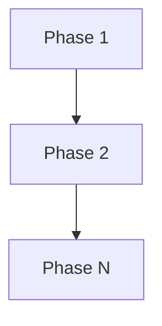

# nOmOsAi - 文档模板集

> 版本: 1.1
> 最后更新: 2026-02-25
> 状态: Draft

本文档定义了 Nomos 系统中关键阶段所需的文档模板。所有模板遵循以下核心原则：

- **Why-First**: AI 必须先问"为什么"再执行
- **标注循环**: 人类通过 MD 文件批注参与迭代
- **阶段门控**: 每个阶段必须满足条件才能进入下一阶段
- **持久化状态**: 状态存储在文件中，支持跨会话恢复

---

## 目录

1. [research.md 模板](#1-researchmd-模板)
2. [plan.md 模板](#2-planmd-模板)
3. [code_review.md 模板](#3-code_reviewmd-模板)
4. [project-why.md 模板](#4-project-whymd-模板)
5. [progress.md 模板](#5-progressmd-模板)
6. [标注格式规范](#6-标注格式规范)

---

## 1. research.md 模板

### 1.1 用途说明

**触发时机**: 新任务开始时，在 `/nomos:start` 或 `/nomos:research` 时自动生成。

**核心目的**:
- 让 AI 强制产出结构化的"项目现实地图"
- 与现有代码/架构 100% 对齐
- 为人类提供可标注的调研文档

**人类角色**: 只负责审阅和批注，不负责编写

### 1.2 模板内容

```markdown
# Research: [任务简述]

---
task_id: t{N}
created: YYYY-MM-DD HH:MM
status: draft
related_plan: null
---

<!--
  WHAT: 当前任务的需求分析 + 现有代码调研
  WHY: 把 AI 的理解显式化，供人类审阅和批注
  WHEN: 任务开始时由 AI 自动生成，人类批注后迭代更新
-->

## 1. 需求理解

### 1.1 用户原始需求
<!--
  从用户输入中提取的原始需求，不做任何推断
-->
> [用户输入的原始描述]

### 1.2 需求拆解
<!--
  AI 将需求拆解为具体的功能点
-->
| # | 功能点 | 优先级 | 说明 |
|---|--------|--------|------|
| 1 | | P0/P1/P2 | |
| 2 | | | |

### 1.3 边界确认
<!--
  明确需求边界，避免范围蔓延
-->
- **包含**: [明确在范围内的功能]
- **不包含**: [明确不在范围内的功能]
- **待确认**: [需要人类澄清的边界]

---

## 2. 现有代码调研

### 2.1 相关模块扫描
<!--
  AI 自动扫描与当前需求相关的代码模块
  范围控制：只扫描相关模块，不全量扫描
-->

| 模块路径 | 相关性 | 现状说明 |
|----------|--------|----------|
| `src/auth/` | 高 | 登录核心逻辑 |
| `src/common/` | 中 | 公共组件 |

### 2.2 关键接口分析
<!--
  列出本次需求可能涉及的关键接口
-->

#### 受影响的函数/类
| 文件 | 函数/类 | 用途 | 改动风险 |
|------|---------|------|----------|
| | | | 低/中/高 |

#### 调用链路
```
[入口点] → [中间层] → [数据层]
```

### 2.3 数据模型影响
<!--
  分析对数据库/数据结构的影响
-->
| 表/模型 | 影响类型 | 说明 |
|---------|----------|------|
| | 新增/修改/无影响 | |

---

## 3. Protected Interfaces (保护接口)

<!--
  列出本次迭代中绝对不能修改的接口
  这将被 Hooks 用于 AST 比对校验
-->

### 3.1 禁止修改的函数签名
```
文件: src/auth/service.py
函数: AuthService.login(username: str, password: str) -> Token
原因: 被上游 5 个模块依赖
```

### 3.2 禁止修改的数据结构
```
表: users
字段: id, email, password_hash
原因: 生产数据依赖
```

---

## 4. Why Questions (为什么问题)

<!--
  AI 针对本次需求涉及模块的疑问
  范围控制：只问相关模块，不超过 15 个问题
-->

### 4.1 从历史累积中自动补充的 Why
<!--
  从 project-why.md 中匹配的历史 Why
-->
| # | 问题 | 来源 | 当前是否仍适用？ |
|---|------|------|-----------------|
| 1 | 为什么 Auth 模块使用 Redis 缓存？ | project-why.md L47 | [待确认] |

### 4.2 本次新增的 Why Questions
<!--
  AI 本次调研中产生的新疑问
-->
| # | 问题 | 涉及模块 | AI 理解 | 需要人类确认 |
|---|------|----------|---------|-------------|
| 1 | | | | [ ] |
| 2 | | | | [ ] |

### 4.3 Why 确认状态
<!--
  所有 Why 问题必须被确认后才能进入 Plan 阶段
-->
- [ ] 所有历史 Why 已确认适用/已更新
- [ ] 所有新增 Why 已获得人类回答
- [ ] 不存在未解答的 Why 问题

---

## 5. Open Questions (待澄清问题)

<!--
  需要人类回答的开放性问题
-->

| # | 问题 | 状态 | 人类回答 |
|---|------|------|----------|
| 1 | | pending | |
| 2 | | | |

**状态**: pending / answered / need_discussion

---

## 6. 遗留问题与技术债

<!--
  调研过程中发现的现有问题
-->

| 问题 | 影响范围 | 建议处理方式 | 优先级 |
|------|----------|--------------|--------|
| | | | |

---

## 7. Review Comments (人类批注区)

<!--
  人类审阅批注区
  格式详见本文档第 6 节"标注格式规范"
-->

### RC-1: [示例批注标题]
> 位置: 47
> 创建时间: YYYY-MM-DD HH:MM
> 最后更新: YYYY-MM-DD HH:MM
> 严重程度: [MAJOR]
> 状态: pending

#### 标注历史

**[YYYY-MM-DD HH:MM] 👤 @username**
> [批注内容]

**[YYYY-MM-DD HH:MM] 🤖 @agent**
> [AI 回复]

---

## 8. Review Status (审阅状态)

### 8.1 Review Comments 汇总
| # | 批注位置 | 严重程度 | 状态 | 处理结果 |
|---|----------|----------|------|----------|
| 1 | 47 | [MAJOR] | pending | |

### 8.2 阶段门控
- [ ] 需求理解已确认
- [ ] 代码调研已完成
- [ ] Protected Interfaces 已列出
- [ ] 所有 Why 问题已回答
- [ ] 所有 Open Questions 已澄清
- [ ] 所有 Review Comments 已 addressed

### 8.3 审阅签名
- **AI 生成**: [Agent ID] @ [时间]
- **人类审阅**: [Username] @ [时间] (首次)
- **人类确认**: [Username] @ [时间] (最终)

---

## 附录: 调研资源

### 相关文档
- [文档链接或路径]

### 相关 Issue/PR
- [Issue/PR 链接]

### 参考资料
- [外部资源链接]
```

---

## 2. plan.md 模板

### 2.1 用途说明

**触发时机**: research.md 审阅通过后，由 AI 自动生成。

**核心目的**:
- 制定详细的实施方案
- 提供人类可标注的计划文档
- 通过 Phase Gates 控制实施进度

### 2.2 模板内容

```markdown
# Plan: [任务简述]

---
task_id: t{N}
created: YYYY-MM-DD HH:MM
status: draft
current_phase: Phase 0
related_research: research.md
---

<!--
  WHAT: 当前任务的详细实施方案
  WHY: 确保方案经过充分审查再执行
  WHEN: research.md 审阅通过后由 AI 生成，人类批注后迭代
-->

## 1. 目标与范围

### 1.1 目标声明
<!--
  一句话描述本次迭代的目标
-->
**目标**: [清晰的目标描述]

### 1.2 成功标准
<!--
  如何判断任务完成
-->
- [ ] [可验证的完成标准 1]
- [ ] [可验证的完成标准 2]
- [ ] [可验证的完成标准 3]

### 1.3 范围边界
- **包含**: [明确在范围内]
- **不包含**: [明确不在范围内]

---

## 2. 架构设计

### 2.1 整体方案
<!--
  方案概述，可以是文字描述或架构图
-->

### 2.2 技术选型
| 决策点 | 选择 | 理由 |
|--------|------|------|
| | | |

### 2.3 模块设计
```
[模块结构图或描述]
```

### 2.4 数据流设计
```
[数据流图或描述]
```

---

## 3. Protected Interfaces (保护接口)

<!--
  从 research.md 继承 + 本次新增的保护声明
-->

### 3.1 禁止修改的接口
| 文件 | 接口签名 | 保护原因 |
|------|----------|----------|
| | | |

### 3.2 兼容性要求
- [ ] API 向后兼容
- [ ] 数据库迁移安全
- [ ] 配置文件兼容

---

## 4. Implementation Phases (实施阶段)

### Phase 1: [阶段名称]
**目标**: [阶段目标描述]
**预计产出**: [产出物列表]

#### Phase Gates (阶段门控)
- [ ] Gate 1.1: [门控条件]
- [ ] Gate 1.2: [门控条件]
- [ ] Gate 1.3: [门控条件]

#### 实施步骤
| 步骤 | 描述 | 涉及文件 | 状态 |
|------|------|----------|------|
| 1.1 | | | [ ] pending |
| 1.2 | | | [ ] pending |

#### 测试要求
- [ ] 单元测试已编写
- [ ] 集成测试已通过
- [ ] 边界条件已覆盖

**阶段完成条件**:
- [ ] 所有 Gates 已勾选
- [ ] 所有步骤已完成
- [ ] 测试已通过
- [ ] Review Comments 已 addressed

---

### Phase 2: [阶段名称]
**目标**: [阶段目标描述]
**预计产出**: [产出物列表]

#### Phase Gates (阶段门控)
- [ ] Gate 2.1: [门控条件]
- [ ] Gate 2.2: [门控条件]

#### 实施步骤
| 步骤 | 描述 | 涉及文件 | 状态 |
|------|------|----------|------|
| 2.1 | | | [ ] pending |

#### 测试要求
- [ ] [测试要求]

**阶段完成条件**:
- [ ] [完成条件]

---

### Phase N: 收尾与验收
**目标**: 最终验收与文档更新

#### Phase Gates
- [ ] 所有功能测试通过
- [ ] 代码审查完成
- [ ] 文档已更新
- [ ] project-why.md 已同步更新

---

## 5. Test-First 约束

<!--
  强制测试先行
-->

### 5.1 测试骨架生成状态
- [ ] 测试文件已创建: `tests/test_xxx.py`
- [ ] 测试用例已定义 (基于成功标准)
- [ ] `pytest --collectonly` 通过

### 5.2 测试用例清单
| 用例 ID | 描述 | 对应需求 | 状态 |
|---------|------|----------|------|
| TC-001 | | | [ ] pending |
| TC-002 | | | [ ] pending |

---

## 6. 风险与缓解

| 风险 | 可能性 | 影响 | 缓解措施 |
|------|--------|------|----------|
| | 低/中/高 | 低/中/高 | |

---

## 7. 本次迭代特殊规则

<!--
  从 project-why.md 继承 + 本次特定的业务规则
  这些规则将被注入到 PreToolUse Hook 的第三层 Linter
-->

### 7.1 i18n 规则
- 规则: 所有用户可见字符串必须使用 `t()` 函数
- 例外: [例外情况]

### 7.2 日志规则
- 规则: 所有 public 方法必须有 `logger.info` (带 trace_id)
- 格式: `logger.info(f"[{trace_id}] message")`

### 7.3 其他业务规则
| 规则 | 说明 | 检查方式 |
|------|------|----------|
| | | AST / LLM |

---

## 8. Review Comments (人类批注区)

<!--
  人类审阅批注区
  格式详见本文档第 6 节"标注格式规范"
-->

### RC-1: [示例批注标题]
> 位置: 47
> 创建时间: YYYY-MM-DD HH:MM
> 最后更新: YYYY-MM-DD HH:MM
> 严重程度: [MAJOR]
> 状态: pending

#### 标注历史

**[YYYY-MM-DD HH:MM] 👤 @username**
> [批注内容]

**[YYYY-MM-DD HH:MM] 🤖 @agent**
> [AI 回复]

---

## 9. Review Status (审阅状态)

### 9.1 Review Comments 汇总
| ID | 标题 | 严重程度 | 状态 | 处理结果 |
|----|------|----------|------|----------|
| RC-1 | | [MAJOR] | pending | |

### 9.2 阶段门控总览
- [ ] Phase 1: [状态]
- [ ] Phase 2: [状态]
- [ ] Phase N: [状态]

### 9.3 放行条件
<!--
  必须全部满足才能进入 Execute 阶段
-->
- [ ] 所有 Review Comments 已 addressed
- [ ] 所有 Phase Gates 已规划
- [ ] 测试骨架已生成
- [ ] Protected Interfaces 已确认
- [ ] 特殊规则已注入

### 9.4 审阅签名
- **AI 生成**: [Agent ID] @ [时间]
- **人类审阅**: [Username] @ [时间]
- **人类批准**: [Username] @ [时间]

---

## 附录

### A. 相关文件清单
| 文件 | 用途 | 状态 |
|------|------|------|
| | | |

### B. 依赖项
| 依赖 | 版本 | 用途 |
|------|------|------|
| | | |

### C. Mermaid 流程图
<!--
  AI 自动生成的实施流程图
-->

```

---

## 3. code_review.md 模板

### 3.1 用途说明

**触发时机**: Plan 阶段通过后，每次代码变更时自动更新。

**核心目的**:
- 记录代码审查过程
- 跟踪问题修复状态
- 支持多层审查（自动 + 子Agent + 人类）

### 3.2 模板内容

```markdown
# Code Review: [任务简述]

---
task_id: t{N}
created: YYYY-MM-DD HH:MM
status: in_progress
related_plan: plan.md
---

<!--
  WHAT: 代码审查记录与问题跟踪
  WHY: 确保代码质量，支持多层审查
  WHEN: Execute 阶段，每次代码变更后自动更新
-->

## 1. 审查配置

### 1.1 审查层级
| 层级 | 类型 | 工具/方式 | 状态 |
|------|------|-----------|------|
| L1 | 自动格式化 | black/prettier | [ ] |
| L2 | 静态分析 | ruff/eslint | [ ] |
| L3 | 业务规则 | AgentLinterEngine | [ ] |
| L4 | 安全检查 | bandit/semgrep | [ ] |
| L5 | 子 Agent 审查 | Validator Subagent | [ ] |
| L6 | 人类审查 | Human Review | [ ] |

### 1.2 本次迭代的业务规则
<!--
  从 plan.md 第 7 节继承
-->
- [ ] i18n 检查: 所有字符串使用 t()
- [ ] 日志检查: public 方法有 logger.info + trace_id
- [ ] 接口保护: Protected Interfaces 未被修改

---

## 2. 变更记录

### 2.1 文件变更清单
| 文件 | 变更类型 | 行数 | 审查状态 |
|------|----------|------|----------|
| | 新增/修改/删除 | | [ ] pending / [x] approved |

### 2.2 变更详情
<!--
  每次变更的详细记录
-->

#### 变更 #1
- **时间**: YYYY-MM-DD HH:MM
- **文件**: [文件路径]
- **变更描述**: [描述]
- **触发原因**: [AI 主动 / 人类请求 / Review 修复]

---

## 3. 审查发现

### 3.1 自动审查 (L1-L4)

#### L1: 格式化
| 文件 | 问题 | 状态 |
|------|------|------|
| | | [ ] pending / [x] fixed / [N/A] |

#### L2: 静态分析
| 文件 | 规则 | 消息 | 严重性 | 状态 |
|------|------|------|--------|------|
| | | | error/warning | [ ] |

#### L3: 业务规则
| 文件 | 规则 | 消息 | 状态 |
|------|------|------|------|
| | i18n | | [ ] pending |

#### L4: 安全检查
| 文件 | 规则 | 消息 | 严重性 | 状态 |
|------|------|------|--------|------|
| | | | critical/high/medium | [ ] |

---

### 3.2 Validator Subagent 审查 (L5)

#### 审查报告
- **审查时间**: YYYY-MM-DD HH:MM
- **审查范围**: [文件列表]
- **审查结论**: pass / fail / needs_discussion

#### 发现的问题
| # | 问题描述 | 位置 | 建议 | 状态 |
|---|----------|------|------|------|
| 1 | | file:line | | [ ] pending |

#### 架构冲突检查
- [ ] 无 Protected Interfaces 变更
- [ ] 无循环依赖引入
- [ ] 无分层架构破坏

---

### 3.3 人类审查 (L6)

<!--
  人类审查批注区
  格式详见本文档第 6 节"标注格式规范"
-->

### RC-1: [示例批注标题]
> 位置: src/auth/service.py:42
> 创建时间: YYYY-MM-DD HH:MM
> 最后更新: YYYY-MM-DD HH:MM
> 严重程度: [MAJOR]
> 状态: pending

#### 标注历史

**[YYYY-MM-DD HH:MM] 👤 @username**
> [批注内容]

**[YYYY-MM-DD HH:MM] 🤖 @agent**
> [AI 回复]

---

## 4. 测试结果

### 4.1 单元测试
| 测试文件 | 用例数 | 通过 | 失败 | 覆盖率 |
|----------|--------|------|------|--------|
| | | | | % |

### 4.2 集成测试
| 测试场景 | 状态 | 备注 |
|----------|------|------|
| | [ ] pending / [x] pass | |

### 4.3 测试覆盖率变化
| 指标 | 变更前 | 变更后 | 变化 |
|------|--------|--------|------|
| 行覆盖率 | % | % | +-% |
| 分支覆盖率 | % | % | +-% |

---

## 5. 修复记录

<!--
  问题修复的完整历史
-->

### 5.1 修复 #1
- **关联问题**: [问题 ID]
- **修复时间**: YYYY-MM-DD HH:MM
- **修复方式**: [代码修复 / 回滚 / 配置调整]
- **修复文件**: [文件列表]
- **验证结果**: [ ] pass / [ ] fail

---

## 6. Revert 记录

<!--
  当审查发现严重问题时，记录 revert 操作
-->

### 6.1 Revert #1 (如有)
- **Revert 时间**: YYYY-MM-DD HH:MM
- **Revert 原因**: [原因]
- **Revert 范围**: [commit/文件]
- **后续处理**: [返回 Plan 阶段 / 重新设计]

---

## 7. 最终状态

### 7.1 审查门控
- [ ] L1 格式化: 通过
- [ ] L2 静态分析: 通过 (无 error)
- [ ] L3 业务规则: 通过
- [ ] L4 安全检查: 通过 (无 critical/high)
- [ ] L5 子 Agent 审查: 通过
- [ ] L6 人类审查: 通过
- [ ] 测试: 全部通过
- [ ] 覆盖率: 达标 (≥80%)

### 7.2 放行决策
- **决策**: approve / reject / needs_discussion
- **决策人**: [AI 自动 / @username]
- **决策时间**: YYYY-MM-DD HH:MM
- **决策理由**: [理由]

### 7.3 签名
- **审查完成**: [Agent ID] @ [时间]
- **人类确认**: [Username] @ [时间]
```

---

## 4. project-why.md 模板

### 4.1 用途说明

**位置**: 项目根目录 (与 CLAUDE.md 同级)

**核心目的**:
- 项目级长期记忆
- 累积"Why"知识库
- 支持跨任务的知识复用
- 减少 AI 重复询问相同问题

**更新时机**:
- 每次任务结束后同步更新
- 人类批注后 AI 自动同步
- 架构决策变更时更新

### 4.2 模板内容

```markdown
# Project Why: [项目名称]

---
project_name: [项目名]
created: YYYY-MM-DD
last_updated: YYYY-MM-DD
version: v1.0
---

<!--
  WHAT: 项目级知识累积库
  WHY: 让 AI 记住项目的"隐形宪法"，减少重复询问
  WHEN: 每次任务结束后自动同步更新

  重要：
  - 这是全项目的"长期记忆"，不是单任务的
  - AI 在新任务开始时会自动读取相关章节
  - 人类可以直接编辑，AI 会同步更新
-->

## 1. 项目概述

### 1.1 项目目标
<!--
  项目存在的根本原因
-->
**目标**: [一句话描述项目目标]

### 1.2 核心价值
- [核心价值 1]
- [核心价值 2]

### 1.3 目标用户
- [用户群体描述]

---

## 2. 技术架构 Why

### 2.1 整体架构决策
| 决策 | 为什么这样选择 | 替代方案 | 决策时间 |
|------|---------------|----------|----------|
| 使用微服务 | 业务复杂度高，需要独立部署 | 单体 | 2024-Q1 |

### 2.2 技术栈 Why
| 技术 | 选择原因 | 限制条件 |
|------|----------|----------|
| Python 3.11 | 团队熟悉，生态丰富 | 必须 ≥3.10 |
| PostgreSQL | 数据一致性要求高 | 主数据库 |
| Redis | 缓存 + 会话 | 必须持久化 |

---

## 3. 模块 Why

<!--
  按模块组织的"Why"知识
  AI 在新任务时只加载相关模块
-->

### 3.1 Auth Module
<!--
  认证模块的"Why"知识
-->

#### 为什么 Auth 使用 JWT？
> **原因**: 无状态，支持分布式部署
> **历史**: 2024-03 从 Session 迁移
> **限制**: Token 有效期 24h，必须支持刷新
> **来源**: research.md t5

#### 为什么登录必须走 AuthUseCase？
> **原因**: 统一风控 + 审计日志
> **限制**: 不能直接调用 Repository
> **来源**: project-why.md L47 (历史)

### 3.2 Payment Module
<!--
  支付模块的"Why"知识
-->

#### 为什么金额必须用 Decimal？
> **原因**: 精度问题，float 会导致计算误差
> **限制**: 禁止使用 float 进行金额计算
> **来源**: 架构决策 2024-Q2

### 3.3 [Other Module]
<!--
  其他模块的"Why"知识
-->

---

## 4. 业务规则 Why

### 4.1 领域不变量
| 规则 | 原因 | 来源 |
|------|------|------|
| 订单金额 ≥ 0.01 | 防止免费订单漏洞 | 业务规则 2024-01 |
| 用户名唯一 | 登录标识 | 数据模型设计 |

### 4.2 合规要求
| 要求 | 原因 | 实现方式 |
|------|------|----------|
| PII 必须加密 | GDPR 合规 | AES-256 |
| 操作日志保留 90 天 | 审计要求 | 日志服务 |

---

## 5. 接口契约 Why

### 5.1 Protected Interfaces
<!--
  不能修改的接口及其原因
-->

| 接口 | 保护原因 | 影响范围 | 添加时间 |
|------|----------|----------|----------|
| `AuthService.login()` | 上游 5 模块依赖 | API 稳定性 | 2024-03 |
| `PaymentService.charge()` | 支付网关集成 | 资金安全 | 2024-02 |

### 5.2 废弃接口
<!--
  已废弃但尚未删除的接口
-->

| 接口 | 废弃原因 | 替代方案 | 计划删除时间 |
|------|----------|----------|--------------|
| `old_login()` | 迁移到 JWT | `AuthService.login()` | 2024-Q4 |

---

## 6. 历史问题与教训

### 6.1 重大事故记录
| 日期 | 问题 | 根因 | 教训 | 修复 |
|------|------|------|------|------|
| 2024-05-01 | 支付超时 | 没有超时重试 | 必须设置超时 | PR #123 |

### 6.2 技术债记录
| 债务 | 原因 | 影响 | 计划偿还时间 |
|------|------|------|--------------|
| 旧日志格式 | 历史遗留 | 日志分析困难 | 2024-Q3 |

---

## 7. 开发规范 Why

### 7.1 代码规范
| 规范 | 原因 | 工具检查 |
|------|------|----------|
| 函数 ≤ 50 行 | 可读性 | ruff |
| 禁止 bare except | 错误追踪 | bandit |

### 7.2 测试规范
| 规范 | 原因 |
|------|------|
| 覆盖率 ≥ 80% | 质量保证 |
| 必须有集成测试 | 端到端验证 |

### 7.3 日志规范
| 规范 | 原因 |
|------|------|
| 必须带 trace_id | 分布式追踪 |
| 错误必须带上下文 | 问题定位 |

---

## 8. 隐形上下文

<!--
  那些"大家都知道但没写下来"的知识
  这是 AI 最容易遗漏的部分
-->

### 8.1 业务隐形规则
- [隐形规则 1]: [描述]
- [隐形规则 2]: [描述]

### 8.2 团队约定
- [约定 1]: [描述]
- [约定 2]: [描述]

### 8.3 历史背景
- [背景 1]: [为什么是这样]

---

## 9. 更新日志

### 9.1 最近更新
| 日期 | 更新内容 | 更新来源 | 更新人 |
|------|----------|----------|--------|
| YYYY-MM-DD | [更新描述] | task t{N} | AI/Human |

### 9.2 待确认变更
<!--
  状态可能已变化，需要在新任务中确认
-->
| Why 条目 | 可能变化 | 确认状态 |
|----------|----------|----------|
| | | [ ] pending |

---

## 附录: 索引

### A. 按模块索引
- Auth: 3.1
- Payment: 3.2
- [Other]: 3.x

### B. 按关键词索引
| 关键词 | 相关章节 |
|--------|----------|
| JWT | 3.1, 5.1 |
| Decimal | 3.2, 4.1 |
```

---

## 5. progress.md 模板

### 5.1 用途说明

**触发时机**: 任务开始时创建，执行过程中持续更新。

**重要性**: **必需文件**（非可选），用于支持断点恢复和 5-Question Reboot Test。

**核心目的**:
- 记录会话日志
- 支持"5-Question Reboot Test"
- 错误追踪与回溯

### 5.2 模板内容

```markdown
# Progress: [任务简述]

---
task_id: t{N}
created: YYYY-MM-DD HH:MM
status: in_progress
---

<!--
  WHAT: 任务执行日志
  WHY: 回答"What have I done?"，支持断点恢复
  WHEN: 执行过程中持续更新
-->

## 1. 5-Question Reboot Check

<!--
  如果能回答这 5 个问题，说明上下文完整
  断点恢复时首先检查这个表
-->

| 问题 | 答案 | 来源 |
|------|------|------|
| Where am I? | Phase X | plan.md |
| Where am I going? | Phase X+1...N | plan.md |
| What's the goal? | [目标] | plan.md 1.1 |
| What have I learned? | [关键发现] | research.md |
| What have I done? | 见下方日志 | progress.md |

---

## 2. Session Logs

### Session 1: YYYY-MM-DD

#### Phase 1: [阶段名称]
- **状态**: in_progress / completed
- **开始时间**: HH:MM
- **结束时间**: HH:MM

**执行动作**:
- [ ] 动作 1: [描述]
- [ ] 动作 2: [描述]

**文件变更**:
| 文件 | 操作 | 状态 |
|------|------|------|
| | 创建/修改 | [ ] |

**产出物**:
- [产出物 1]

---

### Session 2: YYYY-MM-DD
...

---

## 3. Test Results

| 测试 | 输入 | 期望 | 实际 | 状态 |
|------|------|------|------|------|
| | | | | [ ] pending / [x] pass / [ ] fail |

---

## 4. Error Log

| 时间 | 错误 | 尝试次数 | 解决方案 |
|------|------|----------|----------|
| HH:MM | [错误描述] | N | [解决方案] |

---

## 5. Decision Log

| 时间 | 决策 | 理由 | 影响 |
|------|------|------|------|
| HH:MM | [决策内容] | [理由] | [影响范围] |

---

## 6. 最终状态

- **任务状态**: [ ] pending / [x] completed
- **完成时间**: YYYY-MM-DD HH:MM
- **总耗时**: X hours Y minutes
- **产出物**: [列出所有产出物]
```

---

## 6. 标注格式规范

本节定义了所有模板中 Review Comments 的标准格式，确保与架构设计一致。

### 6.1 标准 Review Comment 格式

```markdown
### RC-{N}: {标题}
> 位置: {位置标识}
> 创建时间: YYYY-MM-DD HH:MM
> 最后更新: YYYY-MM-DD HH:MM
> 严重程度: [{CRITICAL|MAJOR|MINOR|SUGGEST|REVERT}]
> 状态: {pending|pending_ai_question|pending_user_clarify|addressed|wont_fix}

#### 标注历史

**[YYYY-MM-DD HH:MM] 👤 @username**
> [批注内容]

**[YYYY-MM-DD HH:MM] 🤖 @agent**
> [AI 回复或修改说明]

**[YYYY-MM-DD HH:MM] ❓ @agent 追问** (可选)
> [AI 对用户的追问]

**[YYYY-MM-DD HH:MM] 👤 @username**
> [用户回答]
```

### 6.2 位置标识格式

| 场景 | 位置格式 | 示例 |
|------|----------|------|
| **普通文本行** | `{行号}` | `47` |
| **章节引用** | `{章节号}` | `4.1` `Phase 1` |
| **代码块** | `code:{块索引}:{块内行号} (源码:{行号})` | `code:1:3 (源码:50)` |
| **Mermaid 图** | `mermaid:{块索引} (源码:{起始行}-{结束行})` | `mermaid:1 (源码:55-60)` |
| **表格行** | `table:{表格索引}:row:{行号} (源码:{行号})` | `table:1:row:2 (源码:65)` |
| **代码文件** | `{文件路径}:{行号}` | `src/auth/service.py:42` |

### 6.3 严重程度定义

| 标记 | 含义 | 处理方式 | 是否阻塞 |
|------|------|---------|---------|
| `[CRITICAL]` | 严重问题，必须修复 | 立即阻塞，可能触发 revert | ✅ 阻塞 |
| `[MAJOR]` | 重要问题，需要修复 | 阻塞，但可协商优先级 | ✅ 阻塞 |
| `[MINOR]` | 小问题，建议修复 | 不阻塞，记录待办 | ❌ 不阻塞 |
| `[SUGGEST]` | 建议，可选 | 不阻塞，仅供参考 | ❌ 不阻塞 |
| `[REVERT]` | 方向错误，回滚 | 自动触发 Revert Manager | ✅ 强制 |

### 6.4 状态值定义

| 状态 | 含义 | 标记点图标 | 阻塞行为 |
|------|------|-----------|---------|
| `pending` | 待处理 | 📝🟠 | ✅ 阻塞（CRITICAL/MAJOR） |
| `pending_ai_question` | AI有追问，待用户回复 | 📝❓ | ✅ 阻塞 |
| `pending_user_clarify` | AI有疑问，待用户澄清 | 📝❓ | ✅ 阻塞 |
| `addressed` | 已处理 | 📝🟢 | ❌ 不阻塞 |
| `wont_fix` | 不修复（人类确认忽略） | 📝⚪ | ❌ 不阻塞 |

### 6.5 状态流转

```
┌─────────────────────────────────────────────────────────────────────┐
│                       标注状态流转图                                 │
├─────────────────────────────────────────────────────────────────────┤
│                                                                      │
│  [用户创建标注]                                                       │
│       │                                                              │
│       ▼                                                              │
│  ┌─────────┐                                                         │
│  │ pending │ ←─────────────────────────────────┐                    │
│  └────┬────┘                                   │                    │
│       │                                        │                    │
│       │ Agent 读取并处理                        │ Agent 不理解，    │
│       │                                        │ 主动提问          │
│       ▼                                        │                    │
│  ┌─────────────────────┐                       │                    │
│  │ Agent 回复/修改     │                       │                    │
│  └──────────┬──────────┘                       │                    │
│             │                                  │                    │
│             ├────────────────────┐             │                    │
│             │                    │             │                    │
│             ▼                    ▼             │                    │
│  ┌──────────────────┐  ┌───────────────────┐  │                    │
│  │ pending_         │  │ pending_user_     │  │                    │
│  │ ai_question      │  │ clarify           │  │                    │
│  │ (AI追问用户)     │  │ (AI有疑问)        │  │                    │
│  └────────┬─────────┘  └─────────┬─────────┘  │                    │
│           │                      │            │                    │
│           │ 用户回复              │ 用户澄清   │                    │
│           │                      │            │                    │
│           └──────────┬───────────┴────────────┘                    │
│                      │                                              │
│                      ▼                                              │
│              ┌───────────────┐                                      │
│              │ 用户确认通过   │                                      │
│              └───────┬───────┘                                      │
│                      │                                              │
│                      ▼                                              │
│              ┌───────────────┐                                      │
│              │  addressed    │                                      │
│              │  (已处理)     │                                      │
│              └───────────────┘                                      │
│                                                                      │
│  特殊路径:                                                           │
│  pending ──[用户确认忽略]──► wont_fix                               │
│                                                                      │
└─────────────────────────────────────────────────────────────────────┘
```

---

## 模板使用指南

### 任务文件夹结构

```
tasks/
├── short-id-mapping.json           # 短 ID 映射表 (必需)
├── t1-2026-02-23-login-feature/     # 任务文件夹
│   ├── research.md                  # 需求调研 (必需)
│   ├── plan.md                      # 实施方案 (必需)
│   ├── code_review.md               # 代码审查 (必需)
│   └── progress.md                  # 执行日志 (必需)
├── t2-2026-02-24-payment-fix/
│   └── ...
└── archive/                         # 已完成任务归档
    └── 2026-02/                     # 按年月组织
        └── t5-2026-02-18-db-migration/
```

### short-id-mapping.json 格式

```json
{
  "t1": {
    "full_id": "t1-2026-02-23-login-feature",
    "path": "tasks/t1-2026-02-23-login-feature",
    "status": "done",
    "archived": false
  },
  "t2": {
    "full_id": "t2-2026-02-24-payment-fix",
    "path": "tasks/t2-2026-02-24-payment-fix",
    "status": "executing",
    "archived": false
  },
  "t5": {
    "full_id": "t5-2026-02-18-db-migration",
    "path": "tasks/archive/2026-02/t5-2026-02-18-db-migration",
    "status": "archived",
    "archived": true
  }
}
```

### 状态流转

```
research.md          plan.md            code_review.md
    │                   │                     │
    ▼                   ▼                     ▼
draft ──► in_review ──► approved ──► executing ──► done
         (人类批注)      (放行)       (代码变更)     (验收)
                                          │
                                          ▼
                                    needs_replan
                                    (需要重新规划)
```

### 任务状态值对照表

| 状态 | 含义 | 阶段 | 说明 |
|------|------|------|------|
| `draft` | 草稿 | Research/Plan | AI 正在生成，等待人类审阅 |
| `in_review` | 审阅中 | Research/Plan | 人类正在审阅和批注 |
| `approved` | 已批准 | Research/Plan | 人类批准，可进入下一阶段 |
| `executing` | 执行中 | Execute | 正在编码实现 |
| `needs_replan` | 需要重新规划 | Execute | 发现设计问题，需要返回 Plan |
| `done` | 已完成 | - | 任务完成 |
| `archived` | 已归档 | - | 已移至归档目录 |

### 标注循环

1. AI 生成文档 → 人类在 `Review Comments` 区批注
2. 人类保存文档 → AI 读取批注 → 更新文档 → 添加标注历史
3. 所有批注状态变为 `addressed` → Hooks 放行进入下一阶段

### Hooks 集成点

| 阶段 | Hook | 检查内容 |
|------|------|----------|
| Research | PreToolUse | 确保 Why 问题已回答 |
| Research | Stop | 所有 Open Questions 已澄清 |
| Plan | PreToolUse | 阻止代码写入 |
| Plan | Stop | 所有 Review Comments 已 addressed |
| Execute | PreToolUse | L1-L4 规则检查 |
| Execute | PostToolUse | L5 子 Agent 审查 |
| Execute | Stop | 所有门控通过 |

---

## 版本历史

| 版本 | 日期 | 变更 |
|------|------|------|
| 1.1 | 2026-02-25 | 与架构文档对齐：1) 元信息改用 YAML Frontmatter 2) Review Comments 添加严重程度和完整状态 3) 添加标注历史机制 4) 添加特殊格式标注 5) 统一状态值 6) 添加 short-id-mapping.json 说明 7) progress.md 标记为必需 |
| 1.0 | 2026-02-24 | 初始版本 |
